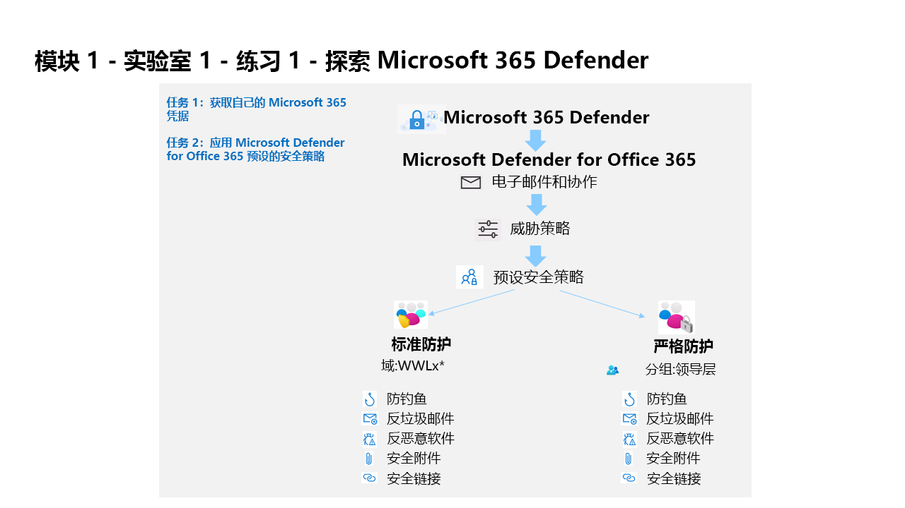

---
lab:
  title: 练习 1 - 探索 Microsoft 365 Defender
  module: Learning Path 1 - Mitigate threats using Microsoft 365 Defender
---

# 学习路径 1 - 实验室 1 - 练习 1 - 探索 Microsoft 365 Defender

## 实验室方案

你是一家公司的安全运营分析师，你所在公司正在实现 Microsoft 365 Defender。 首先，在 EOP 和 Microsoft Defender for Office 365 中分配预设的安全策略。

>                **注意：** 我们提供 **[交互式实验室模拟](https://mslabs.cloudguides.com/guides/SC-200%20Lab%20Simulation%20-%20Explore%20Microsoft%20365%20Defender)** ，让你能以自己的节奏点击浏览实验室。 你可能会发现交互式模拟与托管实验室之间存在细微差异，但演示的核心概念和思想是相同的。

>注意：WWL 租户 - 使用条款 如果在讲师引导式培训过程中向你提供租户，请注意，提供租户的目的是支持讲师引导式培训中的动手实验室 。 租户不应共享或用于动手实验室以外的用途。 本课程使用的租户为试用租户，课程结束后无法使用或访问，不符合扩展条件。 租户不得转换为付费订阅。 在本课程中获得的租户仍然是 Microsoft Corporation 的财产，我们保留随时获取访问权限和收回的权利。 

### 任务 1：获取 Microsoft 365 凭据

启动实验室后，你将获得一个免费试用版租户，可在 Microsoft 虚拟实验室环境中访问。 系统会自动向该租户分配一个唯一用户名和密码。 你必须检索此用户名和密码，以便在 Microsoft 虚拟实验室环境中登录 Azure 和 Microsoft 365。 

由于学习合作伙伴可以通过多家授权实验室托管 (ALH) 提供商中的任何一家来提供本课程，因此检索与租户关联的租户 ID 所涉及的实际步骤可能因实验室托管提供商而异。 因此，讲师需要向你提供必要的指导，介绍如何检索课程的此类信息。 你应该记录以供稍后使用的信息包括：

- 租户后缀 ID。 此 ID 适用于将在所有实验室中用来登录 Microsoft 365 的 onmicrosoft.com 帐户。 其格式为 {username}@ZZZZZZ.onmicrosoft.com，其中 ZZZZZZ 是实验室托管提供者提供的唯一租户后缀 ID。 记录此 ZZZZZZ 值以供稍后使用。 当有任何实验室步骤指示你登录 Microsoft 365 门户时，都必须输入在此处获取的 ZZZZZZ 值。
- 租户密码。 这是由实验室托管提供者提供的管理员帐户的密码。

### 任务 2：应用 Microsoft Defender for Office 365 预设的安全策略

在此任务中，你将在 Microsoft 365 安全门户中为 Exchange Online Protection (EOP) 和 Microsoft Defender for Office 365 分配预设安全策略。

1. 使用以下密码以管理员身份登录到 WIN1 虚拟机：**Pa55w.rd**。  

1. 启动 Microsoft Edge 浏览器。

1. 在 Microsoft Edge 浏览器中，转到 Microsoft 365 Defender 门户 (https://security.microsoft.com) )。

1. 在“登录”对话框中，复制并粘贴实验室托管提供者为管理员用户名提供的租户电子邮件帐户，然后选择“下一步” 。

1. 在“输入密码”对话框中，复制粘贴实验室托管提供者提供的管理员的租户密码，然后选择“登录” 。

    >**注意：** 如果收到消息“操作无法完成。 请稍后再试。 如果问题持续出现，请联系 Microsoft 支持部门。”， 单击“确定”即可继续。  

1. 如果显示，请关闭 Microsoft 365 Defender 快速导览弹出窗口。 提示：在本实验室的后面部分，需要等到 Defender 工作区预配完成，在这段时间内，你可以浏览引导教程，了解有关 Microsoft 365 Defender 的详细信息。

1. 在导航菜单中的“电子邮件与协作”区域下，选择“策略与规则”。

1. 在“策略与规则”仪表板上，选择“威胁策略”。

1. 在“威胁策略”仪表板上，选择“预设安全策略”。

    >**注意：** 如果收到消息“客户端错误 - 收到 bip 规则时出错”，请选择“确定”以继续。 此错误是由于 Office 365 在默认情况下未启用租户的冻结状态。

    >**注意：** 如果你收到消息“客户端错误 - 检索预设的安全策略时发生错误。*请稍后重试。”* ， 选择“确定”继续。 使用 Ctrl+F5 刷新浏览器。

1. 在“标准保护”下，选择“管理保护设置”。 提示：如果看到此选项灰显，请使用 Ctrl+F5 刷新浏览器。

1. 在“应用 Exchange Online Protection”部分中，选择“特定收件人”，然后在“域”下开始编写租户的域名，选择它，然后选择“下一步”。

    >提示：租户的域名与管理员帐户的域名相同，可能与 WWLx######.onmicrosoft.com 类似。 请注意，此配置适用于防垃圾邮件、出站垃圾邮件筛选器、防恶意软件和防钓鱼的策略。

1. 在“应用 Defender for Office 365 保护”部分，应用与上一步相同的配置，然后选择“下一步”。 请注意，此配置适用于防钓鱼、安全附件、安全链接的策略。

1. 在“模拟保护”部分，选择“下一步”四次（4 次）继续。

1. 在“策略模式”部分，确保选中“完成后启用策略”单选按钮，然后选择“下一步” 。

1. 阅读“查看并确认更改”下的内容，选择“确认”以应用更改，然后选择“完成”以完成 。

    >**注意：** 如果你收到信息“URI 'https://outlook.office365.com/psws/service.svc/AntiPhishPolicy ' 对 PUT 操作无效。*对于 PUT 操作，URI 必须指向单个资源。”* ， 只需选择“确定”，然后选择“取消”以返回到主页 。 你将看到“标准保护已启用”选项启用。

1. 在“严格保护”下，选择“管理保护设置”。 提示：在“电子邮件与协作 - 策略与规则 - 威胁策略 - 预设安全策略”下找到“严格保护”。

1. 在“应用 Exchange Online Protection”中，选择“特定收件人”，然后在“组”下开始写入“领导力”，选择它，然后选择”下一步”。 请注意，此配置适用于防垃圾邮件、出站垃圾邮件筛选器、防恶意软件和防钓鱼的策略。

1. 在“应用 Defender for Office 365 保护”部分，应用与上一步相同的配置，然后选择“下一步”。 请注意，此配置适用于防钓鱼、安全附件、安全链接的策略。

1. 在“模拟保护”部分，选择“下一步”四次（4 次）继续。

1. 在“策略模式”部分，确保选中“完成后启用策略”单选按钮，然后选择“下一步” 。

1. 阅读“查看并确认更改”下的内容，选择“确认”以应用更改，然后选择“完成”以完成 。

    >**注意：** 如果你收到信息“URI 'https://outlook.office365.com/psws/service.svc/AntiPhishPolicy ' 对 PUT 操作无效。*对于 PUT 操作，URI 必须指向单个资源。”* ， 只需选择“确定”，然后选择“取消”以返回到主页 。 你将看到“严格保护已启用”选项启用。

### 任务 3：准备 Microsoft 365 Defender 工作区

1. 在 Microsoft 365 Defender 门户的左侧导航菜单中，选择“主页” 。

    >注意：可能需要一直滚动到菜单顶部。

1. 在门户“主页”上，会显示“欢迎使用 Microsoft 365 Defender” 。

1. 向下滚动图块，直到找到标记为“Microsoft 365 Defender”并显示“启用 Microsoft 365 Defender”消息的图块 。

    >提示：它应位于图块的右下角。

1. 选择显示“启用新功能”的按钮。

1. 你将在页面顶部看到简要显示了“正在加载和初始化”消息，然后你将咖啡杯的图像和一条消息，内容如下：“请稍等！我们正在为你的数据准备新的空间并将它们连接起来”。 大约需要 5 分钟才能完成。 使页面保持打开状态并确保它已完成，因为下一个实验室需要它。

    >**注意：** 如果收到错误消息“我们未计划到它会失败，但出现了问题。” 请稍后重试此步骤，或在下一实验室之前重试。

1. 新空间成功完成后，你将看到 Microsoft 365 Defender 的帐户、电子邮件通知、警报服务设置、权限和角色以及流式处理 API 等常规设置。 你还将看到“预览功能”已打开。

## 你已完成本实验室
