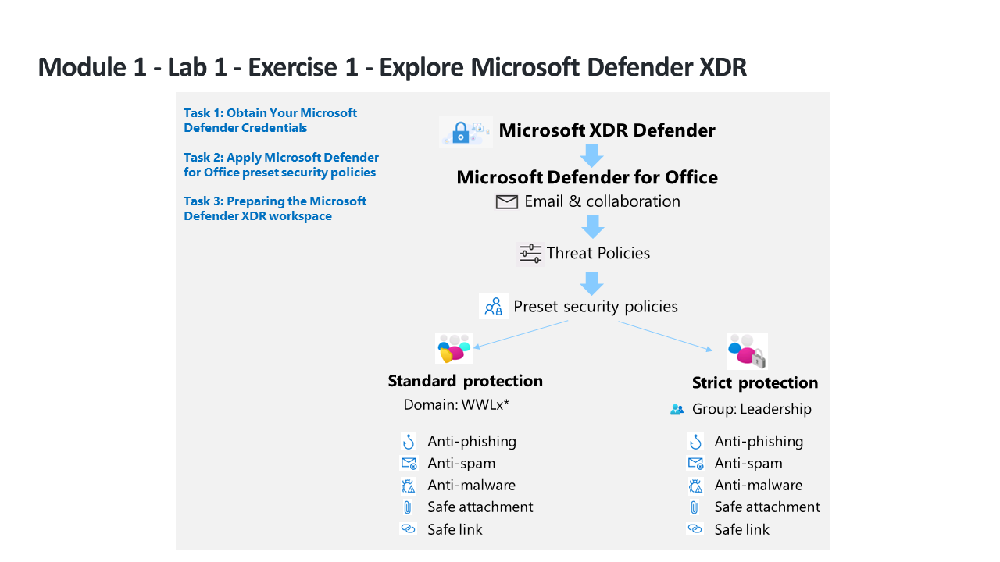

---
lab:
  title: 练习 1 - 探索 Microsoft 365 Defender
  module: Module 1 - Mitigate threats using Microsoft 365 Defender
---

# 模块 1 - 实验室 1 - 练习 1 - 探索 Microsoft 365 Defender 

## 实验室方案

You are a Security Operations Analyst working at a company that is implementing Microsoft 365 Defender. You start by assigning preset security policies in EOP and Microsoft Defender for Office 365.

### 任务 1：获取 Microsoft 365 凭据

Once you launch the lab, a free trial tenant will be made available to you to access in the Microsoft virtual Lab environment. This tenant will be automatically assigned a unique username and password. You must retrieve this username and password so that you can sign into Azure and Microsoft 365 within the Microsoft Virtual Lab environment. 

Because this course can be offered by learning partners using any one of several Authorized Lab Hosting (ALH) providers, the actual steps involved to retrieve the tenant ID associated with your tenant may vary by lab hosting provider. Therefore, your instructor will provide you with the necessary instructions for how to retrieve this information for your course. The information that you should note for later use includes:

- <bpt id="p1">**</bpt>Tenant suffix ID.<ept id="p1">**</ept> This ID is for the onmicrosoft.com accounts that you will use to sign into Microsoft 365 throughout the labs. This is in the format of <bpt id="p1">**</bpt>{username}<ph id="ph1">@ZZZZZZ.onmicrosoft.com</ph><ept id="p1">**</ept>, where ZZZZZZ is your unique tenant suffix ID provided by your lab hosting provider. Record this ZZZZZZ value for later use. When any of the lab steps direct you to sign into Microsoft 365 portals, you must enter the ZZZZZZ value that you obtained here.
- <bpt id="p1">**</bpt>Tenant password.<ept id="p1">**</ept> This is the password for the admin account provided by your lab hosting provider.

### 任务 2：应用 Microsoft Defender for Office 365 预设的安全策略

在此任务中，你将在 Microsoft 365 安全门户中为 Exchange Online Protection (EOP) 和 Microsoft Defender for Office 365 分配预设安全策略。

1. 使用以下密码以管理员身份登录到 WIN1 虚拟机：**Pa55w.rd**。  

1. 启动 Microsoft Edge 浏览器。

1. 在 Microsoft Edge 浏览器中，转到 Microsoft 365 Defender 门户 (https://security.microsoft.com) )。

1. 在“登录”对话框中，复制并粘贴实验室托管提供者为管理员用户名提供的租户电子邮件帐户，然后选择“下一步” 。

1. 在“输入密码”对话框中，复制粘贴实验室托管提供者提供的管理员的租户密码，然后选择“登录” 。

    >你是一家公司的安全运营分析师，你所在公司正在实现 Microsoft 365 Defender。  

1. 如果显示，请关闭 Microsoft 365 Defender 快速导览。

1. 在导航菜单中的“电子邮件与协作”区域下，选择“策略与规则”。

1. 在“策略与规则”仪表板上，选择“威胁策略”。

1. 在“威胁策略”仪表板上，选择“预设安全策略”。

    >首先，在 EOP 和 Microsoft Defender for Office 365 中分配预设的安全策略。

    ><bpt id="p1">**</bpt>Note:<ept id="p1">**</ept> If you receive the message <bpt id="p2">*</bpt>"Client Error - An error occurred when retrieving preset security policies. Please try again later."<ept id="p2">*</ept> select <bpt id="p1">**</bpt>OK<ept id="p1">**</ept> to continue. Refresh your browser using <bpt id="p1">**</bpt>Ctrl+F5<ept id="p1">**</ept>.

1. Under <bpt id="p1">*</bpt>Standard protection<ept id="p1">*</ept>, select <bpt id="p2">**</bpt>Manage protection settings<ept id="p2">**</ept>. <bpt id="p1">**</bpt>Hint:<ept id="p1">**</ept> If you see this option grayed out, refresh your browser using <bpt id="p2">**</bpt>Ctrl+F5<ept id="p2">**</ept>.

1. 启动实验室后，你将获得一个免费试用版租户，可在 Microsoft 虚拟实验室环境中访问。 

1. 系统会自动向该租户分配一个唯一用户名和密码。

1. 在“模拟保护”部分，选择“下一步”四次（4 次）继续。

1. 在“策略模式”部分，确保选中“完成后启用策略”单选按钮，然后选择“下一步” 。

1. 阅读“查看并确认更改”下的内容，选择“确认”以应用更改，然后选择“完成”以完成 。

    >你必须检索此用户名和密码，以便在 Microsoft 虚拟实验室环境中登录 Azure 和 Microsoft 365。

1. Under <bpt id="p1">*</bpt>Strict protection<ept id="p1">*</ept>, select <bpt id="p2">**</bpt>Manage protection settings<ept id="p2">**</ept>. <bpt id="p1">**</bpt>Hint:<ept id="p1">**</ept> <bpt id="p2">*</bpt>Strict protection<ept id="p2">*</ept> is found under "Email &amp; Collaboration - Policies &amp; rules - Threat policies - Preset security policies".

1. 由于学习合作伙伴可以通过多家授权实验室托管 (ALH) 提供商中的任何一家来提供本课程，因此检索与租户关联的租户 ID 所涉及的实际步骤可能因实验室托管提供商而异。

1. 因此，讲师需要向你提供必要的指导，介绍如何检索课程的此类信息。

1. 在“模拟保护”部分，选择“下一步”四次（4 次）继续。

1. 在“策略模式”部分，确保选中“完成后启用策略”单选按钮，然后选择“下一步” 。

1. 阅读“查看并确认更改”下的内容，选择“确认”以应用更改，然后选择“完成”以完成 。

    >你应该记录以供稍后使用的信息包括：

1. 在 Microsoft 365 Defender 门户中，从左侧“导航”菜单中选择“设置” 。

1. On the <bpt id="p1">**</bpt>Settings<ept id="p1">**</ept> page select <bpt id="p2">**</bpt>Microsoft 365 Defender<ept id="p2">**</ept>. You are going to see an image of a coffee mug and a message that reads: "Hang on! We're preparing new spaces for your data and connecting them". It will take several minutes to finish, so leave the page open until the next lab. 

    >租户后缀 ID。

1. 当新空间成功完成时，你将看到 Microsoft 365 Defender 的帐户、电子邮件通知、预览功能和流式处理 API 的设置。

## 你已完成本实验室。
