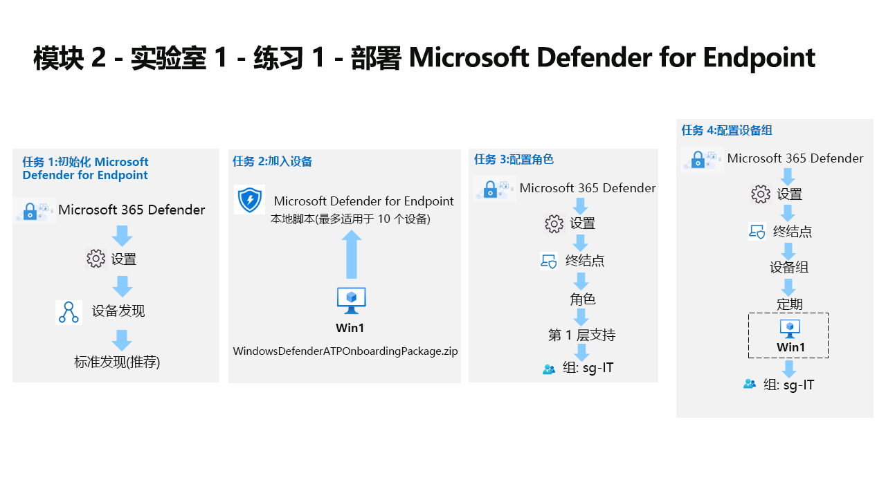

---
lab:
  title: 练习 1 - 部署 Microsoft Defender for Endpoint
  module: Learning Path 2 - Mitigate threats using Microsoft Defender for Endpoint
---

# 学习路径 2 - 实验室 1 - 练习 1 - 部署 Microsoft Defender for Endpoint

## 实验室方案

你是一家公司的安全操作分析师，你的公司正在实施 Microsoft Defender for Endpoint。 你的主管计划加入一些设备，以深入了解安全运营 (SecOps) 团队响应程序所需的更改。

首先初始化 Defender for Endpoint 环境。 接下来，通过对初始设备运行加入脚本，为你的部署加入这些设备。 配置环境的安全性。 最后，创建设备组并分配适当的设备。

>**重要提示：** 通过不同的模块使用实验室虚拟机。 请保存你的虚拟机。 如果在不保存的情况下退出实验室，将需要再次重新运行某些配置。

>**注意：** 请确保已成功完成前一模块的任务 3。

>                **注意：** 我们提供 **[交互式实验室模拟](https://mslabs.cloudguides.com/guides/SC-200%20Lab%20Simulation%20-%20Deploy%20Microsoft%20Defender%20for%20Endpoint)** ，让你能以自己的节奏点击浏览实验室。 你可能会发现交互式模拟与托管实验室之间存在细微差异，但演示的核心概念和思想是相同的。 

### 任务 1：初始化 Microsoft Defender for Endpoint

在此任务中，你将执行 Microsoft Defender for Endpoint 门户的初始化。

1. 使用以下密码以管理员身份登录到 WIN1 虚拟机：Pa55w.rd 。  

1. 如果你尚未处于 Microsoft 365 Defender 门户，请启动 Microsoft Edge 浏览器。

1. 在 Microsoft Edge 浏览器中，转到 Microsoft 365 Defender 门户 (https://security.microsoft.com) )。

1. 在“登录”对话框中，复制并粘贴实验室托管提供者为管理员用户名提供的租户电子邮件帐户，然后选择“下一步” 。

1. 在“输入密码”对话框中，复制粘贴实验室托管提供者提供的管理员的租户密码，然后选择“登录” 。

    >提示：可以在“资源”选项卡上找到管理员的租户电子邮件帐户和密码。

1. 在 Microsoft 365 Defender 门户中，从左侧“导航”菜单中选择“设置” 。

1. 在“设置”页面上，选择“设备发现”。 

    >**注意：** 如果“设置”下面没有显示“设备发现”选项，可通过选择右上角包含帐户首字母缩写的圆圈，然后选择“注销”进行注销  。可能想尝试的其他选项是使用 Ctrl+F5 刷新页面或打开页面 InPrivate。 使用“租户电子邮件”凭据重新登录。

1. 在“发现”设置中，确保选中“标准发现(推荐)”。 

    >提示：如果看不到该选项，请刷新页面。

### 任务 2：加入设备。

在此任务中，你将使用加入脚本将设备加入 Microsoft Defender for Endpoint。

1. 从左侧菜单栏中选择“设置”，然后从“设置”页面中选择“终结点” 。

1. 在“设备管理”部分选择“加入”。

    >注意：还可以从左侧菜单栏的“资产”部分执行设备载入。 展开“资产”，然后选择“设备”。 在“设备清单”页上，选中“计算机和移动设备”，向下滚动到“载入设备”。 此操作会将你转到“设置”>“终结点”页。

1. 在“1. 加入设备”区域中，确保“部署方法”下拉列表中包含“本地脚本(用于最多 10 台设备)”，然后选择“下载加入包”按钮。

1. 在“下载”弹出窗口下，用鼠标突出显示 WindowsDefenderATPOnboardingPackage.zip 文件，然后选择“在文件夹中显示”文件夹图标。 提示：如果没找到该文件，它应当位于 c:\users\admin\downloads directory。

    >提示：如果浏览器阻止下载，请在浏览器中执行操作以允许下载。 在 Microsoft Edge 浏览器中，你可能会看到消息“通常不下载 WindowsDefenderATPOnboardingPackage.zip。请确保信任...”，根据需要选择省略号按钮 (...)，然后选择“保留”。 在 Microsoft Edge 中，将显示第二个弹出窗口，其中包含消息“在打开之前，请确保信任 WindowsDefenderATPOnboardingPackage.zip”，选择“显示更多”以展开选项，然后选择“仍然保留” 。

1. 右键单击已下载的 zip 文件，然后选择“全部提取...”，确保选中“完成时显示提取的文件”，然后选择“提取”。

1. 右键单击解压缩的文件 WindowsDefenderATPLocalOnboardingScript.cmd，然后选择“属性”。 选择“属性”窗口右下角的“解除阻止”复选框，然后选择“确定” 。

1. 再次右键单击解压缩文件“WindowsDefenderATPLocalOnboardingScript.cmd”，然后选择“以管理员身份运行”。  提示：如果遇到 Windows SmartScreen 窗口，请选择“详细信息”，然后选择“仍要运行” 。 
    
1. 显示“用户帐户控制”窗口时，请选择“是”以允许脚本运行，并对脚本提供的问题回答“Y”，然后按 Enter 键  。 完成后，命令屏幕上会显示一条“已成功将计算机加入 Microsoft Defender for Endpoint”的消息。

1. 按任意键继续。 这会关闭命令提示符窗口。

### 任务 3：配置角色

在此任务中，你将配置用于设备组的角色。

1. 在 Microsoft 365 Defender 门户中，从左侧菜单栏中选择“设置”，然后选择“终结点” 。 

1. 在“权限”区域下选择“角色”。

1. 选择“启用角色”按钮。

1. 选择“**+ 添加角色**”。

1. 在“添加角色”对话框中，输入以下内容：

    |常规设置|值|
    |---|---|
    |角色名称|**第 1 层支持**|
    |权限|实时响应功能 - 高级|

1. 选择“**下一步**”。

1. 选择顶部的“分配的用户组”选项卡。 选择“sg-IT”，然后选择“添加所选组”。 请确保它显示在“Azure AD 具有此角色的用户组”下。

1. 选择“提交”，完成后选择“完成” 。

    >注意：如果收到错误“用户无法执行此操作，因为其 UserAuthEnforcementMode 为 Rbac，此操作需要以下任一项: RbacV2”，请选择“确定”，然后重试。

### 任务 4：配置设备组

在此任务中，你将配置允许访问控制和自动化配置的设备组。

1. 在 Microsoft 365 Defender 门户中，从左侧菜单栏中选择“设置”，然后选择“终结点” 。 

1. 在“权限”区域中，选择“设备组”。

1. 选择“+ 添加设备组”图标。

1. 在“常规”选项卡中输入以下信息：

    |常规设置|值|
    |---|---|
    |设备组名称|**常规**|
    |自动化级别|全面 - 自动修正威胁|

1. 选择“下一步”  。

1. 在“设备”选项卡中，对操作系统条件选择“Windows 10”，然后选择“下一步” 。

1. 在“预览设备”选项卡上，选择“显示预览”按钮可显示 WIN1 虚拟机，但很可能尚未填充数据。 选择“下一步”继续操作。

1. 对于“用户访问”选项卡，选择“sg-IT”，然后选择“添加所选组”按钮 。 请确保它显示在“Azure AD 可访问此设备组的用户组”下。

1. 选择“提交”，完成后选择“完成” 。

1. 设备组配置已更改。 选择“应用更改”，检查匹配项并重新计算分组。

1. 现在，你将有两个设备组；刚刚创建的“常规”设备组和具有相同修正级别的“未分组设备(默认)”设备组。

## 继续进行练习 2
