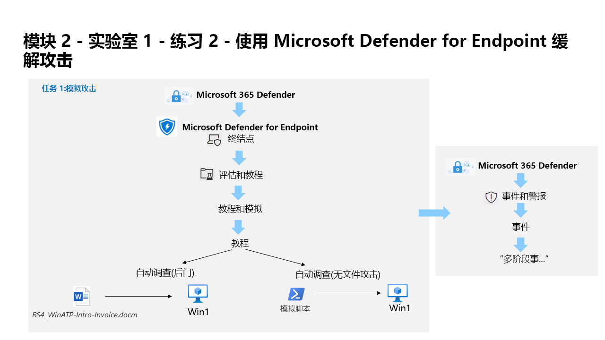

---
lab:
  title: 练习 2 - 使用 Microsoft Defender for Endpoint 缓解攻击
  module: Module 2 - Mitigate threats using Microsoft Defender for Endpoint
---

# 模块 2 - 实验室 1 - 练习 2 - 使用 Microsoft Defender for Endpoint 缓解攻击

## 实验室方案

You are a Security Operations Analyst working at a company that is implementing Microsoft Defender for Endpoint. Your manager plans to onboard a few devices to provide insight into required changes to the Security Operations (SecOps) team response procedures.

为了探索 Defender for Endpoint 的攻击缓解功能，你将运行两次模拟攻击。

### 任务 1：模拟攻击

在此任务中，你将运行两次模拟攻击，以探索 Microsoft Defender for Endpoint 的功能。

1. 如果尚未访问 Microsoft Edge 浏览器中的 Microsoft 365 Defender 门户，请转到 (https://security.microsoft.com) 并以租户的管理员身份登录。

1. 从菜单中的“终结点”下，选择“评估和教程”，然后从左侧选择“教程和模拟”  。

1. 选择“教程”选项卡。

1. Under <bpt id="p1">*</bpt>Automated investigation (backdoor)<ept id="p1">*</ept> you will see a message describing the scenario. Below this paragraph, click <bpt id="p1">**</bpt>Read the walkthrough<ept id="p1">**</ept>. A new browser tab opens which includes instructions to perform the simulation.

1. In the new browser tab, locate the section named <bpt id="p1">**</bpt>Run the simulation<ept id="p1">**</ept> (page 5, starting at step 2) and follow the steps to run the attack. <bpt id="p1">**</bpt>Hint:<ept id="p1">**</ept> The simulation file <bpt id="p2">*</bpt>RS4_WinATP-Intro-Invoice.docm<ept id="p2">*</ept> can be found back in portal, just below the <bpt id="p3">**</bpt>Read the walkthrough<ept id="p3">**</ept> you selected in the previous step by selecting the <bpt id="p4">**</bpt>Get simulation file<ept id="p4">**</ept> button. 

1. 重复最后 3 步，立即运行“自动调查(无文件攻击)”。

1. 在 Microsoft 365 Defender 门户中，从左侧菜单栏中选择“事件和警报”，然后选择“事件” 。

1. A new incident called "Multi-stage incident..." will appear in the right pane. Allow at least 5 minutes for the incident to appear. Click the incident name to load its details.

1. 选中“管理事件”按钮，此时将显示一个新的窗口边栏选项卡。 

1. 在“事件标记”下，键入“教程”，然后选择“教程(新建)”创建新标记 。 

1. 选择切换“分配给我”，将用户帐户添加为事件所有者。 

1. 在“分类”下，展开下拉菜单。 

1. 在“参考性预期活动”下，选择“安全测试” 。 

1. 如果需要，请添加注释，然后单击“保存”完成操作。

1. Review the contents of the Alerts, Devices, Users, Investigations, Evidence and Response, Graph tabs. <bpt id="p1">**</bpt>Hint:<ept id="p1">**</ept> Some tabs might be hidden due the size of your display. Select the ellipsis tab (...) to make them appear.

>你是一家公司的安全操作分析师，你的公司正在实施 Microsoft Defender for Endpoint。

## 你已完成本实验室。
