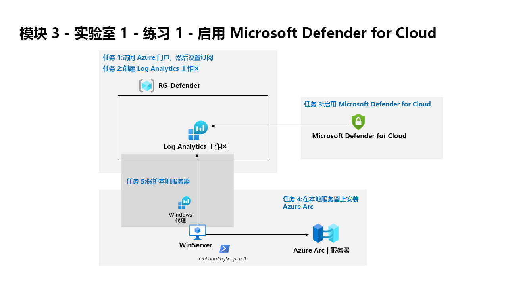

---
lab:
  title: 练习 1 - 启用 Microsoft Defender for Cloud
  module: Learning Path 3 - Mitigate threats using Microsoft Defender for Cloud
---

# 学习路径 3 - 实验室 1 - 练习 1 - 启用 Microsoft Defender for Cloud

## 实验室方案

你是一名安全运营分析师，你所在公司正在使用 Microsoft Defender for Cloud 实现云工作负载保护。  在此实验室中，你将启用 Microsoft Defender for Cloud。

>**注意：** 我们提供 **[交互式实验室模拟](https://mslabs.cloudguides.com/guides/SC-200%20Lab%20Simulation%20-%20Enable%20Microsoft%20Defender%20for%20Cloud)** ，让你能以自己的节奏点击浏览实验室。 你可能会发现交互式模拟与托管实验室之间存在细微差异，但演示的核心概念和思想是相同的。 

### 任务 1：访问 Azure 门户，然后设置订阅

在此任务中，你将设置完成本实验室和以后的实验室所需的 Azure 订阅。

1. 使用以下密码以管理员身份登录到 WIN1 虚拟机：Pa55w.rd 。  

1. 打开 Microsoft Edge 浏览器，如果已打开浏览器，则打开新选项卡。

1. 在 Microsoft Edge 浏览器中，导航到 Azure 门户 (https://portal.azure.com) )。

1. 在“登录”对话框中，复制并粘贴实验室托管提供者为管理员用户名提供的租户电子邮件帐户，然后选择“下一步” 。

1. 在“输入密码”对话框中，复制粘贴实验室托管提供者提供的管理员的租户密码，然后选择“登录” 。

1. 在 Azure 门户的搜索栏中，键入“订阅”，然后选择“订阅”。 

1. 选择显示的“Azure Pass - 赞助”订阅（或所选语言的等效名称）。

    >注意：如果未显示订阅，请向讲师咨询如何创建包含租户管理员用户凭据的 Azure 订阅。 **注意：** 订阅创建过程可能需要长达 10 分钟的时间。 

1. 选择“访问控制 (IAM)”，然后从“授予对此资源的访问权限”框中选择“添加角色分配”。

1. 选择“特权管理员角色”选项卡，然后选择“所有者” 。 选择“下一步”继续。

1. 在“成员”选项卡下，选择“+ 选择成员”，选择“MOD 管理员”帐户，然后选择“选择”以继续  。

    >**注意：** 如果“条件”选项卡显示红点，请选择“下一步”，如果显示“委派类型”，则选择“不受约束”；如果显示“用户可以执行的操作”，则选择“允许用户分配所有角色(高度特权)”********************。

1. 选择“查看 + 分配”两次，将所有者角色分配给管理员帐户。

>**重要提示：** 这些实验室已设计为在上课期间使用低于 10 美元的 Azure 服务。

### 任务 2：创建 Log Analytics 工作区

在此任务中，你将创建一个 Log Analytics 工作区，以与 Microsoft Defender for Cloud 配合使用。

1. 在 Azure 门户的搜索栏中，键入“Log Analytics 工作区”，然后选择相同的服务名称。

1. 从命令栏中选择“+ 创建”。

1. 为资源组选择“新建”。

1. 输入 RG-Defender，然后选择“确定”。

1. 对于“名称”，请输入唯一的名称，例如：uniquenameDefender。

1. 选择“查看 + 创建”  。

1. 工作区验证通过后，选择“创建”。 等待新工作区进行预配，这可能需要几分钟时间。

### 任务 3：启用 Microsoft Defender for Cloud

在此任务中，你将启用和配置 Microsoft Defender for Cloud。

1. 在 Azure 门户的搜索栏中，输入 Defender，然后选择“Microsoft Defender for Cloud”。

1. 在“开始”页面的“升级”选项卡下，确保订阅已选中，然后选择页面底部的“升级”按钮  。 等待显示“试用已启动”通知，大约需要 2 分钟。 

    >提示：可以单击顶部栏中的铃声按钮，查看 Azure 门户通知。

    >注意：如果看到错误“无法在订阅上启动 Azure Defender 试用版”，请继续执行后续步骤，以在步骤 5 中启用所有 Defender 计划。

1. 在 Microsoft Defender for Cloud 的左侧菜单中的“管理”下，选择“环境设置”。

1. 选择“Azure Pass - 赞助”订阅（或所选语言的等效名称）。 

1. 查看现在受 Defender for Cloud 计划保护的 Azure 资源。

    >重要说明：如果所有 Defender 计划均为“禁用”，请选择“启用所有计划”，然后单击“保存” 。 等待“订阅 Azure Pass 中的资源计划已成功保存!” 通知。

1. 从“设置”区域（“保存”旁边）选择“设置和监视”选项卡。

1. 查看监视扩展。 它包括虚拟机、容器和存储帐户的配置。 选择页面右上角的“X”，关闭“设置和监视”页面。

1. 选择页面右上角的“X”关闭设置页面，返回到“环境设置”，然后选择订阅左侧的“>”。

1. 选择之前创建的 Log Analytics 工作区“uniquenameDefender”，查看可用选项和定价。

1. 选择“启用所有计划”（在“选择 Defender 计划”的右侧），然后选择“保存” 。 等待显示“已成功保存工作区 uniquenameDefender 的 Microsoft Defender 计划！” 通知。

    >**注意：** 如果页面未显示，请刷新 Microsoft Edge 浏览器，然后重试。

1. 选择页面右上角的“X”关闭 Defender 计划页面，返回到“环境设置”

### 任务 4：在本地服务器上安装 Azure Arc

在此任务中，你将在本地服务器上安装 Azure Arc，以便更轻松地加入。

>**重要提示：** 接下来的步骤将在另一台计算机上完成，而不是你之前使用的计算机。 查找虚拟机名称引用。

1. 使用以下密码以管理员身份登录到 WINServer 虚拟机：Passw0rd! （如果需要）。  

1. 打开 Microsoft Edge 浏览器并导航到 Azure 门户 (https://portal.azure.com )。

1. 在“登录”对话框中，复制粘贴实验室托管提供者提供的租户电子邮件帐户，然后选择“下一步”  。

1. 在“输入密码”对话框中，复制粘贴实验室托管提供者提供的租户密码，然后选择“登录”  。

1. 在 Azure 门户的搜索栏中，键入“Arc”，然后选择“Azure Arc”。

1. 在“Azure Arc 资源”下的导航窗格中选择“计算机”********

1. 选择“**+ 添加/创建**”，然后选择“**添加计算机**”。

1. 在“添加单个服务器”部分选择“生成脚本”。

    <!--- 1. Read through the *Prerequisites* tab and then select **Next** to continue.--->

1. 在“使用 Azure Arc 添加服务器”页面中，在“项目详细信息”下选择之前创建的资源组 。 提示：RG-Defender

    >**注意：** 如果尚未创建资源组，请打开另一个选项卡并创建资源组，然后重新开始。

1. 对于“区域”，请从下拉列表中选择“(美国)美国东部”。

1. 查看“服务器详细信息”和“连接方法”选项 。 保留默认值并选择“下一步”，以转到“标记”选项卡。

1. 查看默认可用的标记。 选择“下一步”，转到“下载并运行脚本”选项卡。

1. 向下滚动并选择“下载”按钮。 提示：如果浏览器阻止下载，请在浏览器中执行操作以允许下载。 在 Microsoft Edge 浏览器中，根据需要选择省略号按钮 (...)，然后选择“保留”。

1. 右键单击 Windows 的“开始”按钮，然后选择“Windows PowerShell (管理员)”。

1. 在“用户名”中输入“Administrator”，在“密码”中输入“Passw0rd!” （如果收到 UAC 提示）。

1. 输入：cd C:\Users\Administrator\Downloads

    >重要提示：如果没有此目录，最有可能意味着你使用的是错误的计算机。 返回任务 4 的开头，更改为 WINServer 并重新启动。

1. 键入“Set-ExecutionPolicy -ExecutionPolicy Unrestricted”，然后按 Enter。

1. 输入“A”，表示全部接受，然后按 Enter。

1. 键入“.\OnboardingScript.ps1”，然后按 Enter。  

    >**重要提示：** 如果收到错误“无法识别术语 .\OnboardingScript.ps1...”，请确保是在 WINServer 虚拟机中执行任务 4 的步骤。 其他问题可能是由于多次下载导致文件名称更改，请在运行目录中搜索“.\OnboardingScript (1).ps1”或其他文件编号。

1. 输入 R 以运行一次，然后按 Enter（这可能需要几分钟时间）。

1. 安装过程将打开新的 Edge 浏览器标签页，以对 Azure Arc 代理进行身份验证。 选择管理员帐户，等待消息“身份验证完成”，然后返回到 Windows PowerShell 窗口。

1. 安装完成后，返回到下载脚本的 Azure 门户页面，然后选择“关闭”。 关闭“**使用 Azure Arc 添加服务器**”，以返回到 Azure Arc“**计算机**”页面。

1. 选择“刷新”，直到显示 WINServer 服务器名称，且状态为“已连接”。

    >注意：这可能需要几分钟。

### 任务 5：保护本地服务器

在此任务中，你将通过在“WINServer”虚拟机上添加“数据收集规则 (DCR)”来手动安装“Azure Monitor 代理”。

1. 转到“Microsoft Defender for Cloud”，然后在左菜单中选择“入门”页面 。

1. 选择“入门”选项卡。

1. 向下滚动并选择“添加非 Azure 服务器”部分下的“配置”。

1. 选择之前创建的工作区旁边的“升级”。 这可能需要几分钟时间，请等待，直到看到通知“工作区 uniquenameDefender 的 Microsoft Defender 计划已成功保存!”。

1. 选择之前创建的工作区旁边的“+ 添加服务器”。

1. 选择“数据收集规则”

1. 选择“+ 新建”。

1. 为“规则名称”输入“WINServer”。

1. 选择“Azure Pass - 赞助”订阅，然后选择资源组。 提示：RG-Defender

1. 可以保留默认的“美国东部”区域，也可以选择其他首选位置。

1. 选择“平台类型”的“Windows”单选按钮，然后选择“下一步: 资源”。

1. 在“资源”选项卡中，选择“+ 添加资源” 。

1. 在“选择范围”页中，展开“RG-Defender”（或你创建的资源组）的“范围”列，然后选择“WINServer”并选择“应用”。

    >注意：如果未显示“WINServer”，则可能需要将“资源类型”的列筛选器设置为“Server-Azure Arc”。

1. 选择“下一步: 收集和传送”

1. 在“收集和传送”选项卡中，选择“+ 添加数据源”

1. 在“添加数据源”页中，从“数据源类型”中选择“性能计数器”。

    >注意：对于本实验室，可以选择“Windows 事件日志”。 这些选择稍后可以修改。

1. 单击“目标”选项卡****

1. 在“目标类型”下拉列表中选择“Azure Monitor 日志”********

1. 从“订阅”下拉列表中选择“Azure Pass - 赞助”订阅******

1. 选择工作区名称“提示”：**** 从“帐户或命名空间”下拉列表中选择“RG-Defender”******

1.  选择“添加数据源”，然后选择“查看 + 创建”

1. 显示“验证通过”后，选择“创建”。

1. “数据收集规则”创建启动在“WINServer”上安装“AzureMonitorWindowsAgent”扩展。

1. “数据收集规则”创建完成后，在“搜索资源、服务和文档”搜索栏中输入“WINServer”，然后从“资源”中选择“WINServer”。

1. 在“WINServer”上，向下滚动左侧菜单直到“设置”和“扩展”。

1. “AzureMonitorWindowsAgent”应列出且“状态”为“成功”。

1. 可以继续下一个实验室，稍后再返回查看“Microsoft Defender for Cloud”的“清单”部分以验证是否包括“WINServer”。

## 继续进行练习 2
