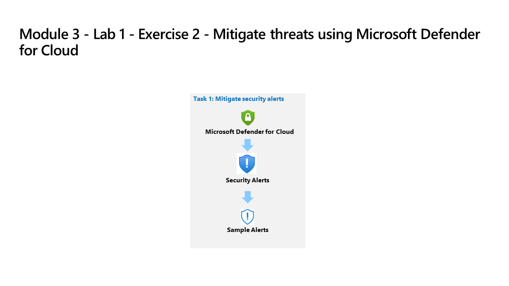

---
lab:
  title: 练习 2 - 使用 Microsoft Defender for Cloud 缓解威胁
  module: Module 3 - Mitigate threats using Microsoft Defender for Cloud
ms.openlocfilehash: 50d77067c70634a4f887a7c8669b38fa7977b860
ms.sourcegitcommit: a90325f86a3497319b3dc15ccf49e0396c4bf749
ms.translationtype: HT
ms.contentlocale: zh-CN
ms.lasthandoff: 04/07/2022
ms.locfileid: "141493957"
---
# 模块 3 - 实验室 1 - 练习 2 - 使用 Microsoft Defender for Cloud 缓解威胁

## 实验室方案

你是一位安全运营分析师，你所在公司已实现 Microsoft Defender for Cloud。 你负责应对由 Microsoft Defender for Cloud 生成的安全警报。

### 任务 1：缓解安全警报

在此任务中，你将加载示例安全警报并查看警报详细信息。

>**重要提示：** 接下来的步骤将在另一台计算机上完成，而不是你之前使用的计算机。 查找虚拟机名称引用。

1. 使用以下密码以管理员身份登录到 WIN1 虚拟机：**Pa55w.rd**。  

1. 在 Edge 浏览器中，打开 Azure 门户 (https://portal.azure.com) )。

1. 在“登录”对话框中，复制粘贴实验室托管提供者提供的租户电子邮件帐户，然后选择“下一步”  。

1. 在“输入密码”对话框中，复制粘贴实验室托管提供者提供的租户密码，然后选择“登录”  。

1. 在 Azure 门户的搜索栏中，键入 Defender，然后选择“Microsoft Defender for Cloud”。

1. 在门户菜单的“常规”下选择“安全警报”。

1. 从命令栏选择“示例警报”。 提示：可能需要从命令栏中选择省略号 (...) 按钮。

1. 在“创建示例警报(预览)”窗格中，确保已选择你的订阅。 确保在 Defender for Cloud 计划区域中选中所有示例警报，然后选择“创建示例警报”。  

    >**注意：** 此示例警报创建过程可能需要几分钟时间才能完成，请等待“已成功创建示例警报”通知。 完成后，每个警报都应显示在安全警报区域。

1. 对于引起你注意的警报，请执行以下操作：

    - 选择警报，随即应会显示有关警报的信息。 选择“查看完整的详细信息”。

    - 查看并阅读“警报详细信息”选项卡。

    - 选择“执行操作”选项卡，或选择页面底部的“下一步:执行操作”按钮。

    - 查看“执行操作”信息。 请注意，可用于执行操作的部分取决于警报类型：缓解威胁、防止将来的攻击、触发自动响应、抑制类似警报。

## 你已完成本实验室。
