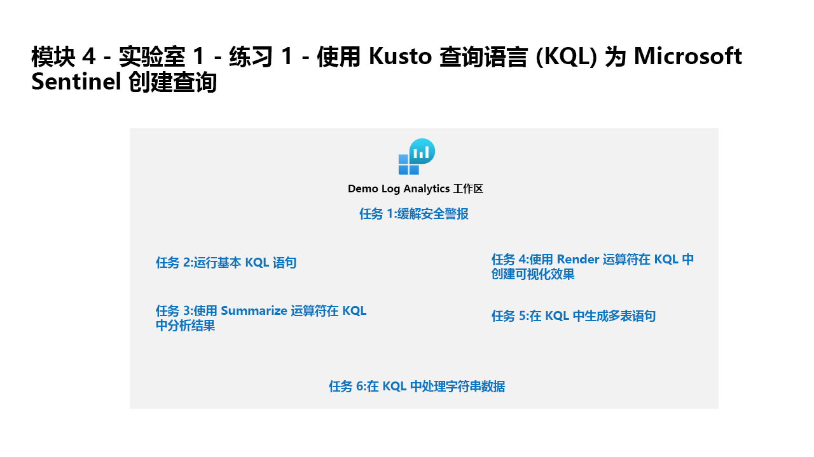

---
lab:
  title: 练习 1 - 使用 Kusto 查询语言 (KQL) 为 Microsoft Sentinel 创建查询
  module: Learning Path 4 - Create queries for Microsoft Sentinel using Kusto Query Language (KQL)
---

# 学习路径 4 - 实验室 1 - 练习 1 - 使用 Kusto 查询语言 (KQL) 为 Microsoft Sentinel 创建查询

## 实验室方案



你是一位安全运营分析师，你所在公司正在实现 Microsoft Sentinel。 你负责执行日志数据分析，以便搜索恶意活动、显示可视化效果并执行威胁搜寻。 为了查询日志数据，你使用 Kusto 查询语言 (KQL)。

>**注意：** 我们提供 **[交互式实验室模拟](https://mslabs.cloudguides.com/guides/SC-200%20Lab%20Simulation%20-%20Create%20queries%20for%20Microsoft%20Sentinel%20using%20Kusto%20Query%20Language)** ，让你能以自己的节奏点击浏览实验室。 你可能会发现交互式模拟与托管实验室之间存在细微差异，但演示的核心概念和思想是相同的。

>**重要提示：** 此实验室需要将大量 KQL 脚本输入到 Microsoft Sentinel 中。 这些脚本是在此实验室开始时的文件中提供的。 另一个下载这些脚本的位置是： https://github.com/MicrosoftLearning/SC-200T00A-Microsoft-Security-Operations-Analyst/tree/master/Allfiles


### 任务 1：访问 KQL 测试区域

在此任务中，你将访问 Log Analytics 环境，可在其中练习编写 KQL 语句。

1. 使用密码 Pa55w.rd 以管理员身份登录到 WIN1 虚拟机 。  

1. 在浏览器中转到 https://aka.ms/lademo。 使用 MOD 管理员凭据登录。

1. 关闭出现的 Log Analytics 视频弹出窗口。

1. 浏览屏幕左侧选项卡中列出的可用表。

1. 在查询编辑器中，输入以下查询，然后选择“运行”按钮。 你应该会在底部窗口中看到查询结果。

    ```KQL
    SecurityEvent
    ```

1. 注意，你已达到最大结果数 (30,000)。

1. 在查询窗口中将时间范围更改为“过去 30 分钟”。

1. 在第一条记录旁边，选择“>”以展开该行的信息。


### 任务 2：运行基本的 KQL 语句

在此任务中，你将生成基本的 KQL 语句。

>重要说明：对于每个查询，都应先从查询窗口中清除之前的语句，或是在最后打开的选项卡（最多 25 个）之后选择 + 打开一个新的查询窗口 。

1. 以下语句演示 search 运算符，该运算符在表的所有列中搜索值。 

1. 在查询窗口中将时间范围更改为“过去 30 分钟”。

1. 在“查询”窗口中，输入以下语句，然后选择“运行”：

    ```KQL
    search "location"
    ```

    >**注意：** 使用 Search 运算符时，没有特定表或限定子句的情况比特定于表和特定于列的文本筛选时的情况效率低。**

1. 以下语句演示了在 in 子句中列出的表中进行搜索 。 在“查询”窗口中，输入以下语句，然后选择“运行”： 

    ```KQL
    search in (SecurityEvent,App*) "new"
    ```

1. 在“查询”窗口中将“事件范围”更改回“过去 24 小时” 。

1. 以下语句演示了 where 运算符，该运算符按特定谓词进行筛选。 在“查询”窗口中，输入以下语句，然后选择“运行”： 

    >重要说明：从下面的代码块中输入每个查询后，应选择“运行” 。

    ```KQL
    SecurityEvent  
    | where TimeGenerated > ago(1h)
    ```

    >注意：“时间范围”现在显示“在查询中设置”，因为我们使用 TimeGenerated 列进行筛选 。

    ```KQL
    SecurityEvent  
    | where TimeGenerated > ago(1h) and EventID == 4624
    ```

    ```KQL
    SecurityEvent  
    | where TimeGenerated > ago(1h)
    | where EventID == 4624  
    | where AccountType =~ "user"
    ```

    ```KQL
    SecurityEvent  
    | where TimeGenerated > ago(1h) and EventID in (4624, 4625)
 
    ```

1. 下面的语句演示了将 let 语句用于声明变量的用法。 在“查询”窗口中，输入以下语句，然后选择“运行”： 

    ```KQL
    let timeOffset = 1h;
    let discardEventId = 4688;
    SecurityEvent
    | where TimeGenerated > ago(timeOffset*2) and TimeGenerated < ago(timeOffset)
    | where EventID != discardEventId
    ```

1. 以下语句演示了将 let 语句用于声明动态列表的用法。 在“查询”窗口中，输入以下语句，然后选择“运行”： 

    ```KQL
    let suspiciousAccounts = datatable(account: string) [
      @"NA\timadmin", 
      @"NT AUTHORITY\SYSTEM"
    ];
    SecurityEvent  
    | where TimeGenerated > ago(1h)
    | where Account in (suspiciousAccounts)
    ```

    >**** 提示：在“查询”窗口中选择省略号 (...)，然后选择“设置查询格式”，可以轻松地重新设置查询格式****。

1. 以下语句演示了将 let 语句用于声明动态表的用法。 在“查询”窗口中，输入以下语句，然后选择“运行”： 

    ```KQL
    let LowActivityAccounts =
        SecurityEvent 
        | summarize cnt = count() by Account 
        | where cnt < 1000;
    LowActivityAccounts | where Account contains "sql"
    ```

1. 在“查询”窗口中将“时间范围”更改为“过去 1 小时” 。 这将限制以下语句的结果。

1. 以下语句演示了 extend 运算符，该运算符创建计算列，并将其添加到结果集。 在“查询”窗口中，输入以下语句，然后选择“运行”： 

    ```KQL
    SecurityEvent  
    | where TimeGenerated > ago(1h) 
    | where ProcessName != "" and Process != "" 
    | extend StartDir =  substring(ProcessName,0, string_size(ProcessName)-string_size(Process))
    ```

1. 以下语句演示了 order by 运算符，该运算符按一列或多列以按升序或降序对输入表的行进行排序。 order by 运算符是 sort by 运算符的别名 。 在“查询”窗口中，输入以下语句，然后选择“运行”： 

    ```KQL
    SecurityEvent  
    | where TimeGenerated > ago(1h) 
    | where ProcessName != "" and Process != "" 
    | extend StartDir =  substring(ProcessName,0, string_size(ProcessName)-string_size(Process)) 
    | order by StartDir desc, Process asc
    ```

1. 以下语句演示了 project 运算符，该运算符按指定的顺序选择要包括的列。 在“查询”窗口中，输入以下语句，然后选择“运行”： 

    ```KQL
    SecurityEvent  
    | where TimeGenerated > ago(1h) 
    | where ProcessName != "" and Process != "" 
    | extend StartDir =  substring(ProcessName,0, string_size(ProcessName)-string_size(Process)) 
    | order by StartDir desc, Process asc 
    | project Process, StartDir
    ```

1. 以下语句演示了 project-away 运算符，该运算符选择要从输出中排除的列。 在“查询”窗口中，输入以下语句，然后选择“运行”： 

    ```KQL
    SecurityEvent  
    | where TimeGenerated > ago(1h) 
    | where ProcessName != "" and Process != "" 
    | extend StartDir =  substring(ProcessName,0, string_size(ProcessName)-string_size(Process)) 
    | order by StartDir desc, Process asc 
    | project-away ProcessName
    ```


### 任务 3：使用 Summarize 运算符分析 KQL 中的结果

在此任务中，你将生成 KQL 语句来聚合数据。 Summarize 根据 by 分组列对行进行分组，并计算每个组的聚合 。

1. 以下语句演示了 count() 函数，该函数返回组的计数。 在“查询”窗口中，输入以下语句，然后选择“运行”： 

    ```KQL
    SecurityEvent  
    | where TimeGenerated > ago(1h) and EventID == 4688  
    | summarize count() by Process, Computer
    ```

1. 以下语句演示了 count() 函数，但在本示例中，我们将列命名为 cnt。 在“查询”窗口中，输入以下语句，然后选择“运行”： 

    ```KQL
    SecurityEvent  
    | where TimeGenerated > ago(1h) and EventID == 4624  
    | summarize cnt=count() by AccountType, Computer
    ```

1. 以下语句演示了 dcount() 函数，该函数返回组元素的近似非重复计数。 在“查询”窗口中，输入以下语句，然后选择“运行”： 

    ```KQL
    SecurityEvent  
    | where TimeGenerated > ago(1h)
    | summarize dcount(IpAddress)
    ```

1. 以下语句是用于检测同一帐户的多个应用程序中的密码无效故障的规则。 在“查询”窗口中，输入以下语句，然后选择“运行”： 

    ```KQL
    let timeframe = 30d;
    let threshold = 1;
    SigninLogs
    | where TimeGenerated >= ago(timeframe)
    | where ResultDescription has "Invalid password"
    | summarize applicationCount = dcount(AppDisplayName) by UserPrincipalName, IPAddress
    | where applicationCount >= threshold
    ```

1. 以下语句演示了 arg_max() 函数，该函数在参数最大化时返回一个或多个表达式。 以下语句将从计算机 SQL10.NA.contosohotels.com 的 SecurityEvent 表中返回最新行。 arg_max 函数中的 * 请求该行的所有列。 在“查询”窗口中，输入以下语句，然后选择“运行”： 

    ```KQL
    SecurityEvent  
    | where Computer == "SQL10.na.contosohotels.com"
    | summarize arg_max(TimeGenerated,*) by Computer
    ```

1. 以下语句演示了 arg_min() 函数，该函数在参数最小化时返回一个或多个表达式。 在此语句中，计算机 SQL10.NA.contosohotels.com 的最早 SecurityEvent 将作为结果集返回。 在“查询”窗口中，输入以下语句，然后选择“运行”： 

    ```KQL
    SecurityEvent  
    | where Computer == "SQL10.na.contosohotels.com"
    | summarize arg_min(TimeGenerated,*) by Computer
    ```

1. 以下语句演示了根据“管道”顺序理解结果的重要性。 在“查询”窗口中，输入以下查询并单独运行每个查询： 

    1. “查询 1”将提供最后一次活动为“登录”的帐户。 首先汇总 SecurityEvent 表并返回每个帐户的最新行。 然后，将只返回 EventID 等于 4624（登录）的行。

        ```KQL
        SecurityEvent  
        | summarize arg_max(TimeGenerated, *) by Account 
        | where EventID == 4624  
        ```

    1. 查询 2 将具有已登录的帐户的最新登录。 SecurityEvent 表将被筛选为仅包含 EventID = 4624。 然后，将按帐户为最新登录行汇总这些结果。

        ```KQL
        SecurityEvent  
        | where EventID == 4624  
        | summarize arg_max(TimeGenerated, *) by Account
        ```

    >**注意：** 还可以通过选择右下角的“查询详细信息”链接查看“总 CPU”和“用于已处理查询的数据”，并对两种语句之间的数据进行比较。

1. 以下语句演示了 make_list() 函数，该函数返回组中所有值的列。 此 KQL 查询将首先使用 where 运算符筛选 EventID。 接下来，对于每台计算机，结果都是帐户的 JSON 数组。 生成的 JSON 数组将包含重复的帐户。 在“查询”窗口中，输入以下语句，然后选择“运行”： 

    ```KQL
    SecurityEvent  
    | where TimeGenerated > ago(1h)
    | where EventID == 4624  
    | summarize make_list(Account) by Computer
    ```

1. 以下语句演示了 make_set() 函数，该函数返回组中的一组非重复值。 此 KQL 查询将首先使用 where 运算符筛选 EventID。 接下来，对于每台计算机，结果都是唯一帐户的 JSON 数组。 在“查询”窗口中，输入以下语句，然后选择“运行”： 

    ```KQL
    SecurityEvent  
    | where TimeGenerated > ago(1h)
    | where EventID == 4624  
    | summarize make_set(Account) by Computer
    ```


### 任务 4：使用 Render 运算符以 KQL 创建可视化效果

在此任务中，你将使用 KQL 语句生成可视化效果。

1. 以下语句演示使用 barchart 可视化效果的 render 运算符（将结果呈现为图形输出） 。 在“查询”窗口中，输入以下语句，然后选择“运行”： 

    ```KQL
    SecurityEvent  
    | where TimeGenerated > ago(1h)
    | summarize count() by Account
    | render barchart
    ```

1. 以下语句演示了使用时序直观呈现结果的 render 运算符。 bin() 函数对时间范围内的所有值进行舍入并将它们分组，经常与 summarize 结合使用 。 如果你有一组分散的值，则这些值将分组为更小的一组特定值。 将生成的结果组合在一起，并通过管道将其传送到具有时间图表的 render 运算符，可以提供时序可视化效果 。 在“查询”窗口中，输入以下语句，然后选择“运行”： 

    ```KQL
    SecurityEvent  
    | where TimeGenerated > ago(1h)
    | summarize count() by bin(TimeGenerated, 1m)
    | render timechart
    ```


### 任务 5：使用 KQL 生成多表语句

在此任务中，你将生成多表 KQL 语句。

1. 在“查询”窗口中将“时间范围”更改为“过去 1 小时” 。 这将限制以下语句的结果。

1. 以下语句演示了 union 运算符，该运算符采用两个或更多个表，并返回所有表的行。 有必要了解结果是如何通过管道符号传递的，又是如何受到该字符影响的。 在“查询”窗口中，输入以下语句，并分别针对每个查询选择“运行”以查看结果： 

    1. 查询 1 将返回 SecurityEvent 的所有行和 SigninLogs 的所有行。

        ```KQL
        SecurityEvent  
        | union SigninLogs  
        ```

    1. 查询 2 将返回一行和一列，也就是 SigninLogs 的所有行和 SecurityEvent 的所有行的计数。

        ```KQL
        SecurityEvent  
        | union SigninLogs  
        | summarize count() 
        ```

    1. 查询 3 将返回 SecurityEvent 的所有行和 SigninLogs 的最后一行。 SigninLogs 的最后一行将包含总行数的汇总计数。

        ```KQL
        SecurityEvent  
        | union (SigninLogs | summarize count() | project count_)
        ```

    >注意：结果中的“空行”将显示 SigninLogs 的汇总计数。

1. 以下语句演示了 union 运算符支持将多个表与通配符联合。 在“查询”窗口中，输入以下语句，然后选择“运行”： 

    ```KQL
    union App*  
    | summarize count() by Type
    ```

1. 以下语句演示了 join 运算符，该运算符通过匹配每个表中指定列的值来合并两个表的行以形成新表。 在“查询”窗口中，输入以下语句，然后选择“运行”： 

    ```KQL
    SecurityEvent  
    | where EventID == 4624 
    | summarize LogOnCount=count() by  EventID, Account
    | project LogOnCount, Account
    | join kind = inner( 
     SecurityEvent  
    | where EventID == 4634 
    | summarize LogOffCount=count() by  EventID, Account
    | project LogOffCount, Account
    ) on Account
    ```

    >**重要提示：** 联接中指定的第一个表被看作是左表。 join 运算符后面的表被看作是右表。 处理表中的列时，名称 $left.Column 和 $right.Column 用于区分正在引用哪个表的列。 join 运算度支持一系列完整的类型：flouter、inner、innerunique、leftanti、leftantisemi、leftouter、leftsemi、rightanti、rightantisemi、rightouter、rightsemi。

1. 在“查询”窗口中将“事件范围”更改回“过去 24 小时” 。


### 任务 6：使用 KQL 处理字符串数据

在此任务中，你将使用 KQL 语句处理结构化和非结构化的字符串字段。

1. 以下语句演示了 extract 函数，该函数从源字符串获取正则表达式的匹配项。 可以选择将提取的子字符串转换为指定的类型。 在“查询”窗口中，输入以下语句，然后选择“运行”： 

    ```KQL
    print extract("x=([0-9.]+)", 1, "hello x=45.6|wo") == "45.6"
    ```

1. 以下语句使用 extract 函数从 SecurityEvent 表的“帐户”字段中提取“帐户名称”。 在“查询”窗口中，输入以下语句，然后选择“运行”： 

    ```KQL
    SecurityEvent  
    | where EventID == 4672 and AccountType == 'User' 
    | extend Account_Name = extract(@"^(.*\\)?([^@]*)(@.*)?$", 2, tolower(Account))
    | summarize LoginCount = count() by Account_Name
    | where Account_Name != "" 
    | where LoginCount < 10
    ```

1. 下面的语句演示 parse 运算符，该运算符计算字符串表达式并将其值分析为一个或多个计算列。 用于构造非结构化数据。 在“查询”窗口中，输入以下语句，然后选择“运行”： 

    ```KQL
    let Traces = datatable(EventText:string)
    [
    "Event: NotifySliceRelease (resourceName=PipelineScheduler, totalSlices=27, sliceNumber=23, lockTime=02/17/2016 08:40:01, releaseTime=02/17/2016 08:40:01, previousLockTime=02/17/2016 08:39:01)",
    "Event: NotifySliceRelease (resourceName=PipelineScheduler, totalSlices=27, sliceNumber=15, lockTime=02/17/2016 08:40:00, releaseTime=02/17/2016 08:40:00, previousLockTime=02/17/2016 08:39:00)",
    "Event: NotifySliceRelease (resourceName=PipelineScheduler, totalSlices=27, sliceNumber=20, lockTime=02/17/2016 08:40:01, releaseTime=02/17/2016 08:40:01, previousLockTime=02/17/2016 08:39:01)",
    "Event: NotifySliceRelease (resourceName=PipelineScheduler, totalSlices=27, sliceNumber=22, lockTime=02/17/2016 08:41:01, releaseTime=02/17/2016 08:41:00, previousLockTime=02/17/2016 08:40:01)",
    "Event: NotifySliceRelease (resourceName=PipelineScheduler, totalSlices=27, sliceNumber=16, lockTime=02/17/2016 08:41:00, releaseTime=02/17/2016 08:41:00, previousLockTime=02/17/2016 08:40:00)"
    ];
    Traces   
    | parse EventText with * "resourceName=" resourceName ", totalSlices=" totalSlices:long * "sliceNumber=" sliceNumber:long * "lockTime=" lockTime ", releaseTime=" releaseTime:date "," * "previousLockTime=" previousLockTime:date ")" *  
    | project resourceName, totalSlices, sliceNumber, lockTime, releaseTime, previousLockTime
    ```

1. 以下语句演示如何使用动态字段，这些字段很特殊，因为它们可以采用其他数据类型的任何值。 在本例中，SigninLogs 表中的 DeviceDetail 字段属于动态类型。 在“查询”窗口中，输入以下语句，然后选择“运行”： 

    ```KQL
    SigninLogs 
    | extend OS = DeviceDetail.operatingSystem
    ```

1. 以下示例演示如何为 SigninLogs 拆分打包字段。 在“查询”窗口中，输入以下语句，然后选择“运行”： 

    ```KQL
    SigninLogs 
    | extend OS = DeviceDetail.operatingSystem, Browser = DeviceDetail.browser 
    | extend StatusCode = tostring(Status.errorCode), StatusDetails = tostring(Status.additionalDetails) 
    | extend Date = startofday(TimeGenerated) 
    | summarize count() by Date, Identity, UserDisplayName, UserPrincipalName, IPAddress, ResultType, ResultDescription, StatusCode, StatusDetails 
    | sort by Date
    ```

    >**重要提示：** 尽管动态类型看起来类似于 JSON，但它可以保存 JSON 模型不表示的值，因为它们在 JSON 中不存在。 因此，在将动态值序列化为 JSON 表示形式时，JSON 无法表示的值将序列化为字符串值。 

1. 以下语句演示了用于操作存储在字符串字段中的 JSON 的运算符。 许多日志以 JSON 格式提交数据，这要求了解如何将 JSON 数据转换为可查询的字段。 在“查询”窗口中，输入以下语句，然后选择“运行”： 

    ```KQL
    SigninLogs 
    | extend AuthDetails =  parse_json(AuthenticationDetails) 
    | extend AuthMethod =  AuthDetails[0].authenticationMethod 
    | extend AuthResult = AuthDetails[0].["authenticationStepResultDetail"] 
    | project AuthMethod, AuthResult, AuthDetails 
    ```

1. 以下语句演示了 mv-expand 运算符，该运算符将动态数组转换为行（多值展开）。

    ```KQL
    SigninLogs 
    | mv-expand AuthDetails = parse_json(AuthenticationDetails) 
    | project AuthDetails
    ```

1. 选择“>”展开第一行，然后在 AuthDetails 旁边再次选择该符号以查看展开的结果。

1. 以下语句演示了 mv-apply 运算符，该运算符将子查询应用于每条记录并返回所有子查询结果的并集。

    ```KQL
    SigninLogs 
    | mv-apply AuthDetails = parse_json(AuthenticationDetails) on
    (where AuthDetails.authenticationMethod == "Password")
    ```

1. 函数是一种日志查询，可使用保存的名称作为命令在其他日志查询中使用。 若要创建函数，请在运行查询后，选择“保存”按钮，然后从下拉列表中选择“另存为函数”  。 在“函数名称”框中输入所需的名称（例如：PrivLogins），然后输入一个旧类别（例如 ：“常规”），然后选择“保存”。 通过使用函数别名，该功能将以 KQL 提供：

    >**注意：** 由于你的帐户只有读取者权限，因此无法在用于本实验室的 lademo 环境中执行此操作，但这是一个重要的概念，可以使查询更加高效和有效。 

    ```KQL
    PrivLogins  
    ```

## 你已完成本实验室。
