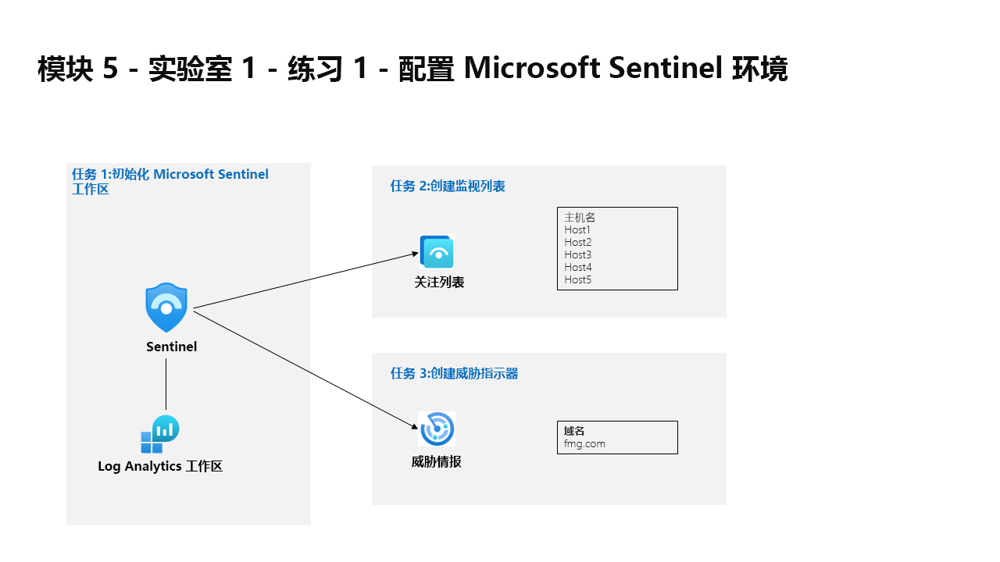

---
lab:
  title: 练习 1 - 配置 Microsoft Sentinel 环境
  module: Module 5 - Configure your Microsoft Sentinel environment
---

# <a name="module-5---lab-1---exercise-1---configure-your-microsoft-sentinel-environment"></a>模块 5 - 实验室 1 - 练习 1 - 配置 Microsoft Sentinel 环境

## <a name="lab-scenario"></a>实验室方案



You are a Security Operations Analyst working at a company that is implementing Microsoft Sentinel. You are responsible for setting up the Microsoft Sentinel environment to meet the company requirement to minimize cost, meet compliance regulations, and provide the most manageable environment for your security team to perform their daily job responsibilities.


### <a name="task-1-initialize-the-microsoft-sentinel-workspace"></a>任务 1：初始化 Microsoft Sentinel 工作区

在此任务中，你将创建 Microsoft Sentinel 工作区。

1. 使用以下密码以管理员身份登录到 WIN1 虚拟机：Pa55w.rd 。  

1. 打开 Microsoft Edge 浏览器。

1. 在 Microsoft Edge 浏览器中，导航到 Azure 门户 (https://portal.azure.com )。

1. 在“登录”对话框中，复制粘贴实验室托管提供者提供的租户电子邮件帐户，然后选择“下一步”  。

1. 在“输入密码”对话框中，复制粘贴实验室托管提供者提供的租户密码，然后选择“登录”  。

1. 在 Azure 门户的搜索栏中，键入“Sentinel”，然后选择“Microsoft Sentinel”。

1. 选择“+ 新建”。 

1. Next, select the Log Analytics workspace you created earlier, for example <bpt id="p1">*</bpt>uniquenameDefender<ept id="p1">*</ept> and select <bpt id="p2">**</bpt>Add<ept id="p2">**</ept>. The activation could take a few minutes.

    >**注意：** 如果在此处未看到 Log Analytics 工作区，请参阅模块 3 练习 1 任务 2 以创建一个工作区。

1. 浏览新建的 Microsoft Sentinel 工作区以熟悉用户界面选项。


### <a name="task-2-create-a-watchlist"></a>任务 2：创建监视列表

在此任务中，你将在 Microsoft Sentinel 中创建监视列表。

1. In the search box at the bottom of the Windows 10 screen, enter <bpt id="p1">*</bpt>Notepad<ept id="p1">*</ept>. Select <bpt id="p1">**</bpt>Notepad<ept id="p1">**</ept> from the results.

1. 键入“主机名”，然后输入新行。

1. 从记事本的第 2 行复制以下主机名，每个主机名位于不同的行中：

    ```Notepad
    Host1
    Host2
    Host3
    Host4
    Host5
    ```

1. From the menu select, <bpt id="p1">**</bpt>File - Save As<ept id="p1">**</ept>, Name the file <bpt id="p2">*</bpt>HighValue.csv<ept id="p2">*</ept>, change the file type to <bpt id="p3">**</bpt>All files(<bpt id="p4">*</bpt>.<ept id="p4">*</ept>)<ept id="p3">**</ept> and select <bpt id="p5">**</bpt>Save<ept id="p5">**</ept>. <bpt id="p1">**</bpt>Hint:<ept id="p1">**</ept> The file can be saved in the <bpt id="p2">*</bpt>Documents<ept id="p2">*</ept> folder.

1. 关闭记事本。

1. 在 Microsoft Sentinel 中的“配置”区域下，选择“监视列表”选项。

1. 从命令栏中选择“+ 添加新增”。

1. 在 Watchlist 向导中，输入以下内容：

    |常规设置|值|
    |---|---|
    |名称|HighValueHosts|
    |说明|高价值主机|
    |监视列表别名|HighValueHosts|

1. 选择“下一步:源 >”。

1. 选择“上传文件”下的“浏览文件”，然后浏览刚创建的 HighValue.csv 文件 。

1. 在“SearchKey”字段中，选择“主机名”。

1. 选择“下一页:查看和创建 >”。

1. 检查输入的设置，然后选择“创建”。

1. 屏幕返回到“监视列表”页。

1. 选择“HighValueHosts”监视列表，然后在右侧选项卡上，选择“在日志中查看”。

    ><bpt id="p1">**</bpt>Important:<ept id="p1">**</ept> It could take some time for the watchlist to appear. <bpt id="p1">**</bpt>Please continue to with the following task and run this command on the next lab<ept id="p1">**</ept>.
    
    >你是一位安全运营分析师，你所在公司正在实现 Microsoft Sentinel。

1. 通过选择右上方的“x”关闭“日志”窗口，然后选择“确定”以放弃未保存的编辑。


### <a name="task-3-create-a-threat-indicator"></a>任务 3：创建威胁指标

在此任务中，你将在 Microsoft Sentinel 中创建指标。

1. 在 Microsoft Sentinel 中，在“威胁管理”区域中选择“威胁智能”选项。

1. 从命令栏中选择“+ 新增”。

1. 你负责设置满足公司要求的 Microsoft Sentinel 环境，并最大程度降低成本、符合法规要求，同时为安全团队提供最易于管理的环境，以便其履行日常工作职责。

1. 对于威胁类型，请选择“恶意活动”。

1. For the <bpt id="p1">*</bpt>Name<ept id="p1">*</ept>, enter the same value used for the Domain. An example would be <bpt id="p1">*</bpt>fmg.com<ept id="p1">*</ept>.

1. 将“有效期开始时间”字段设置为当天日期。

1. 选择“应用”。

1. Select the <bpt id="p1">**</bpt>Logs<ept id="p1">**</ept> option under the General area. You might want to disable the "Always show queries" option and close the <bpt id="p1">*</bpt>Queries<ept id="p1">*</ept> window to run the KQL statements.

1. 运行以下 KQL 语句。

    ```KQL
    ThreatIntelligenceIndicator
    ```

    >**注意：** 设置可能需要几分钟时间才能显示。

1. Scroll the results to the right to see the DomainName column. You can also run the following KQL statement to just see the DomainName column. 

    ```KQL
    ThreatIntelligenceIndicator | project DomainName
    ```

### <a name="task-4-configure-log-retention"></a>任务 4：配置日志保留期

在此任务中，将更改 SecurityEvent 表的保持期。

1. 在 Microsoft Sentinel 的“配置”区域中，选择“设置”选项。
1. 选择“工作区设置”
1. 在 Log Analytics 工作区中，选择“设置”区域中的“表(预览)”选项。
1. 选择表名称“SecurityEvent”，然后选择“...”。
1. 选择“管理表”。
1. Select <bpt id="p1">**</bpt>180 days<ept id="p1">**</ept> for <bpt id="p2">*</bpt>Total retention period<ept id="p2">*</ept>. Then <bpt id="p1">**</bpt>Save<ept id="p1">**</ept>.


## <a name="you-have-completed-the-lab"></a>你已完成本实验室。
