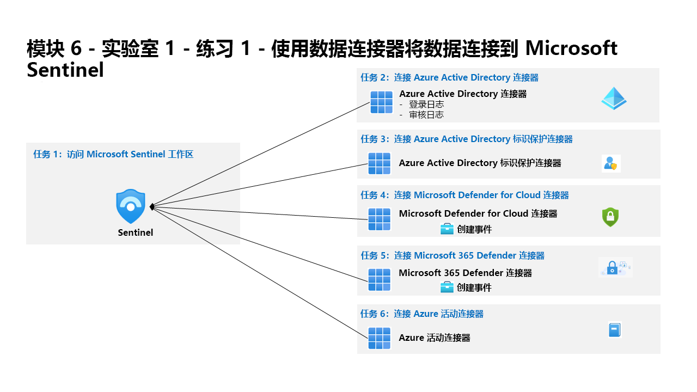

---
lab:
  title: 练习 1 - 使用数据连接器将数据连接到 Microsoft Sentinel
  module: Module 6 - Connect logs to Microsoft Sentinel
---

# 模块 6 - 实验室 1 - 练习 1 - 使用数据连接器将数据连接到 Microsoft Sentinel

## 实验室方案

You are a Security Operations Analyst working at a company that implemented Microsoft Sentinel. You must learn how to connect log data from the many data sources in your organization. The organization has data from Microsoft 365, Microsoft 365 Defender, Azure resources, non-azure virtual machines, etc. You start connecting the Microsoft sources first.

### 任务 1：访问 Microsoft Sentinel 工作区

在此任务中，你将访问 Microsoft Sentinel 工作区。

1. 使用以下密码以管理员身份登录到 WIN1 虚拟机：Pa55w.rd 。  

1. 打开 Microsoft Edge 浏览器。

1. 在 Microsoft Edge 浏览器中，导航到 Azure 门户 (https://portal.azure.com )。

1. 在“登录”对话框中，复制粘贴实验室托管提供者提供的租户电子邮件帐户，然后选择“下一步”  。

1. 在“输入密码”对话框中，复制粘贴实验室托管提供者提供的租户密码，然后选择“登录”  。

1. 在 Azure 门户的搜索栏中，键入“Sentinel”，然后选择“Microsoft Sentinel”。

1. 选择你在上一个实验室中创建的 Microsoft Sentinel 工作区。

### 任务 2：连接 Azure Active Directory 连接器

在此任务中，你要将 Azure Active Directory 连接器连接到 Microsoft Sentinel。

1. Under the Configuration area select <bpt id="p1">**</bpt>Data connectors<ept id="p1">**</ept>. In the Data Connectors page, search for the <bpt id="p1">**</bpt>Azure Active Directory<ept id="p1">**</ept> connector and select it from the list.

1. 在连接器信息边栏选项卡上选择“打开连接器页面”。

1. 从“配置”区域中选择“登录日志”和“审核日志”选项，然后选择“应用更改”。

### 任务 3：连接 Azure Active Directory 标识保护连接器

在此任务中，你要将 Azure Active Directory 标识保护连接器连接到 Microsoft Sentinel。

1. 在“数据连接器”选项卡中，搜索“Azure Active Directory 标识保护”连接器，并从列表中选择它。

1. 在连接器信息边栏选项卡上选择“打开连接器页面”。

1. 从“配置”区域，选择“连接”按钮。

### 任务 4：连接 Microsoft Defender for Cloud 连接器

在此任务中，你将连接 Microsoft Defender for Cloud 连接器。

1. 在“数据连接器”选项卡中，搜索“Microsoft Defender for Cloud”连接器，并从列表中选择它。

1. 在连接器信息边栏选项卡上选择“打开连接器页面”。

1. 在“配置”区域的“订阅”下，选中“Azure Pass - 赞助”订阅的复选框，并将“状态”选项滑动到右侧以指示“已连接” 。

1. 现在，“状态”应该是“已连接”，并且“双向同步”应该是“已启用” 。

1. Scroll down and under the "Create incidents - Recommended!" area, select <bpt id="p1">**</bpt>Enable<ept id="p1">**</ept>. This option creates an Analytics rule automatically for this service. You can manually add it later if not enabled here or change its configuration within the <bpt id="p1">*</bpt>Analytics<ept id="p1">*</ept> blade.

### 任务 5：连接 Microsoft 365 Defender 连接器

在此任务中，你将连接 Microsoft 365 Defender 连接器。

1. 在“数据连接器”选项卡中，搜索“Microsoft 365 Defender(预览版)”连接器，并从列表中选择它。

1. 在连接器信息边栏选项卡上选择“打开连接器页面”。

1. 在“配置”区域中，选择“连接事件和警报”。 

1. 在“连接事件”下，选中“名称”复选框，从而选中“Microsoft Defender for Endpoint”的所有复选框。

1. 针对“Microsoft Defender for Office 365”执行相同的操作

1. 滚动到页面底部，并选择“应用更改”。

### 任务 6：连接 Azure 活动连接器

在此任务中，你将连接 Azure 活动连接器。

1. 在“数据连接器”选项卡中，搜索“Azure 活动”连接器，并从列表中选择它。

1. 在连接器信息边栏选项卡上选择“打开连接器页面”。

1. In the Configuration area, scroll down and under "2. Connect your subscriptions..." select <bpt id="p1">**</bpt>Launch Azure Policy Assignment Wizard&gt;<ept id="p1">**</ept>.

1. 在“基本信息”选项卡中，选择“范围”下的省略号按钮 (...)，然后从下拉列表中选择你的“Azure Pass - 赞助”订阅，然后单击“选择”  。

1. 选择“参数”选项卡，从“主要 Log Analytics 工作区”下拉列表中选择“uniquenameDefender”工作区。

1. 选择“修正”选项卡，然后选择“创建修正任务”复选框 。

1. 选择“查看 + 创建”按钮，检查配置。

1. 选择“创建”以完成操作。

## 继续进行练习 2
