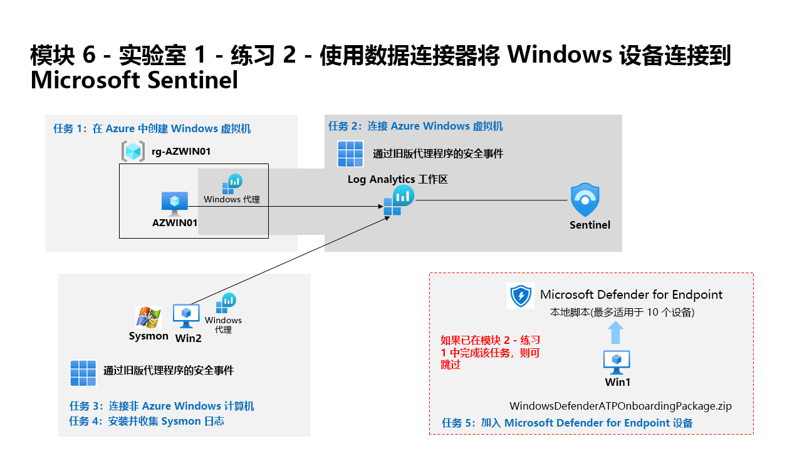

---
lab:
  title: 练习 2 - 使用数据连接器将 Windows 设备连接到 Microsoft Sentinel
  module: Learning Path 6 - Connect logs to Microsoft Sentinel
---

# 学习路径 6 - 实验室 1 - 练习 2 - 使用数据连接器将 Windows 设备连接到 Microsoft Sentinel

## 实验室方案

你是一位安全运营分析师，你所在公司已实现 Microsoft Sentinel。 你需要了解如何连接来自组织中多个数据源的日志数据。 下一个数据源是 Azure 内部和外部的 Windows 虚拟机，例如本地环境或其他公共云。

>**注意：** 我们提供 **[交互式实验室模拟](https://mslabs.cloudguides.com/guides/SC-200%20Lab%20Simulation%20-%20Connect%20Windows%20devices%20to%20Microsoft%20Sentinel%20using%20data%20connectors)** ，让你能以自己的节奏点击浏览实验室。 你可能会发现交互式模拟与托管实验室之间存在细微差异，但演示的核心概念和思想是相同的。 

### 任务 1：在 Azure 中创建 Windows 虚拟机

在本任务中，你将在 Azure 中创建 Windows 虚拟机。

1. 使用密码 Pa55w.rd 以管理员身份登录到 WIN1 虚拟机 。  

1. 在 Microsoft Edge 浏览器中，导航到 Azure 门户 (https://portal.azure.com )。

1. 在“登录”对话框中，复制粘贴实验室托管提供者提供的租户电子邮件帐户，然后选择“下一步”  。

1. 在“输入密码”对话框中，复制粘贴实验室托管提供者提供的租户密码，然后选择“登录”  。

1. 选择“+ 创建资源”。 提示：如果已在 Azure 门户中，则可能需要从顶部栏中选择 Microsoft Azure 以返回主页。

1. 在“搜索服务和市场”框中，输入“Windows 10”并从下拉列表中选择“Microsoft Window 10”。

1. 选中 Microsoft Window 10 对应的框。

1. 打开“计划”下拉列表，然后选择“Windows 10 企业版，版本 22H2”。

1. 选择“开始使用预设置配置”以继续。

1. 选择“开发/测试”，然后选择“继续创建 VM” 。

1. 为“资源组”选择“新建”，输入 RG-AZWIN01 作为名称，然后选择“确定”。

    >**注意：** 该资源组将是用于跟踪的新资源组。 

1. 在“虚拟机名称”处输入 AZWIN01。

1. 将“区域”的默认值保留为“(US) 美国东部”。

1. 向下滚动，查看虚拟机的“映像”。 如果显示为空，请选择“Windows 10 企业版，版本 22H2”。

1. 查看虚拟机的“大小”。 如果它显示为空，请选择“查看所有大小”，在“Azure 用户最常用的大小”下选择第一个 VM 大小，然后选择“选择”。

    >注意：如果看到消息“Azure Automanage 不支持此映像。若要禁用此功能，请导航到“管理”选项卡。否则，请选择受支持的映像******。” 转到“管理”选项卡并禁用“Automanage”。 之后创建过程便会成功。

1. 向下滚动，输入你选择的用户名。 提示：避免使用保留字，如 admin 或 root。

1. 输入你选择的密码。 提示：重新使用你的租户密码可能更简单。 可以在“资源”选项卡中找到它。

1. 向下滚动到页面底部，选中“许可”下面的复选框，以确认你具有符合条件的许可证。

1. 选择“查看 + 创建”，然后等待验证通过。

    >注意：如果网络验证失败，请选择该选项卡，查看其内容，然后再次选择“查看 + 创建”。

1. 选择“创建”。 等待创建资源，这可能需要几分钟的时间。

### 任务 2：连接 Azure Windows 虚拟机

在此任务中，需要将 Azure Windows 虚拟机连接到 Microsoft Sentinel。

1. 在 Azure 门户的“搜索”栏中，键入 Sentinel，然后选择 Microsoft Sentinel。

1. 选择之前创建的 Microsoft Sentinel 工作区。

1. 1. 在 Microsoft Sentinel 左侧菜单中，向下滚动到“内容管理”部分，然后选择“内容中心”。

1. 在“内容中心”，搜索“Windows 安全事件”解决方案，并从列表中选择它。

1. 在“Windows 安全事件”解决方案页上，选择“安装”。

1. 安装完成后，选择“管理”

    >注意：“Windows 安全事件”解决方案安装“通过 AMA 收集的 Windows 安全事件”和“通过旧版代理程序的安全事件”数据连接器。 外加 2 个工作簿、20 个分析规则和 43 个搜寻查询。

1. 选择“通过 AMA 收集的 Windows 安全事件”数据连接器，然后在连接器信息窗格上选择“打开连接器页面”。

1. 在“说明”选项卡下的“配置”部分，选择“创建数据收集规则”。

1. 为“规则名称”输入“AZWINDCR”，然后选择“下一步: 资源”。

1. 选择“+ 添加资源”，以选择我们创建的虚拟机。

1. 展开“RG-AZWIN01”，然后选择“AZWIN01” 。

1. 选择“应用”，然后选择“下一步: 收集” 。

1. 查看不同的安全事件收集选项。 保留所有安全事件，然后选择“下一步: 查看 + 创建”。

1. 选择“创建”，保存数据收集规则。

1. 等待几分钟，然后选择“刷新”以查看列出的新数据收集规则。

### 任务 3：连接非 Azure Windows 计算机

在此任务中，需要将连接到 Azure Arc 的非 Azure Windows 虚拟机添加到 Microsoft Sentinel。  

   >注意：“通过 AMA 的 Windows 安全中心事件”需要针对非 Azure 设备的 Azure Arc。

1. 确保你位于 Microsoft Sentinel 工作区中的“通过 AMA 数据连接器收集的 Windows 安全事件”配置中。

1. 在“说明”选项卡中的“配置”部分下，通过选择铅笔图标编辑“AZWINDCR”数据收集规则。

1. 选择“下一页:**资源”，并在“资源”选项卡上的“范围”下展开你的订阅。********

    >提示****：可选择“范围”列前面的“>”来展开整个范围层次结构。****

1. 展开 RG-Defender（或你创建的资源组），然后选择 WINServer 。

    >重要说明：如果未看到 WINServer，请参阅在此服务器中安装 Azure Arc 的学习路径 3 练习 1 任务 4。

1. 选择“应用”。

1. 依次选择“下一步: 收集”、“下一步: 查看 + 创建” 。

1. 显示“验证通过”后，选择“创建”。

## 继续完成练习 3
