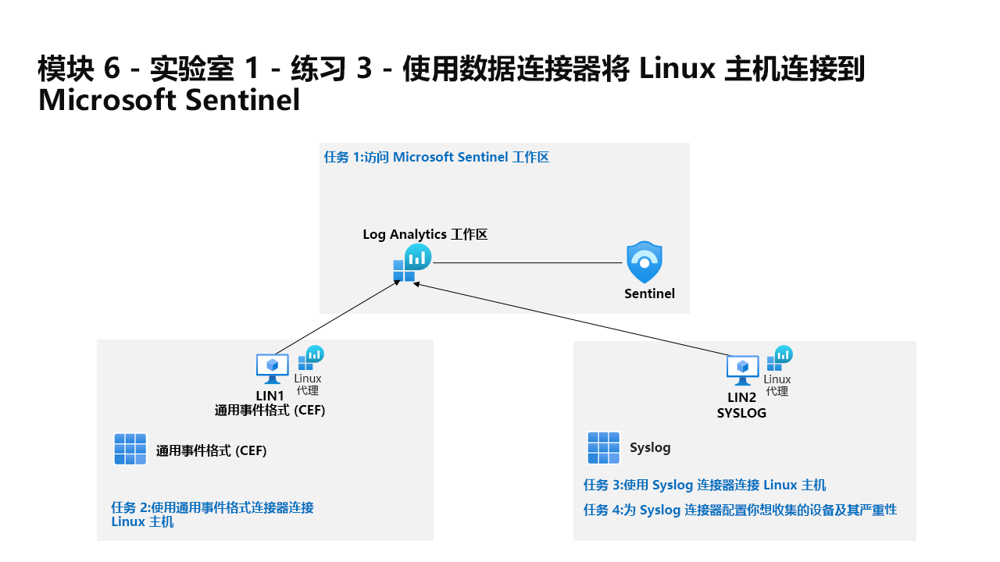

---
lab:
  title: 练习 3 - 使用数据连接器将 Linux 主机连接到 Microsoft Sentinel
  module: Learning Path 6 - Connect logs to Microsoft Sentinel
---

# 学习路径 6 - 实验室 1 - 练习 3 - 使用数据连接器将 Linux 主机连接到 Microsoft Sentinel

## 实验室方案



你是一位安全运营分析师，你所在公司已实现 Microsoft Sentinel。 你需要了解如何连接来自组织中多个数据源的日志数据。 下一个数据源是使用“通过旧版代理程序实现通用事件格式 (CEF)”连接器和 Syslog 连接器的 Linux 虚拟机。

>**注意：** 我们提供 **[交互式实验室模拟](https://mslabs.cloudguides.com/guides/SC-200%20Lab%20Simulation%20-%20Connect%20Linux%20hosts%20to%20Microsoft%20Sentinel%20using%20data%20connectors)** ，让你能以自己的节奏点击浏览实验室。 你可能会发现交互式模拟与托管实验室之间存在细微差异，但演示的核心概念和思想是相同的。

>**重要提示：** 下一个任务中有一些步骤是在不同的虚拟机中完成的。 查找虚拟机名称引用。

### 任务 1：访问 Microsoft Sentinel 工作区

在此任务中，你将访问 Microsoft Sentinel 工作区。

1. 使用以下密码以管理员身份登录到 WIN1 虚拟机：Pa55w.rd 。  

1. 启动 Microsoft Edge 浏览器。

1. 在 Microsoft Edge 浏览器中，导航到 Azure 门户 (https://portal.azure.com )。

1. 在“登录”对话框中，复制粘贴实验室托管提供者提供的租户电子邮件帐户，然后选择“下一步”  。

1. 在“输入密码”对话框中，复制粘贴实验室托管提供者提供的租户密码，然后选择“登录”  。

1. 在 Azure 门户的搜索栏中，键入“Sentinel”，然后选择“Microsoft Sentinel”。

1. 选择你在之前的实验室中创建的 Microsoft Sentinel 工作区。


### 任务 2：使用通用事件格式连接器连接 Linux 主机

在此任务中，你将使用“通过旧版代理程序实现通用事件格式 (CEF)”连接器将 Linux 主机连接到 Microsoft Sentinel。

1. 在 Microsoft Sentinel 左侧菜单中，向下滚动到“内容管理”部分，然后选择“内容中心”。

1. 在“内容中心”，搜索通用事件格式”解决方案并从列表中选择它。

1. 在“通用事件格式”解决方案页上，选择“安装”。

1. 安装完成后，选择“管理”

    >注意：“通用事件格式”解决方案安装“通过 AMA 实现通用事件格式 (CEF)”和“通用事件格式 (CEF)”数据连接器。

1. 选择“通用事件格式 (CEF)”数据连接器，然后在连接器信息窗格上选择“打开连接器页面”。

1. 在“说明”选项卡下的“配置”部分中，将“1.2 在 Linux 计算机上安装 CEF 收集器”中显示的命令复制到剪贴板  。

1. 启动 LIN1 虚拟机。 使用实验室宿主提供的用户名和密码登录。 提示：你可能需要按 Enter 键以查看登录提示。 

1. 请注意 LIN1 服务器的 IP 地址。 以下面的屏幕截图为例：

    

1. 返回到 WIN1 虚拟机。 通过右键单击“开始”菜单图标以管理员身份启动 Windows PowerShell，然后选择“Windows PowerShell(管理员)”。 选择“是”，允许应用在显示的“用户帐户控制”窗口中运行。 提示：你可能已从前面的练习中打开了一个 Windows PowerShell 窗口。

1. 输入以下 PowerShell 命令，根据你的具体 Linux 服务器信息进行调整，然后按 Enter：

    ```PowerShell
    ssh insert-your-linux-IP-address-here -l insert-linux-user-name-here
    ```

1. 输入“yes”以确认连接，然后键入用户密码，并按 Enter 键。 屏幕应如下所示：

    

1. 现在可以粘贴前面的步骤中的“1.2 在 Linux 计算机上安装 CEF 收集器”命令。 确保来自 Azure 的脚本在剪贴板中。 在 PowerShell 中右键单击顶部栏并依次选择“编辑”、“粘贴” 。 

1. 粘贴后，在按 Enter 键之前，将字符 3 添加到单词 python，如下所示：

    


1. 调整脚本后，按 Enter 键。 该脚本将在 Linux 服务器上远程运行。 如果脚本处理得当，它应如以下屏幕所示：

    

1. 键入“exit”以关闭与 LIN1 的远程 Shell 连接。


### 任务 3：使用 Syslog 连接器连接 Linux 主机

在此任务中，你将通过 Syslog 连接器将 Linux 主机连接到 Microsoft Sentinel。

1. 返回到打开 Microsoft Sentinel 门户的 Microsoft Edge 浏览器，并通过选择右上角的“x”关闭“通过旧版代理程序实现通用事件格式 (CEF)”数据连接器页。

1. 在 Microsoft Sentinel 左侧菜单中，向下滚动到“内容管理”部分，然后选择“内容中心”。

1. 在“内容中心”，搜索“Syslog”解决方案并从列表中选择它。

1. 在“Syslog”解决方案页上，选择“安装”。

1. 安装完成后，选择“管理”

    >注意：“Syslog”解决方案会安装 Syslog 数据连接器、5 个分析规则、9 个搜寻查询和 1 个工作簿。

1. 选择“Syslog”数据连接器，然后在连接器信息窗格上选择“打开连接器页面”

1. 在“配置”部分，展开“在非 Azure Linux 计算机上安装代理”。

1. 选择“为非 Azure Linux 计算机下载和安装代理”的链接。

    >**注意：** Log Analytics 工作区会显示 2 台 Windows 计算机已连接。 分别对应于之前连接的 WINServer 和 AZWIN01 虚拟机。

1. 选择“Linux 服务器”的选项卡。

    >**注意：** Log Analytics 工作区会显示 1 台 Linux 计算机已连接。 对应于先前与 CEF 连接器连接的 LIN1 (ubuntu1) 虚拟机。

1. 选择“Log Analytics 代理说明”。

1. 将“下载和加入适用于 Linux 的代理”区域中的命令复制到剪贴板。

1. 启动 LIN2 虚拟机。 使用实验室宿主提供的用户名和密码登录。 提示：你可能需要按 Enter 键以查看登录提示。

1. 请注意 LIN2 服务器的 IP 地址。 以下面的屏幕截图为例：

    

1. 返回到 WIN1 虚拟机。 选择上一个任务中使用的 Windows PowerShell。

1. 输入以下 PowerShell 命令，根据你的具体 Linux 服务器信息进行调整，然后按 Enter：

    ```PowerShell
    ssh insert-your-linux-IP-address-here -l insert-linux-user-name-here
    ```

1. 输入“yes”以确认连接，然后键入用户密码，并按 Enter 键。 屏幕应如下所示：

    

1. 现在可以粘贴前面的步骤中的“下载和加入适用于 Linux 的代理”命令。 确保脚本在剪贴板中。 在 PowerShell 中右键单击顶部栏并依次选择“编辑”、“粘贴” 。

1. 粘贴脚本后，按 Enter 键。 该脚本将在 Linux 服务器上远程运行。 Wait

1. 完成后，键入“exit”以关闭与 LIN2 的远程 Shell 连接。


### 任务 4：为 Syslog 连接器配置你想收集的设备及其严重性

在此任务中，你将配置 Syslog 收集设备。

1. 返回到打开 Microsoft Sentinel 门户的 Microsoft Edge 浏览器，并通过选择两次右上角的“x”关闭“Log Analytics 工作区”页和“Syslog”数据连接器页。

1. 在 Microsoft Sentinel 门户中，选择“配置”下的“设置”，然后选择“工作区设置”选项卡。

1. 在“经典”区域下选择“旧代理管理”。

1. 选择“Syslog”选项卡。

1. 选择“+ 添加设备”按钮。

1. 从“设备名称”下拉菜单中选择“auth”。

1. 再次选择“+ 添加设备”按钮。

1. 在“设施名称”下拉菜单中选择 syslog。

1. 选择“应用”以保存所做的更改。

## 继续完成练习 4
