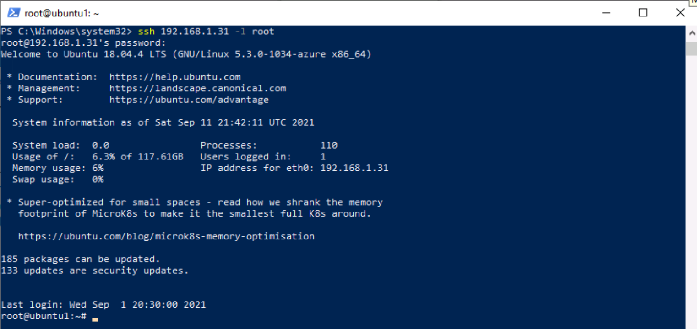

---
lab:
    title: '练习 3 - 使用数据连接器将 Linux 主机连接到 Microsoft Sentinel'
    module: '模块 6 - 将日志连接到 Microsoft Sentinel'
---

# 模块 6 - 实验室 1 - 练习 3 - 使用数据连接器将 Linux 主机连接到 Microsoft Sentinel


### 任务 1：访问 Microsoft Sentinel 工作区。

在此任务中，你将访问 Microsoft Sentinel 工作区。

1. 使用以下密码以管理员身份登录到 WIN1 虚拟机：**Pa55w.rd**。  

2. 启动 Microsoft Edge 浏览器。

3. 在 Microsoft Edge 浏览器中，通过 https://portal.azure.com 导航到 Azure 门户。

4. 在 **“登录”** 对话框中，复制粘贴实验室托管提供者提供的租户电子邮件帐户，然后选择 **“下一步”**。

5. 在 **“输入密码”** 对话框中，复制粘贴实验室托管提供者提供的**租户密码**，然后选择 **“登录”**。

6. 在 Azure 门户的搜索栏中，键入 Sentinel，然后选择“**Microsoft Sentinel**”。

7. 选择你在之前的实验室中创建的 Microsoft Sentinel 工作区。


### 任务 2：使用通用事件格式连接器连接 Linux 主机。

在此任务中，你将通过通用事件格式 (CEF) 连接器将 Linux 主机连接到 Microsoft Sentinel。

1. 从 Microsoft Sentinel 的“配置”区域选择“**数据连接器**”。  在“数据连接器”选项卡中，从列表搜索“**通用事件格式(CEF)**”连接器并将其选中。

2. 在连接器信息边栏选项卡上选择 **“打开连接器页面”**。

3. 将 *“1.2 在 Linux 计算机上安装 CEF 收集器”* 中显示的命令复制到剪贴板。

4. 启动 LIN1 虚拟机，并使用实验室主机托管服务提供商提供的用户名和密码登录。请注意 LIN1 服务器的 IP 地址。以下面的屏幕截图为例：

   

5. 返回到 WIN1 虚拟机，右键单击开始菜单图标以管理员身份启动 Windows PowerShell，然后选择“**Windows PowerShell (管理员)**”。选择“是”，允许应用在出现的“**用户帐户控制**”窗口中运行。

6. 输入以下 PowerShell 命令，根据你的具体 Linux 服务器信息进行调整，然后按 Enter：

```PowerShell
ssh <insert your linux IP address here> -l <insert linux user name here>
```

7. 输入“*是*”以确认连接，然后键入用户密码并按 Enter。屏幕应如下所示：

   

8. 现在可以粘贴前面的步骤“*1.2 在 Linux 计算机上安装 CEF 收集器*”中的命令。确保来自 Azure 的脚本在剪贴板中。在 PowerShell 中右键单击顶部栏并依次选择“**编辑**”、“**粘贴**”。粘贴后，添加“**3**”到单词“*python*”中，如下所示：

   


9. 粘贴并调整脚本后，按 Enter。该脚本将在 Linux 服务器上远程运行。如果脚本处理得当，它应如以下屏幕所示：

   


### 任务 3：使用 Syslog 连接器连接 Linux 主机。

在此任务中，你将通过 Syslog 连接器将 Linux 主机连接到 Microsoft Sentinel。

1. 连接到 WIN1，它应该已经在工作区的 Microsoft Sentinel 门户中。  

2. 在“数据连接器”选项卡中，从列表搜索 **Syslog** 连接器并将其选中。

3. 在连接器信息边栏选项卡上选择 **“打开连接器页面”**。

4. 打开 **“在非 Azure Linux 计算机上安装代理”** 部分。

5. 选择 **“为非 Azure Linux 计算机下载和安装代理”** 的链接。 

6. 选择 **“Linux 服务器”** 的选项卡。

7. 将 *“下载和加入适用于 Linux 的代理”* 区域中的命令复制到剪贴板。

8. 启动 LIN2 虚拟机，并使用实验室主机托管服务提供商提供的用户名和密码登录。请注意 LIN2 服务器的 IP 地址。以下面的屏幕截图为例：

   

9. 返回到 WIN1 虚拟机，右键单击开始菜单图标以管理员身份启动新的 Windows PowerShell，然后选择“**Windows PowerShell (管理员)**”。选择“是”，允许应用在出现的“用户帐户控制”窗口中运行。

   >**备注**： 如果最后一个任务的安装完成，可输入 *Exit* 关闭与 LIN1 的连接来重复使用 Windows PowerShell 窗口。

10. 输入以下 PowerShell 命令，根据你的具体 Linux 服务器信息进行调整，然后按 Enter：

```PowerShell
ssh <insert your linux IP address here> -l <insert linux user name here>
```

11. 输入“*是*”以确认连接，然后键入用户密码并按 Enter。屏幕应如下所示：

   

12. 现在可以粘贴前面的步骤“*下载和加入适用于 Linux 的代理*”中的命令。确保来自 Azure 的脚本在剪贴板中。在 PowerShell 中右键单击顶部栏并依次选择“**编辑**”、“**粘贴**”。

13. 粘贴脚本后，按 Enter。该脚本将在 Linux 服务器上远程运行。你已完成本任务。本课程中其他实验室均不会依赖于此连接。


### 任务 4：为 Syslog 连接器配置你想收集的设备及其严重性。

在此任务中，你将配置 Syslog 收集设备。

1. 连接到 WIN1 虚拟机。

2. 在 Microsoft Sentinel 门户中，选择“**设置**”，然后从设置边栏选项卡中选择“**工作区设置**”。

3. 在 **“设置”** 区域中，选择 **“代理配置”**。

4. 选择 **“Syslog”** 选项卡。

5. 选择 **“+ 添加设备”** 按钮。

6. 从 **“设备名称”** 下拉菜单中选择 **“auth”**。

7. 再次选择“**+ 添加设备**”按钮。

8. 从下拉菜单中选择“**authpriv**”作为*设备名称*。

9. 选择 **“应用”**。  你已完成本任务。

## 转到练习 4
