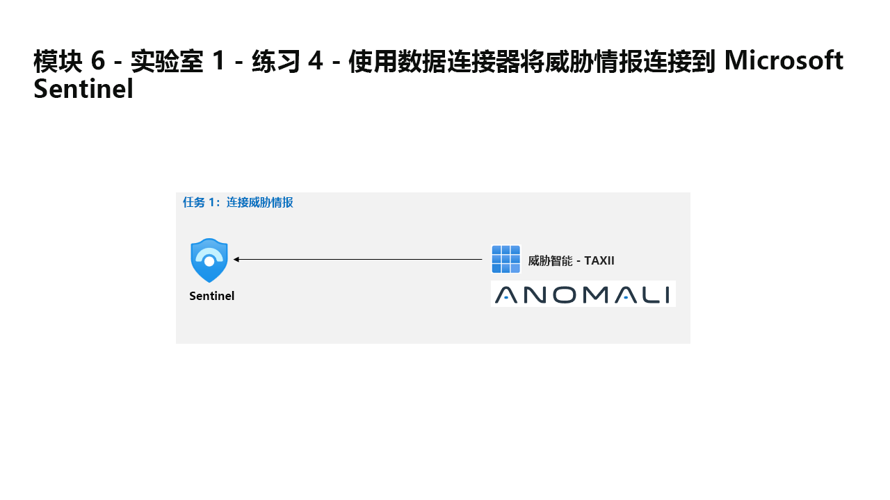

---
lab - Do not use. Temporarily not operational!:
  title: 练习 4 - 使用数据连接器将威胁情报连接到 Microsoft Sentinel
  module: Module 6 - Connect logs to Microsoft Sentinel
---

# 模块 6 - 实验室 1 - 练习 4 - 使用数据连接器将威胁情报连接到 Microsoft Sentinel

## 实验室方案

You are a Security Operations Analyst working at a company that implemented Microsoft Sentinel. You must learn how to connect log data from the many data sources in your organization. Finally, you connect a threat intelligence feed to enhance your ability to detect and prioritize known threats.

### 任务 1：连接威胁情报

在此任务中，你将通过威胁情报 - TAXII 连接器连接威胁情报提供程序。

1. 使用以下密码以管理员身份登录到 WIN1 虚拟机：**Pa55w.rd**。  

1. 在 Edge 浏览器中，导航到 Azure 门户 (<https://portal.azure.com>)。

1. 在“登录”对话框中，复制粘贴实验室托管提供者提供的租户电子邮件帐户，然后选择“下一步”  。

1. 在“输入密码”对话框中，复制粘贴实验室托管提供者提供的租户密码，然后选择“登录”  。

1. 在 Azure 门户的搜索栏中，键入“Sentinel”，然后选择“Microsoft Sentinel”。

1. 选择之前创建的 Microsoft Sentinel 工作区。

1. 在“数据连接器”选项卡中，搜索“威胁情报 - TAXII”连接器。

1. 在连接器信息边栏选项卡上选择“打开连接器页面”。

1. 在“配置”区域下的“(服务器)易记名称”字段中，输入“PhishURLs”

1. 对于 API 根 URL，输入 <https://limo.anomali.com/api/v1/taxii2/feeds/>

1. 输入 107 作为集合 ID。

1. 输入 guest 作为用户名。

1. 输入 guest 作为密码。

1. Now select the <bpt id="p1">**</bpt>Add<ept id="p1">**</ept> button.  Phishing URLs will be pulled and populate the ThreatIntelligenceIndicator table.

>**注意：** 如果要添加其他集合，请在 Microsoft Edge 浏览器中打开 <https://limo.anomali.com/api/v1/taxii2/feeds/collections/> ，并使用来宾用户名和密码查看可用的不同 ID。

## 你已完成本实验室
