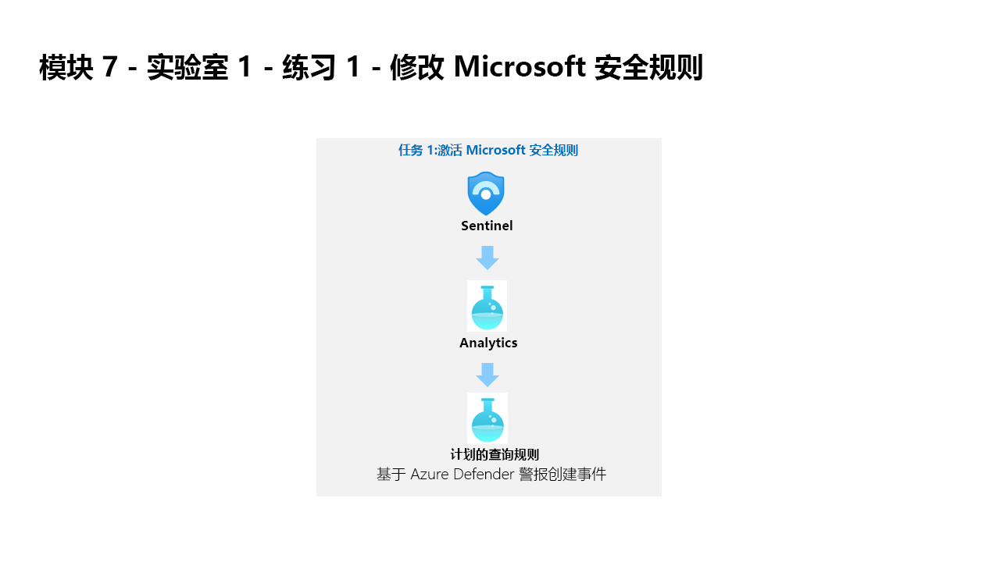

---
lab:
  title: 练习 1 - 修改 Microsoft 安全规则
  module: Module 7 - Create detections and perform investigations using Microsoft Sentinel
ms.openlocfilehash: 266335a86b6ee3c1d86aaa4acf67cd1785aa5d2f
ms.sourcegitcommit: f8918eddeaa7a7a480e92d0e5f2f71143c729d60
ms.translationtype: HT
ms.contentlocale: zh-CN
ms.lasthandoff: 07/08/2022
ms.locfileid: "147038004"
---
# 模块 7 - 实验室 1 - 练习 1 - 修改 Microsoft 安全规则

## 实验室方案

你是一位安全运营分析师，你所在公司已实现 Microsoft Sentinel。 你需要了解如何使用 Microsoft Sentinel 检测和缓解威胁。 首先，需要按严重性将来自 Defender for Cloud 的警报筛选到 Microsoft Sentinel 中。 

### 任务 1：激活 Microsoft 安全规则

在此任务中，你将激活 Microsoft 安全规则。

1. 使用以下密码以管理员身份登录到 WIN1 虚拟机：**Pa55w.rd**。  

1. 在 Edge 浏览器中，导航到 Azure 门户 (https://portal.azure.com) )。

1. 在“登录”对话框中，复制粘贴实验室托管提供者提供的租户电子邮件帐户，然后选择“下一步”  。

1. 在“输入密码”对话框中，复制粘贴实验室托管提供者提供的租户密码，然后选择“登录”  。

1. 在 Azure 门户的搜索栏中，键入“Sentinel”，然后选择“Microsoft Sentinel”。

1. 选择你在前面实验室中创建的 Microsoft Sentinel 工作区。

1. 从“配置”区域选择“分析”。 默认情况下，会显示“有效规则”。

1. 选择“基于 Microsoft Defender for Cloud 创建事件”。 此规则是由“模块 6 - 练习 1 - 任务 4”中配置的 Defender for Cloud 连接器激活的。 

1. 在右侧边栏选项卡上，选择“编辑”按钮。

1. 向下滚动页面，在“分析规则逻辑 - 按严重性筛选”下选择“自定义”下拉列表。

1. 取消选择“低”作为严重性级别，然后返回到规则。

1. 选择底部的自动响应”按钮，然后选择“下一步:审阅”按钮。

1. 查看所做的更改并选择“保存”按钮。 分析规则会保存。

## 继续进行练习 2
