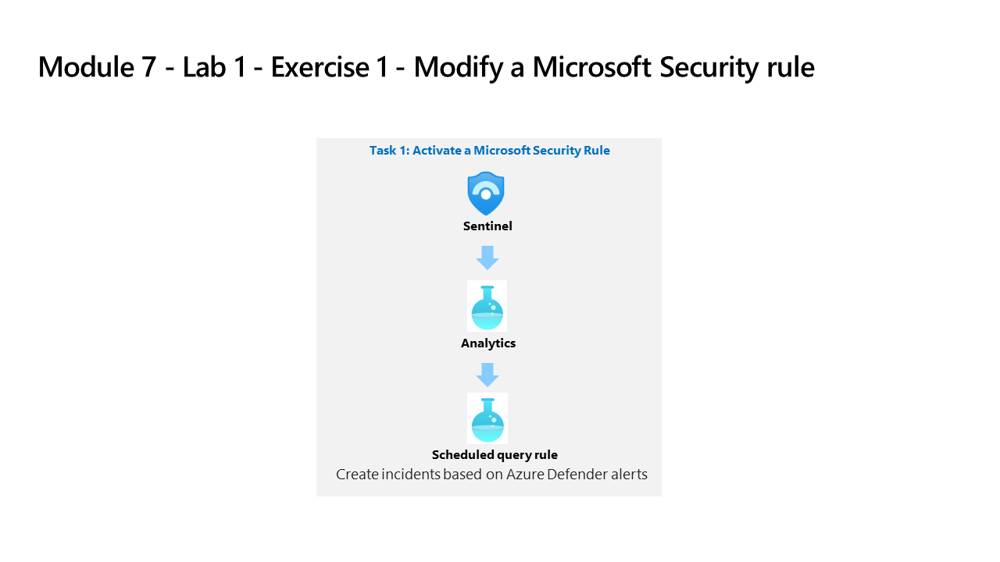

---
lab:
  title: 练习 1 - 修改 Microsoft 安全规则
  module: Learning Path 7 - Create detections and perform investigations using Microsoft Sentinel
---

# 学习路径 7 - 实验室 1 - 练习 1 - 修改 Microsoft 安全规则

## 实验室方案

你是一位安全运营分析师，你所在公司已实现 Microsoft Sentinel。 你需要了解如何使用 Microsoft Sentinel 检测和缓解威胁。 首先，需要按严重性将来自 Defender for Cloud 的警报筛选到 Microsoft Sentinel 中。 

>                **注意：** 我们提供 **[交互式实验室模拟](https://mslabs.cloudguides.com/guides/SC-200%20Lab%20Simulation%20-%20Modify%20a%20Microsoft%20Security%20rule)** ，让你能以自己的节奏点击浏览实验室。 你可能会发现交互式模拟与托管实验室之间存在细微差异，但演示的核心概念和思想是相同的。 

### 任务 1：激活 Microsoft 安全规则

在此任务中，你将激活 Microsoft 安全规则。

1. 使用以下密码以管理员身份登录到 WIN1 虚拟机：**Pa55w.rd**。  

1. 在 Edge 浏览器中，导航到 Azure 门户 (https://portal.azure.com) )。

1. 在“登录”对话框中，复制粘贴实验室托管提供者提供的租户电子邮件帐户，然后选择“下一步”  。

1. 在“输入密码”对话框中，复制粘贴实验室托管提供者提供的租户密码，然后选择“登录”  。

1. 在 Azure 门户的搜索栏中，键入“Sentinel”，然后选择“Microsoft Sentinel”。

1. 选择你在前面实验室中创建的 Microsoft Sentinel 工作区。

1. 从“配置”区域选择“分析”。 默认情况下，会显示“有效规则”。

1. 注意“基于 Microsoft Defender for Cloud 创建事件”。 此规则是由“模块 6 - 练习 1 - 任务 4”中配置的 Defender for Cloud 连接器激活的。

1. 单击命令栏中的“+ 创建”按钮，然后选择“Microsoft 事件创建规则” 。

1. 在“名称”下，写下“基于 Defender for Endpoint 创建事件”。

1. 向下滚动，在“Microsoft 安全服务”下选择“Microsoft Defender for Endpoint”。

1. 在“按严重性筛选”下，选择“自定义”选项，为严重级别选择“低”、“中”和“高”，然后返回到规则   。

1. 选择底部的自动响应”按钮，然后选择“下一步:审阅”按钮。

1. 查看所做的更改，然后选择“创建”按钮。 如果 Defender for Endpoint 中存在警报，则会保存 Analytics 规则并创建事件。

1. 现在，你将拥有一种 Fusion 和两种 Microsoft 安全警报类型。

## 继续进行练习 2
