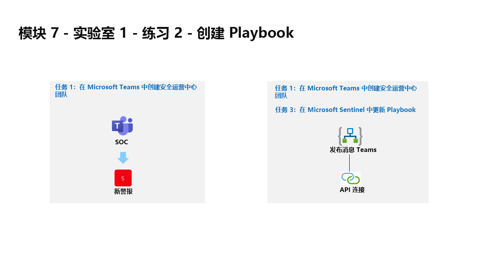

---
lab:
  title: 练习 2 - 创建 Playbook
  module: Module 7 - Create detections and perform investigations using Microsoft Sentinel
---

# 模块 7 - 实验室 1 - 练习 2 - 创建 Playbook

## 实验室方案

你是一位安全运营分析师，你所在公司已实现 Microsoft Sentinel。 你需要了解如何使用 Microsoft Sentinel 检测和缓解威胁。 现在，你想要响应和修正可以从 Microsoft Sentinel 作为例程运行的操作。

使用 playbook，可以帮助自动执行和协调威胁响应，与其他内部系统和外部系统集成，并可以设置为自动运行以响应特定警报或事件（分别由分析规则或自动化规则触发时）。 

### 任务 1：在 Microsoft Teams 中创建安全运营中心团队

在此任务中，你将创建 Microsoft Teams 团队以便在实验室中使用。

1. 使用以下密码以管理员身份登录到 WIN1 虚拟机：**Pa55w.rd**。  

1. 在 Microsoft Edge 浏览器中，打开新选项卡，然后导航到 Microsoft Teams 门户 (https://teams.microsoft.com) )。

1. 在“登录”对话框中，复制粘贴实验室托管提供者提供的租户电子邮件帐户，然后选择“下一步”  。

1. 在“输入密码”对话框中，复制粘贴实验室托管提供者提供的租户密码，然后选择“登录”  。

1. 关闭任何可能出现的 Teams 弹出窗口。

1. 如果尚未选择，请在左侧菜单上选择“团队”，然后在底部选择“加入或创建团队” 。

1. 在主窗口中选择“创建团队”按钮。

1. 选择“从头开始”按钮。

1. 选择“专用”按钮。

1. 为团队指定名称：键入“SOC”并选择“创建”按钮 。

1. 在“向 SOC 添加成员”屏幕中，选择“跳过”按钮。 

1. 向下滚动“团队”边栏选项卡以找到新创建的 SOC 团队，选择名称右侧的省略号“...”，然后选择“添加频道” 。

1. 输入频道名称“新建警报”，然后选择“添加”按钮。

### 任务 2：在 Microsoft Sentinel 创建 Playbook

在此任务中，你将创建在 Microsoft Sentinel 用作 Playbook 的逻辑应用。

1. 在 Microsoft Edge 浏览器中，导航到 Azure 门户 (https://portal.azure.com )。

1. 在“登录”对话框中，复制粘贴实验室托管提供者提供的租户电子邮件帐户，然后选择“下一步”  。

1. 在“输入密码”对话框中，复制粘贴实验室托管提供者提供的租户密码，然后选择“登录”  。

1. 在 Azure 门户的搜索栏中，键入“Sentinel”，然后选择“Microsoft Sentinel”。

1. 选择之前创建的 Microsoft Sentinel 工作区。

1. 在页面左侧的“内容管理”区域下，选择“社区”页。

1. 在右窗格中，选择“加入社区内容”链接。 这会在 Microsoft Edge 浏览器中打开一个新选项卡展示 Microsoft Sentinel GitHub 内容。

1. 选择“Solutions”文件夹。

1. 接下来，选择“Teams”文件夹，然后选择“Playbooks”文件夹。

1. 选择“Post-Message-Teams”文件夹。

1. 在“readme.md”框中，向下滚动到第二个“快速部署”选项“使用警报触发器进行部署”，并选择“部署到 Azure”按钮 。  

    >**非常重要**：请注意，“事件”和“警报”是两个不同的 Microsoft Sentinel 触发器。 请确保选择“警报”（第二个）。

1. 确保已选择 Azure 订阅。

1. 对于资源组，选择“新建”并输入“RG-Playbooks”，然后选择“确定”。

1. 将“区域”的默认值保留为“(US) 美国东部”。

1. 确保“Playbook 名称”为 PostMessageTeams-OnAlert，然后选择“查看 + 创建”。 提示：如果名称不同，请返回到 GitHub 并选择“使用警报触发器部署”playbook。

1. 现在选择“创建”。 

    >**注意：** 请等待部署完成后再继续下一个任务。

### 任务 3：在 Microsoft Sentinel 中更新 Playbook

在此任务中，你将使用适当的连接信息更新创建的新 playbook。

1. 在 Azure 门户的搜索栏中，键入“Sentinel”，然后选择“Microsoft Sentinel”。

1. 选择 Microsoft Sentinel 工作区。

1. 在“配置”区域下选择“自动化”，然后选择“可用的 Playbook”选项卡。

1. 选择“PostMessageTeams-OnAlert”playbook。 提示：如果未看到 playbook，请按 Ctrl+F5 刷新 Azure 门户页面。

1. 在 PostMessageTeams-OnAlert 的逻辑应用页的命令菜单中，选择“编辑”。

1. 选择第一个块，Microsoft Sentinel 警报。

1. 选择“更改连接”链接。

1. 选择“添加新项”，然后选择“登录” 。 当系统提示时，在新窗口中，选择 Azure 订阅管理员凭据。 现在，块的最后一行应显示“已连接到 your-admin-username”。

1. 现在，选择第二个块“警报 - 获取事件”。

1. 选择“更改连接”链接。

1. 在“显示名称”下选择具有 Azure 管理员用户名的连接。 提示：admin@ZZZZZZ.onmicrosoft.com。 现在，块的最后一行应显示“已连接到 your-admin-username”。

1. 现在，选择第三个块“连接”。

1. 选择“添加新项”，在系统提示时选择 Azure 管理员凭据。 现在，块的最后一行应显示“已连接到 your-admin-username”。

1. 该块现已重命名为“发布消息 (V3)”，在“团队”字段的末尾，选择“X”以清除内容。 该字段将改为列出 Microsoft Teams 中各个可用团队的下拉列表。 选择“SOC”。

1. 对“频道”字段进行相同的选择，选择字段末尾的“X”以清除内容。 字段将更改为一个下拉列表，其中列出了 SOC 团队的频道。 选择“新建警报”。

1. 在命令栏上选择“保存”。

将来的实验室中将使用逻辑应用。

## 继续完成练习 3
