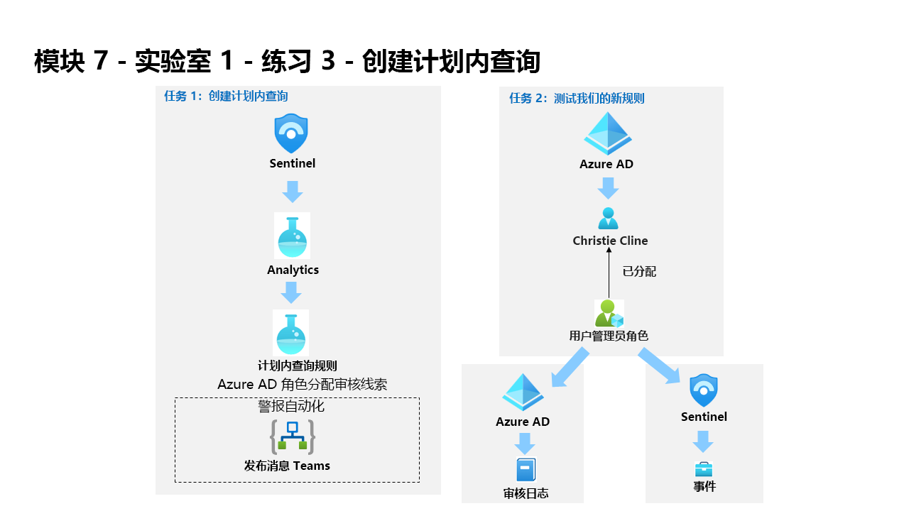

---
lab:
  title: 练习 3 - 创建计划查询
  module: Module 7 - Create detections and perform investigations using Microsoft Sentinel
---

# <a name="module-7---lab-1---exercise-3---create-a-scheduled-query"></a>模块 7 - 实验室 1 - 练习 3 - 创建计划查询

## <a name="lab-scenario"></a>实验室方案



你是一位安全运营分析师，你所在公司已实现 Microsoft Sentinel。 你需要了解如何使用 Microsoft Sentinel 检测和缓解威胁。 将数据源连接到 Microsoft Sentinel 后，可以创建自定义分析规则来帮助发现环境中的威胁和异常行为。

分析规则将在你的整个环境中搜索特定事件或事件集，在达到特定事件阈值或条件时发出警报，生成故障事件以供 SOC 进行会审和调查，并通过自动化跟踪和修正流程来响应威胁。


### <a name="task-1-create-a-scheduled-query"></a>任务 1：创建计划查询

在此任务中，你将创建一个计划查询，并将其连接到在上一个练习中创建的 Teams 频道。

1. 使用以下密码以管理员身份登录到 WIN1 虚拟机：**Pa55w.rd**。  

1. 在“登录”对话框中，复制粘贴实验室托管提供者提供的租户电子邮件帐户，然后选择“下一步”  。

1. 在“输入密码”对话框中，复制粘贴实验室托管提供者提供的租户密码，然后选择“登录”  。

1. 在 Azure 门户的搜索栏中，键入“Sentinel”，然后选择“Microsoft Sentinel”。

1. 选择 Microsoft Sentinel 工作区。

1. 从“配置”区域选择“分析”。

1. 选择“+ 创建”按钮，然后选择“计划查询规则” 。

1. 在“分析”规则向导中的“常规”选项卡上，键入名称“Azure AD 角色分配审核线索”。

1. 对于“策略”，请选择“持久性”。

1. 对于“严重性”，选择“低”。

1. 选择“下一页:设置规则逻辑 >”按钮：

1. 对于规则查询，粘贴以下 KQL 语句：

    >**警告：** 使用粘贴功能时，可以向虚拟机添加额外（管道）字符。 请确保先使用记事本粘贴以下查询。

    ```KQL
    AuditLogs  
    | where isnotempty(InitiatedBy.user.userPrincipalName) and Result == 'success' and OperationName contains "member to role" and AADOperationType startswith "Assign"
    | extend InitiatedByUPN = tostring(InitiatedBy.user.userPrincipalName)
    | extend InitiatedFromIP = iff(tostring(AdditionalDetails.[7].value) == '', tostring(AdditionalDetails.[6].value), tostring(AdditionalDetails.[7].value))
    | extend TargetUser = tostring(TargetResources.[2].displayName)
    | extend TargetRoleName = tostring(TargetResources.[0].displayName)
    | project TimeGenerated, InitiatedByUPN, InitiatedFromIP, TargetUser, TargetRoleName, AADOperationType, OperationName
    ```

1. 选择“查看查询结果”。 不应收到任何结果或任何错误。 如果收到错误，请查看查询是否与上一个 KQL 语句一样。 通过选择右上方的 X 关闭“日志”窗口，然后选择“确定”以放弃保存更改，并返回到向导 。

1. 在“分析规则向导 - 创建新计划规则”选项卡中的“警报扩充”区域下，选择“实体映射”，然后选择以下值： 

    - 对于“实体类型”下拉列表，请选择“帐户”。
    - 对于“标识符”下拉列表，选择“FullName”。
    - 对于“值”下拉列表，请选择“InitiatedByUPN”。

1. 然后选择“添加新实体”并选择以下值：

    - 对于“实体类型”下拉列表，请选择“IP”。
    - 对于“标识符”下拉列表，选择“地址”。
    - 对于“值”下拉列表，请选择“InitiatedFromIP”。

1. 向下滚动并在“查询计划”下设置以下项：

    |设置|值|
    |---|---|
    |运行查询的时间间隔|5 分钟|
    |查看最近多久的数据|1 天|

    >**注意：** 我们特意针对同一数据生成了多个事件。 这样，实验室就可使用这些警报。

1. 在“警报阈值”区域下，保留值不变，因为我们希望警报注册每个事件。

1. 在“事件分组”区域下，将“将所有事件分组到一个警报中”保留为所选选项，因为我们希望在每次运行时生成单个警报，只要查询返回的结果多于上述指定的警报阈值。

1. 选择底部的“下一步: 事件设置 >”按钮。 

1. 在“事件设置”选项卡上，查看默认选项。

1. 选择底部的“下一步: 自动响应 >”按钮。

1. 在“自动响应”选项卡的“警报自动化(经典)”区域下，选择在上一个练习中创建的“PostMessageTeams-OnAlert”playbook 。

1. 在“自动化规则(预览版)”下，选择“添加新项”。

1. 对于“自动化规则名称”，请输入“第 2 层”。

1. 对于“操作”，请选择“分配所有者”。

1. 然后，选择“分配给我”。 然后，选择“应用”。

1. 选择底部的“下一步: 查看 >”按钮。
  
1. 选择“创建”。


### <a name="task-2-test-our-new-rule"></a>任务 2：测试我们的新规则

在此任务中，你将测试新的计划查询规则。

1. 在 Azure 门户的搜索栏中，键入“Azure Active Directory”。 然后选择“Azure Active Directory”。

1. 选择“管理”区域中的“用户”，以便显示“用户 - 所有用户”页。

1. 选择列表中的用户“Christie Cline”，以便显示“Christie Cline - 个人资料”页。

1. 选择“管理”区域中的“分配角色”，以便显示“Christie Cline - 分配角色”页。

1. 从命令栏中选择“+ 添加分配”。

1. 在“目录角色”边栏选项卡中，选中“用户管理员”复选框。

1. 选择 **添加** 。

1. 选择命令栏中的“刷新”按钮以查看新的角色分配。 

1. 通过选择两次右上方的“x”来关闭“Christie Cline - 分配角色”和“用户 - 所有用户”页。

1. 在“Contoso - 概述”Azure Active Directory 页中的“监视”下，选择“审核日志”。

1. 选择“导出数据设置”。 通过查看“诊断设置”下的信息，验证 Microsoft Sentinel 的“Azure Active Directory”数据连接器是否正确设置配置以将数据发送到 Log Analytics 工作区。

1. 查看之前为 Sentinel 创建的 Log Analytics 工作区是否具有“诊断设置”条目 。

1. 通过选择右上方的“x”关闭页面。

1. 返回“Contoso - 审核日志”，选择“刷新”直到看到指示你之前在角色中所做更改的“类别：RoleManagement”的条目。

1. 在 Azure 门户的搜索栏中，键入“Sentinel”，然后选择“Microsoft Sentinel”。

1. 选择 Microsoft Sentinel 工作区。

1. 选择“威胁管理”下的“事件”菜单选项。

1. 选择“自动刷新事件”切换按钮。

1. 应该会看到新创建的事件。 

    >注意：触发警报的事件可能至少需要 5 分钟才能处理。 你可以继续进行下一个练习，稍后再返回到这里。

1. 选择“事件”并查看右侧边栏选项卡中的信息。

1. 通过在 Microsoft Edge 浏览器中选择选项卡来返回到 Microsoft Teams。 如果已关闭它，只需打开新选项卡并键入 https://teams.microsoft.com 。 转到 SOC Teams，选择“新建警报”频道，并查看有关事件的消息帖子 。

## <a name="proceed-to-exercise-4"></a>继续完成练习 4
