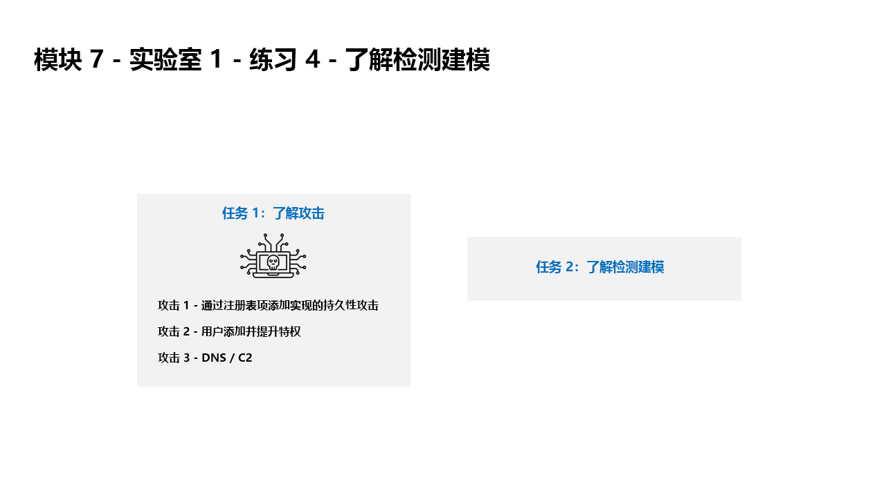

---
lab:
  title: 练习 5 - 了解检测建模
  module: Learning Path 7 - Create detections and perform investigations using Microsoft Sentinel
---

# <a name="learning-path-7---lab-1---exercise-5---understand-detection-modeling"></a>学习路径 7 - 实验室 1 - 练习 5 - 了解检测建模


### <a name="task-1-understand-the-attacks"></a>任务 1：了解攻击

>**重要说明：在此练习中你不会执行任何操作。**  这些说明只说明了在后续练习中将执行的攻击。 请仔细阅读本页。

攻击模式基于开源项目： https://github.com/redcanaryco/atomic-red-team


#### <a name="attack-1---persistence-with-registry-key-add"></a>攻击 1 - 通过注册表项添加实现的持久性攻击

攻击者会在运行注册表项中添加一个程序。 这通过使程序在用户每次登录时都能运行来实现持久性。

```
REG ADD "HKCU\SOFTWARE\Microsoft\Windows\CurrentVersion\Run" /V "SOC Test" /t REG_SZ /F /D "C:\temp\startup.bat"
```

#### <a name="attack-2---user-add-and-elevate-privilege"></a>攻击 2 - 用户添加和特权提升

攻击将添加新建用户并将新用户提升到管理员组。 这会让攻击者能够使用有特权的其他帐户登录。

```
net user theusernametoadd /add
net user theusernametoadd ThePassword1!
net localgroup administrators theusernametoadd /add
```

#### <a name="attack-3---dns--c2"></a>攻击 3 - DNS / C2 

攻击者会向命令发送大量 DNS 查询，并控制 (C2) 服务器。 目的是对来自单个源系统或发往单个目标域的 DNS 查询的数目触发基于阈值的检测。

```
param(
    [string]$Domain = "microsoft.com",
    [string]$Subdomain = "subdomain",
    [string]$Sub2domain = "sub2domain",
    [string]$Sub3domain = "sub3domain",
    [string]$QueryType = "TXT",
        [int]$C2Interval = 8,
        [int]$C2Jitter = 20,
        [int]$RunTime = 240
)
$RunStart = Get-Date
$RunEnd = $RunStart.addminutes($RunTime)
$x2 = 1
$x3 = 1 
Do {
    $TimeNow = Get-Date
    Resolve-DnsName -type $QueryType $Subdomain".$(Get-Random -Minimum 1 -Maximum 999999)."$Domain -QuickTimeout
    if ($x2 -eq 3 )
    {
        Resolve-DnsName -type $QueryType $Sub2domain".$(Get-Random -Minimum 1 -Maximum 999999)."$Domain -QuickTimeout
        $x2 = 1
    }
    else
    {
        $x2 = $x2 + 1
    }
    if ($x3 -eq 7 )
    {
        Resolve-DnsName -type $QueryType $Sub3domain".$(Get-Random -Minimum 1 -Maximum 999999)."$Domain -QuickTimeout
        $x3 = 1
    }
    else
    {
        $x3 = $x3 + 1
    }
    $Jitter = ((Get-Random -Minimum -$C2Jitter -Maximum $C2Jitter) / 100 + 1) +$C2Interval
    Start-Sleep -Seconds $Jitter
}
Until ($TimeNow -ge $RunEnd)
```


### <a name="task-2-understand-detection-modeling"></a>任务 2：了解检测建模

本实验室中使用的攻击检测配置循环代表所有数据源，虽然你仅专注于两个特定数据源。

要构建检测，从构建 KQL 语句开始。 你将开始攻击主机，因此将使用代表数据开始构建 KQL 语句。


有 KQL 语句后，即可创建分析规则。

触发规则并创建警报和事件后，调查以确定你是否提供了可帮助安全运营分析师进行调查的字段。

接下来，你将对分析规则进行其他更改。

>**注意：** 为了方便演示实验室，某些警报触发的时间期限较短。

## <a name="proceed-to-exercise-6"></a>继续完成练习 6
