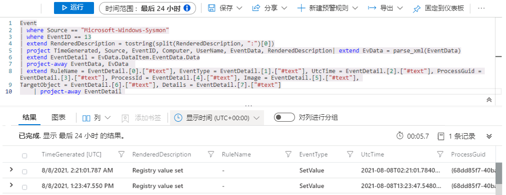

---
lab:
  title: 练习 6 - 创建检测
  module: Module 7 - Create detections and perform investigations using Microsoft Sentinel
ms.openlocfilehash: a78585ad2c3b175ab0277ad76fe417307f8374f7
ms.sourcegitcommit: 320cb9d3ce20c75731418e03eb86916841cecc69
ms.translationtype: HT
ms.contentlocale: zh-CN
ms.lasthandoff: 03/19/2022
ms.locfileid: "140742101"
---
# <a name="module-7---lab-1---exercise-6---create-detections"></a>模块 7 - 实验室 1 - 练习 6 - 创建检测

## <a name="lab-scenario"></a>实验室方案

你是一位安全运营分析师，你所在公司已实现 Microsoft Sentinel。 你将使用 Log Analytics KQL 查询，并从这里创建自定义分析规则，以帮助发现环境中的威胁和异常行为。

分析规则将在你的整个环境中搜索特定事件或事件集，在达到特定事件阈值或条件时发出警报，生成故障事件以供 SOC 进行会审和调查，并通过自动化跟踪和修正流程来响应威胁。


### <a name="task-1-attack-1-detection-with-sysmon"></a>任务 1：使用 Sysmon 检测攻击 1

在此任务中，你将在安装了安全事件连接器和 Sysmon 的主机上创建针对攻击 1 的检测。

>**重要提示：** 接下来的步骤将在另一台计算机上完成，而不是你之前使用的计算机。 查找虚拟机名称引用。

1. 使用以下密码以管理员身份登录到 WIN1 虚拟机：**Pa55w.rd**。  

1. 在 Microsoft Edge 浏览器中，导航到 Azure 门户 (https://portal.azure.com )。

1. 在“登录”对话框中，复制粘贴实验室托管提供者为管理员提供的租户电子邮件帐户，然后选择“下一步”  。

1. 在“输入密码”对话框中，复制粘贴实验室托管提供者为管理员提供的租户密码，然后选择“登录”  。

1. 在 Azure 门户的“搜索”栏中，键入 Sentinel，然后选择 Microsoft Sentinel。

1. 选择之前创建的 Microsoft Sentinel 工作区。

1. 从“常规”部分选择“日志”，并确保日志“时间范围:”设置为“过去 24 小时” 。

1. 首先需要查看存储数据的位置。 运行以下 KQL 语句：

    ```KQL
    search "temp\\startup.bat"
    ```

1. 结果显示来自三个不同表的数据：

    - DeviceProcessEvents。 源：Defender for Endpoint 连接器。
    - DeviceRegistryEvents。 源：Defender for Endpoint 连接器。
    - 事件。 源：Log Analytics 代理、Sysmon/Operational Windows 事件日志（代理配置）。
    - SecurityEvent。 源：Log Analytics 代理、安全 Windows 事件日志（默认）。

    由于我们要从各种源接收数据，因此需要生成两个 KQL 语句，稍后可以联合这些语句。 初次调查时，你将分别查看每份数据。

    >**注意：** 在极少数情况下，初始数据加载过程需要的时间可能会超过预期。 发生这种情况时，这些表在几个小时内都不会出现在结果中。 如果只看到事件表，则现在可以继续，因为它就是你现在将使用的表。

1. 第一个数据源是分析 Windows 主机中的 Sysmon。 运行以下 KQL 语句，以仅显示事件表中的结果：

    ```KQL
    search in (Event) "temp\\startup.bat"
    ```

1. 展开第一行以查看与记录相关的所有列。 一些字段（例如 EventData 和 ParameterXml）具有多个存储为结构化数据的数据项 。 这使得很难对特定字段进行查询。 

1. 为此，我们需要生成一个可分析每行中数据的 KQL 语句，从而得到有意义的字段。 在 GitHub 上的 Microsoft Sentinel 社区中，“Parsers”文件夹中提供了很多示例。 在 Microsoft Edge 浏览器中打开另一个选项卡，然后键入 https://github.com/Azure/Azure-Sentinel。

1. 选择“分析程序”文件夹，然后选择“Sysmon”文件夹 。

1. 选择要查看的 Sysmon-v12.0.txt 文件。

1. 在文件顶部的注释后，你将看到以下 let 语句正在查询事件表并存储到名为 EventData 的变量，如下所示  ：

    >**注意：** 以下代码片段用于更好地了解步骤 16 中的查询，而不是复制和执行查询。

    ```
    let EventData = Event
    | where Source == "Microsoft-Windows-Sysmon"
    | extend RenderedDescription = tostring(split(RenderedDescription, ":")[0])
    | project TimeGenerated, Source, EventID, Computer, UserName, EventData, RenderedDescription
    | extend EvData = parse_xml(EventData)
    | extend EventDetail = EvData.DataItem.EventData.Data
    | project-away EventData, EvData  ;
    ```

1. 在文件的稍后部分，你会再看到一个 let 语句，它正在查找 EventID == 13 并将 EventData 变量用作输入，如下所示  ：

    >**注意：** 以下代码片段用于更好地了解步骤 16 中的查询，而不是复制和执行查询。

    ```
    let SYSMON_REG_SETVALUE_13=()
    {
        let processEvents = EventData
        | where EventID == 13
        | extend RuleName = EventDetail.[0].["#text"], EventType = EventDetail.[1].["#text"], UtcTime = EventDetail.[2].["#text"], ProcessGuid = EventDetail.[3].["#text"], ProcessId = EventDetail.[4].["#text"], Image = EventDetail.[5].["#text"], TargetObject = EventDetail.[6].["#text"], Details = EventDetail.[7].["#text"]
        | project-away EventDetail  ;
        processEvents;
    };
    ```

1. 看起来开局不错。 使用上述两个语句，你可创建自己的 KQL 语句，以使用事件表中的 Sysmon 显示所有注册表项设置值行。 返回到 Microsoft Sentinel Edge 浏览器选项卡并运行以下 KQL 查询：

    >**重要提示：** 请首先将任意 KQL 查询粘贴到记事本，然后从该查询复制到“新建查询 1 日志”窗口以避免任何错误 。

    ```KQL
    Event | where Source == "Microsoft-Windows-Sysmon"
    | where EventID == 13
    | extend RenderedDescription = tostring(split(RenderedDescription, ":")[0])
    | project TimeGenerated, Source, EventID, Computer, UserName, EventData, RenderedDescription
    | extend EvData = parse_xml(EventData)
    | extend EventDetail = EvData.DataItem.EventData.Data
    | project-away EventData, EvData  
    | extend RuleName = EventDetail.[0].["#text"], EventType = EventDetail.[1].["#text"], UtcTime = EventDetail.[2].["#text"], ProcessGuid = EventDetail.[3].["#text"], ProcessId = EventDetail.[4].["#text"], Image = EventDetail.[5].["#text"], TargetObject = EventDetail.[6].["#text"], Details = EventDetail.[7].["#text"]
    | project-away EventDetail 
    ```

   

1. 可从这里继续生成检测规则，但该 KQL 语句似乎可在其他检测规则的查询中重复使用。 在“日志”窗口中，选择“保存”，然后选择“另存为函数” 。 在“另存为函数”边栏选项卡中，键入以下内容：

    |设置|值|
    |---|---|
    |函数名称|Event_Reg_SetValue|
    |旧类别|**Sysmon**|

1. 选择“保存”，然后通过选择 + 符号打开新的“日志查询”选项卡 。 

1. 运行以下 KQL 语句以测试新创建的函数：

    ```KQL
    Event_Reg_SetValue
    ```

1. 根据当前的数据集合，你可接收多个行。 这是正常情况。 下一个任务是筛选特定方案。 运行以下 KQL 语句返回我们现在可以查看的特定记录，以查看可以更改哪些内容来标识行：

    ```KQL
    Event_Reg_SetValue | search "startup.bat"
    ```

1. 从结果中，我们现在知道了 Threat Actor 正在使用 reg.exe 向注册表项添加项，程序位于 C:\temp。运行以下语句，将查询中的搜索运算符替换为 where 运算符 :

    ```KQL
    Event_Reg_SetValue | where Image contains "reg.exe"
    | where Details startswith "C:\\TEMP"
    ```

1. 这是一个不错的开始。 请务必尽可能多地提供关于警报的上下文，为安全操作分析师提供帮助。 这包括投影在调查关系图中使用的实体。 运行以下查询：

    ```KQL
    Event_Reg_SetValue | where Image contains "reg.exe"
    | where Details startswith "C:\\TEMP"
    | extend timestamp = TimeGenerated, HostCustomEntity = Computer, AccountCustomEntity = UserName
    ```

1. 你现在有一个不错的检测规则，接下来请在“日志”窗口中，选择命令栏中的“+ 新建警报规则”，然后选择“创建 Azure Sentinel 警报” 。 这将新建一个计划规则，与在“模块 7 - 练习 3”中创建的规则相似。

1. 这会启动“分析规则向导”。 在“常规”选项卡中，键入以下内容：

    |设置|值|
    |---|---|
    |名称|Sysmon Startup RegKey|
    |说明|c:\temp 中的 Sysmon Startup Regkey|
    |策略|**持久性**|
    |Severity|**高**|

1. 选择“下一步: 设置规则逻辑 >”。 

1. 在“设置规则逻辑”选项卡上，“规则查询”应已填充 KQL 查询，以及“警报扩充 - 实体映射”下的实体  。 选择“-> 使用当前数据进行测试”，使用当前配置查看每天收到的警报数。

1. 下拉并找到“查询计划”，设置以下项：

    |设置|值|
    |---|---|
    |运行查询的时间间隔|5 分钟|
    |查看最近多久的数据|1 天|

    >**注意：** 我们特意针对同一数据生成了多个事件。 这样，实验室就可使用这些警报。 更改此配置后，收到的警报数将增加。

1.  再次选择“-> 使用当前数据进行测试”，使用已更改的配置查看每天收到的警报数。

1. 将其余选项保留为默认值。 选择“下一页:**事件设置 >”按钮**。

1. 对于事件设置（预览版）选项卡，保留默认值并选择“下一页: **自动响应 >”按钮**。

1. 对于“自动响应”选项卡，选择“警报自动化”下的“PostMessageTeams-OnAlert”，然后选择“下一页: **查看 >”按钮**。

1. 在“查看”选项卡上，选择“创建”按钮以新建计划分析规则。


### <a name="task-2-attack-1-detection-with-defender-for-endpoint"></a>任务 2：使用 Defender for Endpoint 检测攻击 1

在此任务中，你将在配置了 Microsoft Defender for Endpoint 的主机上创建针对攻击 1 的检测。

1. 如果你已离开此页面，在 Microsoft Sentinel 门户中，选择“常规”部分中的“日志”。

1. 再次运行以下 KQL 语句，以召回包含此数据的表：

    ```KQL
    search "temp\\startup.bat"
    ```

1. 此检测将重点关注来自 Defender for Endpoint 的数据。 运行以下 KQL 语句：

    ```KQL
    search in (Device*) "temp\\startup.bat"
    ```

1. DeviceRegistryEvents 表中的数据已经规范化，便于进行查询。 展开该行以查看与记录相关的所有列。

    >**重要提示：** 如果在结果中看不到 DeviceRegistryEvents 表，则以下查询的替代方法是使用 DeviceProcessEvents 表作为替换项 。 也就是说，可使用下面提供的两个示例之一。

1. 从结果中，我们现在知道了 Threat Actor 正在使用 reg.exe 向注册表项添加项，程序位于 C:\temp。运行以下语句，将查询中的搜索运算符替换为 where 运算符 :

    ```KQL
    DeviceRegistryEvents | where ActionType == "RegistryValueSet"
    | where InitiatingProcessFileName == "reg.exe"
    | where RegistryValueData startswith "c:\\temp"
    ```

1. 或者，可以使用 DeviceProcessEvents 表运行以下 KQL 查询：

    ```KQL
    DeviceProcessEvents | where ActionType == "ProcessCreated"
    | where FileName == "reg.exe"
    | where ProcessCommandLine contains "c:\\temp"
    ```

1. 请务必尽可能多地提供关于警报的上下文，为安全运营中心分析师提供帮助。 这包括投影在调查关系图中使用的实体。 运行以下查询：

    ```KQL
    DeviceRegistryEvents
    | where ActionType == "RegistryValueSet"
    | where InitiatingProcessFileName == "reg.exe"
    | where RegistryValueData startswith "c:\\temp"
    | extend timestamp = TimeGenerated, HostCustomEntity = DeviceName, AccountCustomEntity = InitiatingProcessAccountName
    ```

   

1. 或者，可以使用 DeviceProcessEvents 表运行以下 KQL 查询：

    ```KQL
    DeviceProcessEvents | where ActionType == "ProcessCreated"
    | where FileName == "reg.exe"
    | where ProcessCommandLine contains "c:\\temp"
    | extend timestamp = TimeGenerated, HostCustomEntity = DeviceName, AccountCustomEntity = InitiatingProcessAccountName
    ```

1. 你现在有一个不错的检测规则，接下来请在“日志”窗口中，选择命令栏中的“+ 新建警报规则”，然后选择“创建 Azure Sentinel 警报” 。 这将新建一个计划规则，与之前创建的规则相似。

1. 这会启动“分析规则向导”。 在“常规”选项卡中，键入以下内容：

    |设置|值|
    |---|---|
    |名称|MDE Startup RegKey|
    |说明|c:\temp 中的 MDE Startup Regkey|
    |策略|**持久性**|
    |Severity|**高**|

1. 选择“下一页:**设置规则逻辑 >”按钮**。

1. 在“设置规则逻辑”选项卡上，“规则查询”应已填充 KQL 查询，以及“警报扩充 - 实体映射”下的实体  。

1. 对于“查询计划”，设置以下项：

    |设置|值|
    |---|---|
    |运行查询的时间间隔|5 分钟|
    |查看最近多久的数据|1 天|

    >**注意：** 我们特意针对同一数据生成了多个事件。 这样，实验室就可使用这些警报。

1. 将其余选项保留为默认值。 选择“下一页:**事件设置 >”按钮**。

1. 对于事件设置（预览版）选项卡，保留默认值并选择“下一页: **自动响应 >”按钮**。

1. 对于“自动响应”选项卡，选择“警报自动化”下的“PostMessageTeams-OnAlert”，然后选择“下一页: 审阅”按钮。

1. 在“查看”选项卡上，选择“创建”按钮以新建计划分析规则。


### <a name="task-3-attack-2-detection-with-securityevent"></a>任务 3：使用 SecurityEvent 检测攻击 2

在此任务中，你将在安装了安全事件连接器和 Sysmon 的主机上创建针对攻击 2 的检测。

1. 如果你已离开此页面，在 Microsoft Sentinel 门户中，选择“常规”部分中的“日志”。

1. 运行以下 KQL 语句以标识任何引用管理员的条目：

    ```KQL
    search "administrators" | summarize count() by $table
    ```

1. 结果可能会显示不同表中的事件，但在我们的案例中，我们想要调查 SecurityEvent 表。 我们查找的 EventID 和 Event 为“4732 - 成员已添加到启用了安全性的本地组”。 通过此操作，我们将确定将成员添加到特权组。 运行以下 KQL 查询以确认：

    ```KQL
    SecurityEvent | where EventID == 4732
    | where TargetAccount == "Builtin\\Administrators"
    ```

1. 展开该行以查看与记录相关的所有列。 不会显示添加为管理员的帐户的用户名。 问题在于未存储该用户名，我们具有的是安全标识符 (SID)。 运行以下 KQL，将 SID 与添加到 Administrators 组的用户名匹配：

    ```KQL
    SecurityEvent | where EventID == 4732
    | where TargetAccount == "Builtin\\Administrators"
    | extend Acct = MemberSid, MachId = SourceComputerId  
    | join kind=leftouter (
        SecurityEvent 
        | summarize count() by TargetSid, SourceComputerId, TargetUserName 
        | project Acct1 = TargetSid, MachId1 = SourceComputerId, UserName1 = TargetUserName) on $left.MachId == $right.MachId1, $left.Acct == $right.Acct1
    ```

   

    >**注意：** 实验室使用的数据集较小，因此该 KQL 可能不会返回预期结果。

1. 扩展行以显示生成的列，在上一行中，我们在 KQL 查询投影的 UserName1 列下看到了添加的用户的名称 。 请务必尽可能多地提供关于警报的上下文，为安全操作分析师提供帮助。 这包括投影在调查关系图中使用的实体。 运行以下查询：

    ```KQL
    SecurityEvent | where EventID == 4732
    | where TargetAccount == "Builtin\\Administrators"
    | extend Acct = MemberSid, MachId = SourceComputerId  
    | join kind=leftouter (
        SecurityEvent 
        | summarize count() by TargetSid, SourceComputerId, TargetUserName 
        | project Acct1 = TargetSid, MachId1 = SourceComputerId, UserName1 = TargetUserName) on $left.MachId == $right.MachId1, $left.Acct == $right.Acct1
    | extend timestamp = TimeGenerated, HostCustomEntity = Computer, AccountCustomEntity = UserName1
    ```

1. 你现在有一个不错的检测规则，接下来请在“日志”窗口中，选择命令栏中的“+ 新建警报规则”，然后选择“创建 Azure Sentinel 警报” 。

1. 这会启动“分析规则向导”。 在“常规”选项卡中，键入以下内容：

    |设置|值|
    |---|---|
    |名称|SecurityEvents 本地管理员用户添加操作|
    |说明|添加到本地管理员组的用户|
    |策略|**特权提升**|
    |Severity|**高**|

1. 选择“下一页:**设置规则逻辑 >”按钮**。 

1. 在“设置规则逻辑”选项卡上，“规则查询”应已填充 KQL 查询，以及“警报扩充 - 实体映射”下的实体  。

1. 对于“查询计划”，设置以下项：

    |设置|值|
    |---|---|
    |运行查询的时间间隔|5 分钟|
    |查看最近多久的数据|1 天|

    >**注意：** 我们特意针对同一数据生成了多个事件。 这样，实验室就可使用这些警报。

1. 将其余选项保留为默认值。 选择“下一页:**事件设置 >”按钮**。

1. 对于事件设置（预览版）选项卡，保留默认值并选择“下一页: **自动响应 >”按钮**。

1. 对于“自动响应”选项卡，选择“警报自动化”下的“PostMessageTeams-OnAlert”，然后选择“下一页: 审阅”按钮。

1. 在“查看”选项卡上，选择“创建”按钮以新建计划分析规则。

## <a name="proceed-to-exercise-7"></a>转到练习 7
