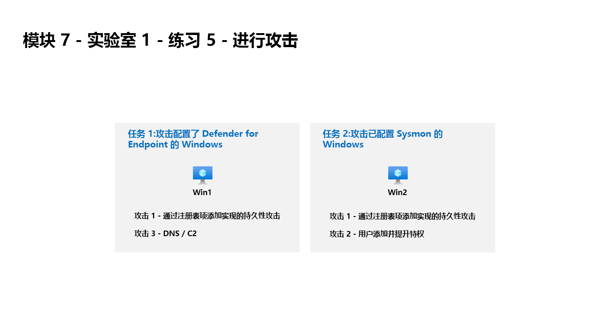

---
lab:
  title: 练习 6 - 进行攻击
  module: Module 7 - Create detections and perform investigations using Microsoft Sentinel
---

# <a name="module-7---lab-1---exercise-6---conduct-attacks"></a>模块 7 - 实验室 1 - 练习 6 - 进行攻击

## <a name="lab-scenario"></a>实验室方案



你将模拟稍后将用于在 Microsoft Sentinel 中检测和调查的攻击。


### <a name="task-1-attack-windows-configured-with-defender-for-endpoint"></a>任务 1：攻击配置了 Defender for Endpoint 的 Windows

在此任务中，你将在配置了 Microsoft Defender for Endpoint 的主机执行攻击。

1. 使用以下密码以管理员身份登录到 WIN1 虚拟机：**Pa55w.rd**。  

1. In the search of the task bar, enter <bpt id="p1">*</bpt>Command<ept id="p1">*</ept>. Command Prompt will be displayed in the search results. Right-click on the Command Prompt and select <bpt id="p1">**</bpt>Run as Administrator<ept id="p1">**</ept>. Select <bpt id="p1">**</bpt>Yes<ept id="p1">**</ept> in the User Account Control window that appears to allow the app to run.

1. In the Command Prompt, create a Temp folder in the root directory. Remember to press Enter after the last row:

    ```CommandPrompt
    cd \
    mkdir temp
    cd temp
    ```

#### <a name="attack-1---persistence-with-registry-key-add"></a>攻击 1 - 通过注册表项添加实现的持久性攻击

1. 复制并运行以下命令以模拟程序持久性：

    ```CommandPrompt
    REG ADD "HKCU\SOFTWARE\Microsoft\Windows\CurrentVersion\Run" /V "SOC Test" /t REG_SZ /F /D "C:\temp\startup.bat"
    ```

#### <a name="attack-3---dns--c2"></a>攻击 3 - DNS / C2 

1. 复制并运行以下命令以创建一个脚本，用于模拟对 C2 服务器的 DNS 查询：

    ```CommandPrompt
    notepad c2.ps1
    ```

1. 选择“是”以创建新文件并将以下 PowerShell 脚本复制到 c2.ps1。

    ><bpt id="p1">**</bpt>Note:<ept id="p1">**</ept> Paste into the virtual machine might have a limited length. Make sure the script looks as it does in these instructions within the <bpt id="p1">*</bpt>c2.ps1<ept id="p1">*</ept> file.

    ```PowerShell
    param(
        [string]$Domain = "microsoft.com",
        [string]$Subdomain = "subdomain",
        [string]$Sub2domain = "sub2domain",
        [string]$Sub3domain = "sub3domain",
        [string]$QueryType = "TXT",
        [int]$C2Interval = 8,
        [int]$C2Jitter = 20,
        [int]$RunTime = 240
    )
    $RunStart = Get-Date
    $RunEnd = $RunStart.addminutes($RunTime)
    $x2 = 1
    $x3 = 1 
    Do {
        $TimeNow = Get-Date
        Resolve-DnsName -type $QueryType $Subdomain".$(Get-Random -Minimum 1 -Maximum 999999)."$Domain -QuickTimeout
        if ($x2 -eq 3 )
        {
            Resolve-DnsName -type $QueryType $Sub2domain".$(Get-Random -Minimum 1 -Maximum 999999)."$Domain -QuickTimeout
            $x2 = 1
        }
        else
        {
            $x2 = $x2 + 1
        }    
        if ($x3 -eq 7 )
        {
            Resolve-DnsName -type $QueryType $Sub3domain".$(Get-Random -Minimum 1 -Maximum 999999)."$Domain -QuickTimeout
            $x3 = 1
        }
        else
        {
            $x3 = $x3 + 1
        }
        $Jitter = ((Get-Random -Minimum -$C2Jitter -Maximum $C2Jitter) / 100 + 1) +$C2Interval
        Start-Sleep -Seconds $Jitter
    }
    Until ($TimeNow -ge $RunEnd)
    ```

1. 在“记事本”菜单中，选择“文件”，然后选择“保存” 。 

1. 返回命令提示符窗口，输入以下命令并按 Enter 键。 

    ><bpt id="p1">**</bpt>Note:<ept id="p1">**</ept> A new PowerShell window will open and you will see resolve errors. This is expected.

    ```CommandPrompt
    Start PowerShell.exe -file c2.ps1
    ```

><bpt id="p1">**</bpt>Important:<ept id="p1">**</ept> Do not close these windows. Let this PowerShell script run in the background. The command needs to generate log entries for some hours. You can proceed to the next task and next exercises while this script runs. The data created by this task will be used in the Threat Hunting lab later. This process will not create substantial amounts of data or processing.


### <a name="task-2-attack-windows-configured-with-microsoft-sentinel-connector"></a>任务 2：攻击配置了 Microsoft Sentinel 连接器的 Windows

在此任务中，你将通过 Microsoft Sentinel 攻击配置了安全事件连接器的主机。

><bpt id="p1">**</bpt>Important:<ept id="p1">**</ept> The next steps are done in a different machine than the one you were previously working. Look for the Virtual Machine name references.

1. 以管理员身份使用密码登录到 WIN2 虚拟机：**Pa55w.rd**。  

>**重要提示：** 实验室的 SAVE 功能会导致 Win2 与 Azure Arc 断开连接。重启可以解决这个问题。  

1. Select <bpt id="p1">**</bpt>Start<ept id="p1">**</ept> in Windows. Then <bpt id="p1">**</bpt>Power<ept id="p1">**</ept>, next <bpt id="p2">**</bpt>Restart<ept id="p2">**</ept>
1. 按照说明再次登录到 WIN2。


1. In the search of the task bar, enter <bpt id="p1">*</bpt>Command<ept id="p1">*</ept>. Command Prompt will be displayed in the search results. Right-click on the Command Prompt and select <bpt id="p1">**</bpt>Run as Administrator<ept id="p1">**</ept>. Select <bpt id="p1">**</bpt>Yes<ept id="p1">**</ept> in the User Account Control window that appears to allow the app to run. <bpt id="p1">**</bpt>Hint:<ept id="p1">**</ept> You might have a Command Prompt as Administrator open from a previous exercise.

1. In the Command Prompt, create a Temp folder in the root directory. Remember to press Enter after the last row:

    ```CommandPrompt
    cd \
    mkdir temp
    cd \temp
    ```

#### <a name="attack-2---user-add-and-elevate-privilege"></a>攻击 2 - 用户添加和特权提升

1. 在任务栏的搜索框中，输入“Command”。

    ```CommandPrompt
    net user theusernametoadd /add
    net user theusernametoadd ThePassword1!
    net localgroup administrators theusernametoadd /add
    ```

## <a name="proceed-to-exercise-7"></a>转到练习 7
