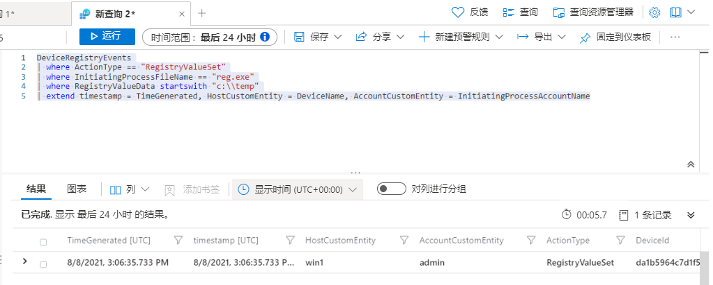

---
lab:
  title: 练习 7 - 创建检测
  module: Module 7 - Create detections and perform investigations using Microsoft Sentinel
ms.openlocfilehash: f94b4d459a9af82751b774f572db69df3c01bf7f
ms.sourcegitcommit: 8c0ae4aec8425a85e0ba6dc8964406bf5d79e4d4
ms.translationtype: HT
ms.contentlocale: zh-CN
ms.lasthandoff: 07/15/2022
ms.locfileid: "147154503"
---
# <a name="module-7---lab-1---exercise-7---create-detections"></a>模块 7 - 实验室 1 - 练习 7 - 创建检测

## <a name="lab-scenario"></a>实验室方案


你是一位安全运营分析师，你所在公司已实现 Microsoft Sentinel。 你将使用 Log Analytics KQL 查询，并从这里创建自定义分析规则，以帮助发现环境中的威胁和异常行为。

分析规则将在你的整个环境中搜索特定事件或事件集，在达到特定事件阈值或条件时发出警报，生成故障事件以供 SOC 进行会审和调查，并通过自动化跟踪和修正流程来响应威胁。


### <a name="task-1-attack-1-detection-with-defender-for-endpoint"></a>任务 1：使用 Defender for Endpoint 检测攻击 1

在此任务中，你将在配置了 Microsoft Defender for Endpoint 的主机上创建针对攻击 1 的检测。

1. 如果你已离开此页面，在 Microsoft Sentinel 门户中，选择“常规”部分中的“日志”。

1. 再次运行以下 KQL 语句，以召回包含此数据的表：

    ```KQL
    search "temp\\startup.bat"
    ```

1. 此检测将重点关注来自 Defender for Endpoint 的数据。 运行以下 KQL 语句：

    ```KQL
    search in (Device*) "temp\\startup.bat"
    ```

1. DeviceRegistryEvents 表中的数据已经规范化，便于进行查询。 展开该行以查看与记录相关的所有列。

    >**重要提示：** 如果在结果中看不到 DeviceRegistryEvents 表，则以下查询的替代方法是使用 DeviceProcessEvents 表作为替换项 。 也就是说，可使用下面提供的两个示例之一。

1. 从结果中，我们现在知道了 Threat Actor 正在使用 reg.exe 向注册表项添加项，程序位于 C:\temp。运行以下语句，将查询中的搜索运算符替换为 where 运算符 :

    ```KQL
    DeviceRegistryEvents | where ActionType == "RegistryValueSet"
    | where InitiatingProcessFileName == "reg.exe"
    | where RegistryValueData startswith "c:\\temp"
    ```

1. 或者，可以使用 DeviceProcessEvents 表运行以下 KQL 查询：

    ```KQL
    DeviceProcessEvents | where ActionType == "ProcessCreated"
    | where FileName == "reg.exe"
    | where ProcessCommandLine contains "c:\\temp"
    ```

1. 请务必尽可能多地提供关于警报的上下文，为安全运营中心分析师提供帮助。 这包括投影在调查关系图中使用的实体。 运行以下查询：

    ```KQL
    DeviceRegistryEvents
    | where ActionType == "RegistryValueSet"
    | where InitiatingProcessFileName == "reg.exe"
    | where RegistryValueData startswith "c:\\temp"
    | extend timestamp = TimeGenerated, HostCustomEntity = DeviceName, AccountCustomEntity = InitiatingProcessAccountName
    ```

   

1. 或者，可以使用 DeviceProcessEvents 表运行以下 KQL 查询：

    ```KQL
    DeviceProcessEvents | where ActionType == "ProcessCreated"
    | where FileName == "reg.exe"
    | where ProcessCommandLine contains "c:\\temp"
    | extend timestamp = TimeGenerated, HostCustomEntity = DeviceName, AccountCustomEntity = InitiatingProcessAccountName
    ```

1. 你现在有一个不错的检测规则，接下来请在“日志”窗口中，选择命令栏中的“+ 新建预警规则”，然后选择“创建 Microsoft Sentinel 警报” 。 随后会创建新的计划规则。

1. 这会启动“分析规则向导”。 在“常规”选项卡中，键入以下内容：

    |设置|值|
    |---|---|
    |名称|MDE Startup RegKey|
    |说明|c:\temp 中的 MDE Startup Regkey|
    |策略|**持久性**|
    |Severity|**高**|

1. 选择“下一页:**设置规则逻辑 >”按钮**。

1. 在“设置规则逻辑”选项卡上，“规则查询”应已填充 KQL 查询，以及“警报扩充 - 实体映射”下的实体  。

1. 对于“查询计划”，设置以下项：

    |设置|值|
    |---|---|
    |运行查询的时间间隔|5 分钟|
    |查看最近多久的数据|1 天|

    >**注意：** 我们特意针对同一数据生成了多个事件。 这样，实验室就可使用这些警报。

1. 将其余选项保留为默认值。 选择“下一页:**事件设置 >”按钮**。

1. 对于“事件设置”选项卡，保留默认值并选择“下一页: “下一步: 自动响应 >”按钮。

1. 对于“自动响应”选项卡，选择“警报自动化”下的“PostMessageTeams-OnAlert”，然后选择“下一页: 审阅”按钮。

1. 在“查看”选项卡上，选择“创建”按钮以新建计划分析规则。


### <a name="task-2-attack-2-detection-with-securityevent"></a>任务 2：使用 SecurityEvent 检测攻击 2

在此任务中，你将在安装了安全事件连接器的主机上创建针对攻击 2 的检测。

1. 如果你已离开此页面，在 Microsoft Sentinel 门户中，选择“常规”部分中的“日志”。

1. 运行以下 KQL 语句以标识任何引用管理员的条目：

    ```KQL
    search "administrators" | summarize count() by $table
    ```

1. 结果可能会显示不同表中的事件，但在我们的案例中，我们想要调查 SecurityEvent 表。 我们查找的 EventID 和 Event 为“4732 - 成员已添加到启用了安全性的本地组”。 通过此操作，我们将确定将成员添加到特权组。 运行以下 KQL 查询以确认：

    ```KQL
    SecurityEvent | where EventID == 4732
    | where TargetAccount == "Builtin\\Administrators"
    ```

1. 展开该行以查看与记录相关的所有列。 不会显示添加为管理员的帐户的用户名。 问题在于未存储该用户名，我们具有的是安全标识符 (SID)。 运行以下 KQL，将 SID 与添加到 Administrators 组的用户名匹配：

    ```KQL
    SecurityEvent | where EventID == 4732
    | where TargetAccount == "Builtin\\Administrators"
    | extend Acct = MemberSid, MachId = SourceComputerId  
    | join kind=leftouter (
        SecurityEvent 
        | summarize count() by TargetSid, SourceComputerId, TargetUserName 
        | project Acct1 = TargetSid, MachId1 = SourceComputerId, UserName1 = TargetUserName) on $left.MachId == $right.MachId1, $left.Acct == $right.Acct1
    ```

   

    >**注意：** 实验室使用的数据集较小，因此该 KQL 可能不会返回预期结果。

1. 扩展行以显示生成的列，在上一行中，我们在 KQL 查询投影的 UserName1 列下看到了添加的用户的名称 。 请务必尽可能多地提供关于警报的上下文，为安全操作分析师提供帮助。 这包括投影在调查关系图中使用的实体。 运行以下查询：

    ```KQL
    SecurityEvent | where EventID == 4732
    | where TargetAccount == "Builtin\\Administrators"
    | extend Acct = MemberSid, MachId = SourceComputerId  
    | join kind=leftouter (
        SecurityEvent 
        | summarize count() by TargetSid, SourceComputerId, TargetUserName 
        | project Acct1 = TargetSid, MachId1 = SourceComputerId, UserName1 = TargetUserName) on $left.MachId == $right.MachId1, $left.Acct == $right.Acct1
    | extend timestamp = TimeGenerated, HostCustomEntity = Computer, AccountCustomEntity = UserName1
    ```

1. 你现在有一个不错的检测规则，接下来请在“日志”窗口中，选择命令栏中的“+ 新建预警规则”，然后选择“创建 Microsoft Sentinel 警报” 。

1. 这会启动“分析规则向导”。 在“常规”选项卡中，键入以下内容：

    |设置|值|
    |---|---|
    |名称|SecurityEvents 本地管理员用户添加操作|
    |说明|添加到本地管理员组的用户|
    |策略|**特权提升**|
    |Severity|**高**|

1. 选择“下一页:**设置规则逻辑 >”按钮**。 

1. 在“设置规则逻辑”选项卡上，“规则查询”应已填充 KQL 查询，以及“警报扩充 - 实体映射”下的实体  。

1. 对于“查询计划”，设置以下项：

    |设置|值|
    |---|---|
    |运行查询的时间间隔|5 分钟|
    |查看最近多久的数据|1 天|

    >**注意：** 我们特意针对同一数据生成了多个事件。 这样，实验室就可使用这些警报。

1. 将其余选项保留为默认值。 选择“下一页:**事件设置 >”按钮**。

1. 对于“事件设置”选项卡，保留默认值并选择“下一页: “下一步: 自动响应 >”按钮。

1. 对于“自动响应”选项卡，选择“警报自动化”下的“PostMessageTeams-OnAlert”，然后选择“下一页: 审阅”按钮。

1. 在“查看”选项卡上，选择“创建”按钮以新建计划分析规则。

## <a name="proceed-to-exercise-8"></a>继续完成练习 8
