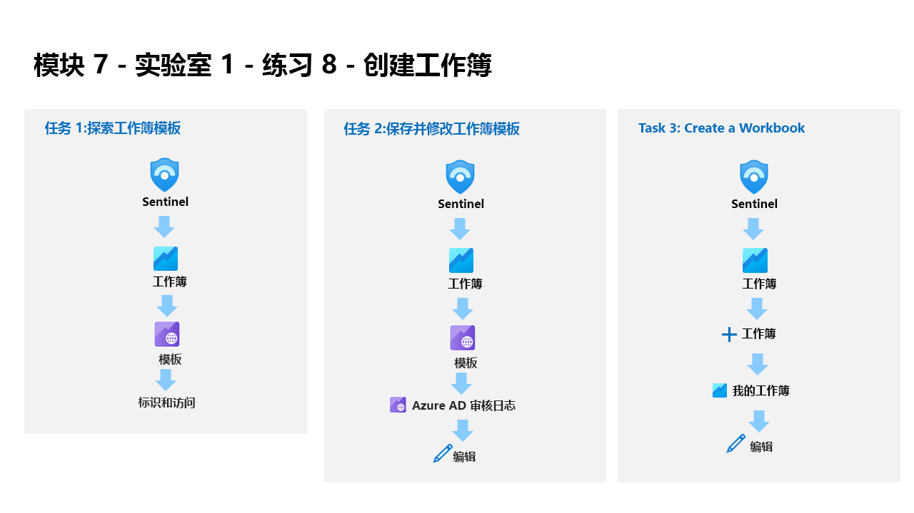

---
lab:
  title: 练习 8 - 调查事件
  module: Learning Path 7 - Create detections and perform investigations using Microsoft Sentinel
---

# 学习路径 7 - 实验室 1 - 练习 8 - 调查事件

## 实验室方案

你是一位安全运营分析师，你所在公司已实现 Microsoft Sentinel。 你已创建“计划”规则和“Microsoft 安全分析”规则。 环境中也启用了“融合”和“异常分析”规则。 现在，可以调查他们创建的事件。

一个事件可以包含多个警报。 其中聚合了特定调查的所有相关证据。 在事件级别设置与警报相关的属性，例如严重性和状态。 让 Microsoft Sentinel 知道要查找的威胁种类以及如何找到它们之后，可以通过调查事件来监视检测到的威胁。

>**注意：** 我们提供 **[交互式实验室模拟](https://mslabs.cloudguides.com/guides/SC-200%20Lab%20Simulation%20-%20Investigate%20incidents)** ，让你能以自己的节奏点击浏览实验室。 你可能会发现交互式模拟与托管实验室之间存在细微差异，但演示的核心概念和思想是相同的。 

### 任务 1：调查一个事件

在此任务中，你将调查一个事件。

1. 使用以下密码以管理员身份登录到 WIN1 虚拟机：**Pa55w.rd**。  

1. 在 Microsoft Edge 浏览器中，导航到 Azure 门户 (https://portal.azure.com )。

1. 在“登录”对话框中，复制粘贴实验室托管提供者提供的租户电子邮件帐户，然后选择“下一步”  。

1. 在“输入密码”对话框中，复制粘贴实验室托管提供者提供的租户密码，然后选择“登录”  。

1. 在 Azure 门户的搜索栏中，键入“Sentinel”，然后选择“Microsoft Sentinel”。

1. 选择之前创建的 Microsoft Sentinel 工作区。

1. 选择“事件”页面。

1. 查看事件列表。

    >**注意：** “分析”规则会在同一特定日志项上生成警报和事件。 请记住，这是在“查询计划”配置中完成的，以生成更多要在实验室中使用的警报和事件。
  
1. 选择其中一个 Startup RegKey 事件。

1. 在打开的右侧边栏选项卡上查看事件详细信息。 向下滚动并选择“查看全部详细信息”按钮。

1. 如果出现“新事件体验”弹出窗口，请按照提示操作，你可以通过选择“下一步”按钮来阅读信息。

1. 在事件的左侧边栏选项卡上，将状态更改为“活动”，然后选择“应用” 。

1. 向下滚动到“标记”区域，选择“+”并键入“RegKey”，然后选择“确定”  。

1. 向下滚动，在“撰写注释...”框中键入“我将对此进行研究”，然后选择 > 图标以提交新注释 。

1. 选择所有者旁边的 << 图标隐藏左侧边栏选项卡。

1. 查看“事件时间线”窗口。 选择右上角的“**事件操作**”按钮，然后选择“**运行剧本**”。 将看到 *PostMessageTeams-OnIncident* 剧本。 此选项可帮助你手动运行 playbook。

1. 选择右上角的 **x** 图标，关闭“*在事件上执行 playbook*”边栏选项卡。

1. 查看“实体”窗口。 至少应显示我们在上一练习中的 KQL 查询中映射的主机实体。 提示：如果未显示任何实体，请刷新页面。

1. 在命令栏中选择新的“任务(预览)”按钮。

1. 选择“+ 添加任务”，在“标题”框中键入“查看拥有计算机的人员”，然后选择“保存”  。

1. 选择右上角的 x 图标，关闭“事件任务(预览)”边栏选项卡。

1. 在命令栏中选择新的“活动日志”按钮。

1. 查看在此练习中执行的操作。

1. 选择右上角的 x 图标，关闭“事件活动日志”边栏选项卡。

1. 在几乎隐藏的左侧边栏选项卡中，选择名为“未分配”的用户图标。 新的事件体验能够实现从此处快速更改。

1. 选择“分配给我”，然后向下滚动，选择“应用”以保存更改 。

1. 选择 >> 图标，展开左侧边栏选项卡。 然后选择“调查”按钮。

    >提示：如果图标对于屏幕来说太小，请选择 (+) 来放大它们。

1. 将鼠标悬停在 WINServer 实体图标上并等待显示新的探索查询。 看起来“相关警报”包含更多数据。 选择探索查询的名称“相关警报”以将其引入调查图，或选择“事件 >”以使用 KQL 查询对其进行调查 。

1. 选择右上角的 X 图标返回到“调查”页面，关闭查询窗口。

1. 现在选择 WINServer 实体，右侧将打开一个窗口，你可以在其中了解更多详细信息。 查看“信息”页。

1. 选择“时间线”按钮。 将鼠标悬停在事件上，查看图表上的哪些事件发生在什么时间点。

1. 选择“实体”按钮，然后查看与 WINServer 相关的实体和警报  。

1. 选择页面右上角的 X 图标关闭调查图。

1. 返回事件页面，在左窗格中选择“活动状态”，然后选择“已关闭” 。 

1. 在“选择分类”下拉列表中，查看不同的选项。 之后，选择“真正 - 可疑活动”，然后选择“应用” 。

## 继续完成练习 9
