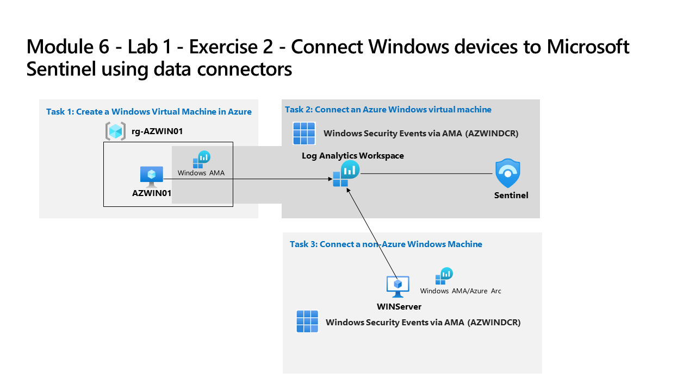

---
lab:
  title: 练习 2 - 使用数据连接器将 Windows 设备连接到 Microsoft Sentinel
  module: Learning Path 8 - Connect logs to Microsoft Sentinel
---

# 学习路径 8 - 实验室 1 - 练习 2 - 使用数据连接器将 Windows 设备连接到 Microsoft Sentinel

## 实验室方案

你是一位安全运营分析师，你所在公司已实现 Microsoft Sentinel。 你需要了解如何连接来自组织中多个数据源的日志数据。 下一个数据源是 Azure 内部和外部的 Windows 虚拟机，例如本地环境或其他公共云。

>**重要说明：** 学习路径 #8 的实验室练习是在*独立*环境中进行的。 如果在完成实验室前退出，则需要重新运行配置。

### 完成本实验室的估计时间：30 分钟

### 任务 1：在 Azure 中创建 Windows 虚拟机

在本任务中，你将在 Azure 中创建 Windows 虚拟机。

1. 使用密码 Pa55w.rd 以管理员身份登录到 WIN1 虚拟机 。  

1. 在 Microsoft Edge 浏览器中，导航到 Azure 门户 (<https://portal.azure.com> )。

1. 在“登录”对话框中，复制粘贴实验室托管提供者提供的租户电子邮件帐户，然后选择“下一步”  。

1. 在“输入密码”对话框中，复制粘贴实验室托管提供者提供的租户密码，然后选择“登录”  。

1. 选择“+ 创建资源”。 提示：如果已在 Azure 门户中，则可能需要从顶部栏中选择 Microsoft Azure 以返回主页。

1. 在“搜索服务和市场”框中，输入“Windows 10”并从下拉列表中选择“Microsoft Window 10”。

1. 选中 Microsoft Window 10 对应的框。

1. 打开“计划”下拉列表，然后选择“Windows 10 企业版，版本 22H2”。

1. 选择“开始使用预设置配置”以继续。

1. 选择“开发/测试”，然后选择“继续创建 VM” 。

1. 为“资源组”选择“新建”，输入 RG-AZWIN01 作为名称，然后选择“确定”。

    >**注意：** 该资源组将是用于跟踪的新资源组。 

1. 在“虚拟机名称”处输入 AZWIN01。

1. 将“区域”的默认值保留为“(US) 美国东部”。

1. 向下滚动，查看虚拟机的“映像”。 如果显示为空，请选择“Windows 10 企业版，版本 22H2”。

1. 查看虚拟机的“大小”。 如果它显示为空，请选择“查看所有大小”，在“Azure 用户最常用的大小”下选择第一个 VM 大小，然后选择“选择”。

    >注意：如果看到消息“Azure Automanage 不支持此映像。若要禁用此功能，请导航到“管理”选项卡。否则，请选择受支持的映像******。” 转到“管理”选项卡并禁用“Automanage”。 之后创建过程便会成功。

1. 向下滚动，输入你选择的用户名。 提示：避免使用保留字，如 admin 或 root。

1. 输入你选择的密码。 提示：重新使用你的租户密码可能更简单。 可以在“资源”选项卡中找到它。

1. 向下滚动到页面底部，选中“许可”下面的复选框，以确认你具有符合条件的许可证。

1. 选择“查看 + 创建”，然后等待验证通过。

    >注意：如果网络验证失败，请选择该选项卡，查看其内容，然后再次选择“查看 + 创建”。

1. 选择“创建”。 等待创建资源，这可能需要几分钟的时间。

<!--- ### Task 2: Install Azure Arc on an On-Premises Server

In this task, you install Azure Arc on an on-premises server to make onboarding easier.

>**Important:** The next steps are done in a different machine than the one you were previously working. Look for the Virtual Machine name references.

1. Log in to **WINServer** virtual machine as Administrator with the password: **Passw0rd!** if necessary.  

1. Open the Microsoft Edge browser and navigate to the Azure portal at <https://portal.azure.com>.

1. In the **Sign in** dialog box, copy, and paste in the **Tenant Email** account provided by your lab hosting provider and then select **Next**.

1. In the **Enter password** dialog box, copy, and paste in the **Tenant Password** provided by your lab hosting provider and then select **Sign in**.

1. In the Search bar of the Azure portal, type *Arc*, then select **Azure Arc**.

1. In the navigation pane under **Azure Arc resources** select **Machines**

1. Select **+ Add/Create**, then select **Add a machine**.

1. Select **Generate script** from the "Add a single server" section.

1. In the *Add a server with Azure Arc* page, select the Resource group you created earlier under *Project details*. **Hint:** *RG-Defender*

    >**Note:** If you haven't already created a resource group, open another tab and create the resource group and start over.

1. For *Region*, select **(US) East Us** from the drop-down list.

1. Review the *Server details* and *Connectivity method* options. Keep the default values and select **Next** to get to the Tags tab.

1. Review the default available tags. Select **Next** to get to the Download and run script tab.

1. Scroll down and select the **Download** button. **Hint:** if your browser blocks the download, take action in the browser to allow it. In Microsoft Edge Browser, select the ellipsis button (...) if needed and then select **Keep**.

1. Right-click the Windows Start button and select **Windows PowerShell (Admin)**.

1. Enter *Administrator* for "Username" and *Passw0rd!* for "Password" if you get a UAC prompt.

1. Enter: cd C:\Users\Administrator\Downloads

    >**Important:** If you do not have this directory, most likely means that you are in the wrong machine. Go back to the beginning of Task 4 and change to WINServer and start over.

1. Type *Set-ExecutionPolicy -ExecutionPolicy Unrestricted* and press enter.

1. Enter **A** for Yes to All and press enter.

1. Type *.\OnboardingScript.ps1* and press enter.  

    >**Important:** If you get the error *"The term .\OnboardingScript.ps1 is not recognized..."*, make sure you are doing the steps for Task 4 in the WINServer virtual machine. Other issue might be that the name of the file changed due to multiple downloads, search for *".\OnboardingScript (1).ps1"* or other file numbers in the running directory.

1. Enter **R** to Run once and press enter (this may take a couple minutes).

1. The setup process opens a new Microsoft Edge browser tab to authenticate the Azure Arc agent. Select your admin account, wait for the message "Authentication complete" and then go back to the Windows PowerShell window.

1. When the installation finishes, go back to the Azure portal page where you downloaded the script and select **Close**. Close the **Add servers with Azure Arc** to go back to the Azure Arc **Machines** page.

1. Select **Refresh** until WINServer server name appears and the Status is *Connected*.

    >**Note:** This could take a couple of minutes. --->

### 任务 2：连接 Azure Windows 虚拟机

在此任务中，需要将 Azure Windows 虚拟机连接到 Microsoft Sentinel。

>**备注：** 已在名称为 **defenderWorkspace** 的 Azure 订阅中预先部署了 Microsoft Sentinel，并且已安装所需的*内容中心*解决方案。

1. 在 Azure 门户的“搜索”栏中，键入 Sentinel，然后选择 Microsoft Sentinel。

1. 选择 Microsoft Sentinel **defenderWorkspace**。

1. 在 Microsoft Sentinel 左侧导航菜单中，向下滚动到“*内容管理*”部分，然后选择“**内容中心**”。

1. 在“内容中心”，搜索“Windows 安全事件”解决方案，并从列表中选择它。

1. 在“*Windows 安全事件*”解决方案页上，选择“**管理**”。

    >注意：“Windows 安全事件”解决方案安装“通过 AMA 收集的 Windows 安全事件”和“通过旧版代理程序的安全事件”数据连接器。 外加 2 个工作簿、20 个分析规则和 43 个搜寻查询。

1. 选择“通过 AMA 收集的 Windows 安全事件”数据连接器，然后在连接器信息窗格上选择“打开连接器页面”。

1. 在“说明”选项卡下的“配置”部分，选择“创建数据收集规则”。

1. 为“规则名称”输入“AZWINDCR”，然后选择“下一步: 资源”。

1. 选择“+ 添加资源”，以选择我们创建的虚拟机。

1. 展开“**RG-AZWIN01**”，然后选择“**AZWIN01**”。

1. 选择“应用”，然后选择“下一步: 收集” 。

1. 查看不同的安全事件收集选项。 保留所有安全事件，然后选择“下一步: 查看 + 创建”。

1. 选择“创建”，保存数据收集规则。

1. 等待几分钟，然后选择“刷新”以查看列出的新数据收集规则。

### 任务 4：连接非 Azure Windows 计算机

在此任务中，需要将连接到 Azure Arc 的非 Azure Windows 虚拟机添加到 Microsoft Sentinel。  

   >注意：“通过 AMA 的 Windows 安全中心事件”需要针对非 Azure 设备的 Azure Arc。

1. 确保你位于 Microsoft Sentinel 工作区中的“通过 AMA 数据连接器收集的 Windows 安全事件”配置中。

1. 在“说明”选项卡中的“配置”部分下，通过选择铅笔图标编辑“AZWINDCR”数据收集规则。

1. 选择“下一页:**资源”，并在“资源”选项卡上的“范围”下展开你的订阅。********

    >提示****：可选择“范围”列前面的“>”来展开整个范围层次结构。****

1. 展开 RG-Defender（或你创建的资源组），然后选择 WINServer 。

    >重要说明：如果未看到 WINServer，请参阅在此服务器中安装 Azure Arc 的学习路径 3 练习 1 任务 4。

1. 选择“应用”。

1. 依次选择“下一步: 收集”、“下一步: 查看 + 创建” 。

1. 显示“验证通过”后，选择“创建”。

## 继续完成练习 3
