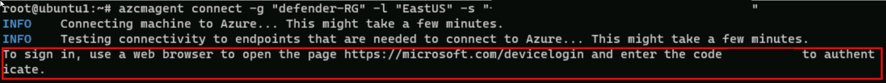

---
lab:
  title: 练习 3 - 使用数据连接器将 Linux 主机连接到 Microsoft Sentinel
  module: Learning Path 8 - Connect logs to Microsoft Sentinel
---

# 学习路径 8 - 实验室 1 - 练习 3 - 使用数据连接器将 Linux 主机连接到 Microsoft Sentinel

## 实验室方案


你是一位安全运营分析师，你所在公司已实现 Microsoft Sentinel。 你需要了解如何连接来自组织中多个数据源的日志数据。 这包括通过 AMA 使用通用事件格式 (CEF) 的 Linux 虚拟机数据源和通过旧版代理程序数据连接器的 Syslog 数据源。

>**重要说明：** 学习路径 #8 的实验室练习是在*独立*环境中进行的。 如果在完成实验室前退出，则需要重新运行配置。

### 完成本实验室的估计时间：30 分钟

>**重要提示：** 下一个任务中有一些步骤是在不同的虚拟机中完成的。 查找虚拟机名称引用。

### 任务 1：访问 Microsoft Sentinel 工作区

在此任务中，你将访问 Microsoft Sentinel 工作区。

>**备注：** 已在名称为 **defenderWorkspace** 的 Azure 订阅中预先部署了 Microsoft Sentinel，并且已安装所需的*内容中心*解决方案。

1. 使用以下密码以管理员身份登录到 WIN1 虚拟机：Pa55w.rd 。  

1. 启动 Microsoft Edge 浏览器。

1. 在 Microsoft Edge 浏览器中，导航到 Azure 门户 (<https://portal.azure.com> )。

1. 在“登录”对话框中，复制粘贴实验室托管提供者提供的租户电子邮件帐户，然后选择“下一步”  。

1. 在“输入密码”对话框中，复制粘贴实验室托管提供者提供的租户密码，然后选择“登录”  。

1. 在 Azure 门户的“搜索”栏中，键入 Sentinel，然后选择 Microsoft Sentinel。

1. 选择 Microsoft Sentinel **defenderWorkspace**。

### 任务 2：使用通用事件格式连接器连接 Linux 主机

在此任务中，你将使用通过 AMA 的通用事件格式 (CEF) 数据连接器将 Linux 主机连接到 Microsoft Sentinel。 还将创建数据收集规则 (DCR) 来收集事件。 Azure Arc 已根据创建 DCR 的需要预装在此 Linux 主机上。

1. 启动 LIN1 虚拟机。 使用实验室宿主提供的用户名和密码登录。 **提示：** 可能需要按 Enter 键才能看到登录提示，最好记下*用户名和密码*。

1. 请注意 LIN1 服务器的 IP 地址。 以下面的屏幕截图为例：

    

1. 返回到 WIN1 虚拟机。 启动 Microsoft Edge 浏览器。

1. 通过在任务栏中的搜索窗体中键入 **Windows PowerShell**，然后选择 **Windows PowerShell** 来启动 Windows PowerShell。

1. 输入以下 PowerShell 命令，根据你的具体 Linux 服务器信息进行调整，然后按 Enter：

    ```PowerShell
    ssh insert-your-linux-IP-address-here -l insert-linux-user-name-here
    ```

1. 输入“yes”以确认连接，然后键入用户密码，并按 Enter 键。 屏幕应如下所示：

    

1. 在 SSH 会话的 Linux 提示符下，键入以下命令。 *请勿按 Enter*：

    ```cmd
    azcmagent connect -g "defender-RG" -l "EastUS" -s "Subscription ID string"
    ```

1. 将“**订阅 ID 字符串**”替换为实验室主机托管服务提供商提供的“*订阅 ID*”（*资源选项卡）。 请确保保留引号。

1. 键入 **Enter** 以运行命令（这可能需要几分钟时间）。

1. 在“*要登录，请使用 Web 浏览器打开页面<https://microsoft.com/devicelogin>并输入代码*”消息中，按住 Ctrl 并单击链接以打开设备登录页。 复制提供的代码并将其粘贴到“*输入代码以允许访问*”框并选择“**下一步**”。

    

1. 在“*选取帐户*”对话框中，选择实验室托管服务提供商提供的“**租户电子邮件**”。 等待“*身份验证完成*”消息，关闭浏览器选项卡并返回到“*命令提示符*”窗口。 或者，如果看见“*登录*”对话框，输入实验室托管服务提供商提供的“**租户电子邮件**”和“**租户密码**”，然后选择“**登录**”。 等待“*身份验证完成*”消息，关闭浏览器选项卡并返回到“*命令提示符*”窗口。

1. 命令运行完成后，将“*命令提示符*”窗口保持打开状态，并键入以下命令以确认连接是否成功：

    ```cmd
    azcmagent show
    ```

1. 在命令输出中，验证“*代理状态*”是否为“**已连接**”。 暂时请勿关闭 *PowerShell 命令提示符*窗口。

1. 启动 Microsoft Edge 浏览器。

1. 在 Microsoft Edge 浏览器中，导航到 Azure 门户 (<https://portal.azure.com> )。

1. 在“登录”对话框中，复制粘贴实验室托管提供者提供的租户电子邮件帐户，然后选择“下一步”  。

1. 在“输入密码”对话框中，复制粘贴实验室托管提供者提供的租户密码，然后选择“登录”  。

1. 在 Azure 门户的“搜索”栏中，键入 Sentinel，然后选择 Microsoft Sentinel。

1. 选择 Microsoft Sentinel **defenderWorkspace**。

1. 在 Microsoft Sentinel 左侧导航菜单中，向下滚动到“*内容管理*”部分，然后选择“**内容中心**”。

1. 在“内容中心”，搜索通用事件格式”解决方案并从列表中选择它。

1. 在“*通用事件格式*”解决方案页上，选择“**管理**”。

    >**备注：***通用事件格式*解决方案会同时*通过 AMA 安装通用事件格式 (CEF)* 和通过*旧版代理程序安装通用事件格式 (CEF)* 数据连接器。

1. 选择“*通过 AMA 的通用事件格式 (CEF)*”数据连接器，然后在连接器信息边栏选项卡上选择“**打开连接器页面**”。

1. 在“*配置*”部分，选择“**+ 创建数据收集规则**”按钮。

1. 在“*创建数据收集规则*”页的“*基本*”选项卡上，输入 **AZLINDCR** 作为“规则名称”，然后选择“**下一步: 资源**”。

1. 在“*资源*”选项卡的“*范围*”下，展开“*MOC 订阅*”。

    >**提示**：可选择“*范围*”列前面的“>”来展开整个“*范围*”层次结构。

1. 展开“**defender-RG**”，然后选择“**LIN1**”。

    >**备注：***LIN1* 虚拟机可能显示为其他名称，如 ubuntuxxx。

1. 选择“**下一步: 收集**”。 在“*收集*”选项卡中，选择“*LOG_ALERT*”下拉菜单，然后选择“**LOG_WARNING**”。

1. 选择“**下一步: 查看 + 创建**”，然后选择“**创建**”。 等待部署完成。

    >**注意：** 可能需要刷新页面。

1. *通过 AMA 的通用事件格式 (CEF)* 数据连接器现在应显示“**已连接**”。

1. 数据收集规则会安装 Azure Monitor 代理 (AMA)，并在 LIN1 计算机上预先部署 *CEF 收集器*安装命令以安装 CEF 收集器。

1. 返回到 *PowerShell 命令提示符*窗口。 此时应仍连接到 LIN1 虚拟机。

1. 在 Linux 提示符处，键入以下命令，然后按 Enter：

    ```cmd
    netstat -lnptv
    ```

1. 应会看到 rsyslog（或 syslog-ng）守护程序正在侦听端口 514。

    >**备注：** 可以查询 *CommonSecurityLog* 表以获取 CEF 事件。

1. 键入“exit”以关闭与 LIN1 的远程 Shell 连接。

### 任务 3：使用 Syslog 连接器连接 Linux 主机

在此任务中，你将通过 Syslog 连接器将 Linux 主机连接到 Microsoft Sentinel。

1. 返回到打开 Microsoft Sentinel 门户的 Microsoft Edge 浏览器，然后选择右上角的“x”关闭“通过 AMA 的通用事件格式 (CEF)”数据连接器页面。

1. 在 Microsoft Sentinel 左侧菜单中，向下滚动到“内容管理”部分，然后选择“内容中心”。

1. 在“内容中心”，搜索“Syslog”解决方案并从列表中选择它。

1. 在 *Syslog* 解决方案页上，选择“**管理**”。

    >**备注：***Syslog* 解决方案安装了两个 *Syslog* 数据连接器、7 个分析规则、9 个搜寻查询、2 个分析器和 21 个工作簿。

1. 选择“*通过旧版代理程序的 Syslog*”数据连接器，然后在连接器信息边栏选项卡上选择“**打开连接器页面**”

1. 在“配置”部分，展开“在非 Azure Linux 计算机上安装代理”。

1. 选择“为非 Azure Linux 计算机下载和安装代理”的链接。

    >**注意：** Log Analytics 工作区会显示 2 台 Windows 计算机已连接。 分别对应于之前连接的 WINServer 和 AZWIN01 虚拟机。

1. 选择“Linux 服务器”的选项卡。

    >**注意：** Log Analytics 工作区会显示 1 台 Linux 计算机已连接。 对应于先前与 CEF 连接器连接的 LIN1 (ubuntu1) 虚拟机。

1. 选择“Log Analytics 代理说明”。

1. 将“下载和加入适用于 Linux 的代理”区域中的命令复制到剪贴板。

1. 启动 LIN2 虚拟机。 使用实验室宿主提供的用户名和密码登录。 提示：你可能需要按 Enter 键以查看登录提示。

1. 请注意 LIN2 服务器的 IP 地址。 以下面的屏幕截图为例：

    

1. 返回到 WIN1 虚拟机。 选择上一个任务中使用的 Windows PowerShell。

1. 输入以下 PowerShell 命令，根据你的具体 Linux 服务器信息进行调整，然后按 Enter：

    ```PowerShell
    ssh insert-your-linux-IP-address-here -l insert-linux-user-name-here
    ```

1. 输入“yes”以确认连接，然后键入用户密码，并按 Enter 键。 屏幕应如下所示：

    

1. 现在可以粘贴前面的步骤中的“下载和加入适用于 Linux 的代理”命令。 确保脚本在剪贴板中。 在 PowerShell 中右键单击顶部栏并依次选择“编辑”、“粘贴” 。

1. 粘贴脚本后，按 Enter 键。 该脚本将在 Linux 服务器上远程运行。 Wait

1. 完成后，键入“exit”以关闭与 LIN2 的远程 Shell 连接。

### 任务 4：为 Syslog 连接器配置你想收集的设备及其严重性

在此任务中，你将配置 Syslog 收集设备。

1. 返回到打开 Microsoft Sentinel 门户的 Microsoft Edge 浏览器，并通过选择两次右上角的“x”关闭“Log Analytics 工作区”页和“Syslog”数据连接器页。

1. 在 Microsoft Sentinel 门户中，选择“配置”下的“设置”，然后选择“工作区设置”选项卡。

1. 在“经典”区域下选择“旧代理管理”。

1. 选择“Syslog”选项卡。

1. 选择“+ 添加设备”按钮。

1. 从“设备名称”下拉菜单中选择“auth”。

1. 再次选择“+ 添加设备”按钮。

1. 在“设施名称”下拉菜单中选择 syslog。

1. 选择“应用”以保存所做的更改。

## 继续完成练习 4
