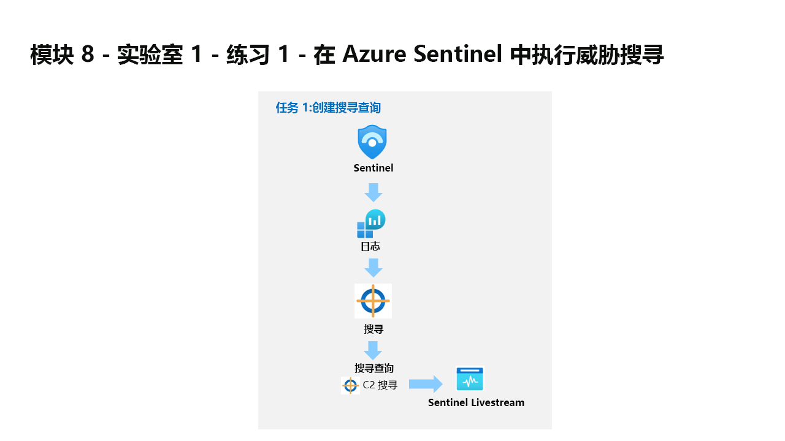

---
lab:
  title: 练习 1 - 在 Microsoft Sentinel 中执行威胁搜寻
  module: Learning Path 8 - Perform threat hunting in Microsoft Sentinel
---

# 学习路径 8 - 实验室 1 - 练习 1 - 在 Azure Sentinel 中执行威胁搜寻

## 实验室方案



你是一位安全运营分析师，你所在公司已实现 Microsoft Sentinel。 你收到了关于命令和控制（C2 或 C&C）技术的威胁情报。 你需要执行搜寻并监视威胁。

>**重要提示：** 本实验室使用的日志数据是在上一个模块中创建的。 请参阅练习 5 中 WIN1 服务器上的攻击 3。

>**注意：** 你已在上一模块中体验过探索数据的过程，因此本实验室提供 KQL 语句供你开始操作。 

>                **注意：** 我们提供 **[交互式实验室模拟](https://mslabs.cloudguides.com/guides/SC-200%20Lab%20Simulation%20-%20Perform%20threat%20hunting%20in%20Microsoft%20Sentinel)** ，让你能以自己的节奏点击浏览实验室。 你可能会发现交互式模拟与托管实验室之间存在细微差异，但演示的核心概念和思想是相同的。 


### 任务 1：创建搜寻查询

在此任务中，你将创建搜寻查询、为结果添加书签并创建 Livestream。

1. 使用以下密码以管理员身份登录到 WIN1 虚拟机：**Pa55w.rd**。  

1. 在 Microsoft Edge 浏览器中，导航到 Azure 门户 (https://portal.azure.com )。

1. 在“登录”对话框中，复制粘贴实验室托管提供者提供的租户电子邮件帐户，然后选择“下一步”  。

1. 在“输入密码”对话框中，复制粘贴实验室托管提供者提供的租户密码，然后选择“登录”  。

1. 在 Azure 门户的搜索栏中，键入“Sentinel”，然后选择“Microsoft Sentinel”。

1. 选择 Microsoft Sentinel 工作区。

1. 选择“日志” 

1. 在“新查询 1”空间输入以下 KQL 语句：

   >**重要提示：** 请首先将任意 KQL 查询粘贴到记事本，然后从此处复制到“新建查询 1 日志”窗口以避免任何错误。

    ```KQL
    let lookback = 2d; 
    SecurityEvent 
    | where TimeGenerated >= ago(lookback) 
    | where EventID == 4688 and Process =~ "powershell.exe"
    | extend PwshParam = trim(@"[^/\\]*powershell(.exe)+" , CommandLine) 
    | project TimeGenerated, Computer, SubjectUserName, PwshParam 
    | summarize min(TimeGenerated), count() by Computer, SubjectUserName, PwshParam 
    | order by count_ desc nulls last 
    ```

1. 查看不同的结果。 现在，你已确定在自己的环境中运行的 PowerShell 请求。

1. 选中显示“-file c2.ps1”的结果的复选框。

1. 在中间的命令栏中，选择“添加书签”按钮。

1. 在“实体映射”下选择“+ 添加新实体”。

1. 对于“实体”，选择“主机”，然后选择“主机名”和“计算机”作为值  。

1. 对于“策略和技术”，选择“命令和控制”。

1. 返回“添加书签”边栏选项卡，然后选择“创建”。 稍后我们会将此书签映射到事件。

1. 通过选择窗口右上方的“X”关闭“日志”窗口，然后选择“确定”以放弃更改 。 

1. 再次选择 Microsoft Sentinel 工作区，并在“威胁管理”区域下选择“搜寻”页面。

1. 选择“查询”选项卡，然后在命令栏中选择“+ 新建查询” 。

1. 在“创建自定义查询”窗口中，输入“PowerShell 搜寻”作为“名称” 。

1. 对于“自定义查询”，输入以下 KQL 语句：

    ```KQL
    let lookback = 2d; 
    SecurityEvent 
    | where TimeGenerated >= ago(lookback) 
    | where EventID == 4688 and Process =~ "powershell.exe"
    | extend PwshParam = trim(@"[^/\\]*powershell(.exe)+" , CommandLine) 
    | project TimeGenerated, Computer, SubjectUserName, PwshParam 
    | summarize min(TimeGenerated), count() by Computer, SubjectUserName, PwshParam 
    | order by count_ desc nulls last 
    ```

1. 向下滚动，在“实体映射”下，选择：

    - 对于“实体类型”下拉列表，请选择“Host”。
    - 对于“标识符”下拉列表，选择“HostName”。
    - 对于“值”下拉列表，选择“计算机”。

1. 向下滚动，然后在“策略与技术”下选择“命令和控制”，然后选择“创建”以创建搜寻查询 。

1. 在“Microsoft Sentinel | 搜寻”边栏选项卡中，在列表中搜索刚刚创建的查询，即“PowerShell 搜寻” 。

1. 在列表中选择“PowerShell 搜寻”。

1. 在中间窗格的“结果”列下查看结果数。

1. 在右窗格中选择“查看结果”按钮。 KQL 查询将自动运行。

1. 通过选择窗口右上方的“X”关闭“日志”窗口，然后选择“确定”以放弃更改 。 

1. 右键单击“PowerShell 搜寻”查询，然后选择“添加到实时流” 。 提示：也可通过向右滑动并选择行末尾的省略号 (...) 打开上下文菜单完成此操作。

1. 查看“状态”现在为“正在运行” 。 这将在后台每 30 秒运行一次，当找到新结果时，你将在 Azure 门户（铃铛图标）中收到通知。 

1. 在中间窗格中选择“书签”选项卡。

1. 在结果列表中选择你刚刚创建的书签。

1. 在右窗格中，向下滚动并选择“调查”按钮。 提示：可能需要几分钟时间才能显示调查图。

1. 像在上一模块中一样浏览调查图。 注意 WINServer 的相关警报数量很多 。

1. 选择窗口右上角的 X 关闭调查图。 

1. 选择 >> 图标，然后向右滚动，直到看到省略号 (...) 图标，以此隐藏右侧边栏选项卡 。

1. 选择“添加到现有事件”。 所有事件都显示在右窗格中。

1. 选择其中一个事件，然后选择“添加”。 

1. 向左滚动可注意到“严重性”列现在填充了事件的数据。


### 任务 2：创建 NRT 查询规则

在此任务中，你将创建 NRT 分析查询规则，而不是使用 LiveStream。 NRT 规则每分钟运行一次，并回溯一分钟。 NRT 规则的优点是可以使用警报和事件创建逻辑。

1. 在 Microsoft Sentinel 中的“配置”下选择“Analytics”页面。 

1. 选择“创建”选项卡，然后选择“NRT 查询规则(预览版)” 。

1. 这会启动“分析规则向导”。 在“常规”选项卡中，键入以下内容：

    |设置|值|
    |---|---|
    |名称|**NRT PowerShell 搜寻**|
    |说明|**NRT PowerShell 搜寻**|
    |策略|**命令和控制**|
    |Severity|**高**|

1. 选择“下一页:**设置规则逻辑 >”按钮**。 

1. 对于“规则查询”，输入以下 KQL 语句：

    ```KQL
    let lookback = 2d; 
    SecurityEvent 
    | where TimeGenerated >= ago(lookback) 
    | where EventID == 4688 and Process =~ "powershell.exe"
    | extend PwshParam = trim(@"[^/\\]*powershell(.exe)+" , CommandLine) 
    | project TimeGenerated, Computer, SubjectUserName, PwshParam 
    | summarize min(TimeGenerated), count() by Computer, SubjectUserName, PwshParam
    ```

1. 选择“查看查询结果 >”，确保查询没有任何错误。

1. 通过选择窗口右上方的“X”关闭“日志”窗口，然后选择“确定”以放弃更改 。 

1. 在“结果模拟”下选择“使用当前数据进行测试”。 注意每天的预期警报数。

1. 在“实体映射”下，选择：

    - 对于“实体类型”下拉列表，请选择“Host”。
    - 对于“标识符”下拉列表，选择“HostName”。
    - 对于“值”下拉列表，选择“计算机”。

1. 向下滚动，选择“下一步: 事件设置>”按钮。

1. 对于“事件设置”选项卡，保留默认值并选择“下一步: 查看和创建 >”按钮。

1. 在“查看和创建”选项卡上，选择“保存”按钮以创建并保存新的计划分析规则。

### 任务 3：创建搜索

在此任务中，你将使用搜索作业查找 C2。 

1. 在 Microsoft Sentinel 的“常规”下，选择“搜索”页面。 

1. 在搜索框中，输入 reg.exe，然后选择“启动” 。 

1. 此时会打开一个运行查询的新窗口。 选择右上角的省略号图标 (...)，然后切换“搜索作业模式” 。

1. 选择命令栏中的“搜索作业”按钮。 

1. 搜索作业会在结果到达后立即使用结果创建一个新表。 你可以在“保存的搜索”选项卡中查询结果。

1. 通过选择窗口右上方的“X”关闭“日志”窗口，然后选择“确定”以放弃更改 。 
 
1. 在命令栏中选择“还原”选项卡，然后选择“还原”按钮 。

1. 在“选择要还原的表”下，搜索并选择 SecurityEvent。

1. 查看可用的选项，然后选择“还原”按钮。

1. 还原作业将运行几分钟，你的数据将在新表中可用。

    >重要说明：还原作业应用于恢复存档数据，而不是用于恢复交互日志。

## 继续进行练习 2
