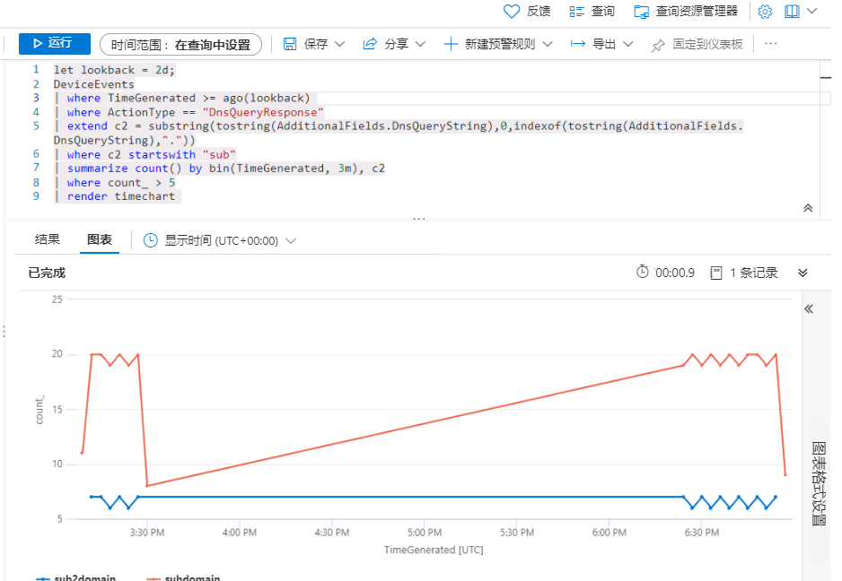
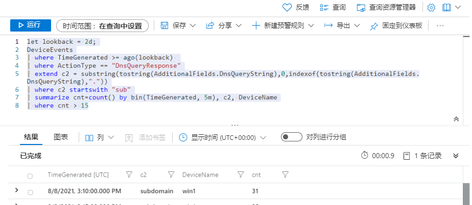

---
lab:
    title: '练习 1 - 在 Microsoft Sentinel 中执行威胁搜寻'
    module: '模块 8 - 在 Microsoft Sentinel 中执行威胁搜寻'
---

# 模块 8 - 实验室 1 - 练习 1 - 在 Microsoft Sentinel 中执行威胁搜寻

## 实验室场景

你是一位安全运营分析师，你所在公司已实现 Microsoft Sentinel。你收到了关于命令和控制 (C2 或 C&C) 技术的威胁情报。  你需要执行搜寻并监视威胁。

>**重要提示**：本实验室使用的日志数据是在上一个模块中创建的。请参阅练习 5 中 WIN1 服务器中的**攻击 3**。

>**备注**：  你已在上一模块中体验过探索数据的过程，因此本实验室提供 KQL 语句供你开始操作。  


### 任务 1：创建搜寻查询

在此任务中，你将创建搜寻查询、为结果添加书签并创建 Livestream。

1. 使用以下密码以管理员身份登录到 WIN1 虚拟机： **Pa55w.rd**。  

2. 在 Microsoft Edge 浏览器中，导航到 Azure 门户 (https://portal.azure.com)。

3. 在“**登录**”对话框中，复制粘贴实验室托管提供者提供的租户电子**邮件帐户**，然后选择“**下一步**”。

4. 在“**输入密码**”对话框中，复制粘贴实验室托管提供者提供的**租户密码**，然后选择“**登录**”。

5. 在 Azure 门户的搜索栏中，键入 *Sentinel*，然后选择“**Microsoft Sentinel**”。

6. 选择 Microsoft Sentinel 工作区。

7. 选择“**日志**”

8. 在新查询 1 区域输入以下 KQL 语句：

   >**重要提示**：请先在记事本中粘贴任意 KQL 查询，然后从其中复制到“*新建查询 1*”日志窗口，以避免出现任何错误。

```KQL
let lookback = 2d;
DeviceEvents
| where TimeGenerated >= ago(lookback) 
| where ActionType == "DnsQueryResponse"
| extend c2 = substring(tostring(AdditionalFields.DnsQueryString),0,indexof(tostring(AdditionalFields.DnsQueryString),"."))
| where c2 startswith "sub"
| summarize count() by bin(TimeGenerated, 3m), c2
| where count_ > 5
| render timechart 
```

   

9. 该语句是为了提供一个可视化效果，用于在一致基础上检查 C2 信标输出。花点时间在 summarize 等运算符中将“3 分钟”设置调整为 30 秒。将 count_ > 5 设置更改为其他阈值计数来观察影响。

10. 你现已确定要向 C2 服务器发送信标的 DNS 请求。  接下来，请确定要发送信标的设备。  输入以下 KQL 语句：

```KQL
let lookback = 2d;
DeviceEvents
| where TimeGenerated >= ago(lookback) 
| where ActionType == "DnsQueryResponse"
| extend c2 = substring(tostring(AdditionalFields.DnsQueryString),0,indexof(tostring(AdditionalFields.DnsQueryString),"."))
| where c2 startswith "sub"
| summarize cnt=count() by bin(TimeGenerated, 5m), c2, DeviceName
| where cnt > 15
```

   

   >**备注**： 生成的日志数据仅来自一台设备。

11. 选择窗口右上角的“x”关闭“日志”窗口，再选择“**确定**”来放弃更改。再次选择你的 Microsoft Sentinel 工作区，然后选择“威胁管理”区域下的“**搜寻**”页面。

12. 从命令栏中选择“**+ 新建查询**”。

13. 对于“**自定义查询**”，输入以下 KQL 语句：

```KQL
let lookback = 2d;
DeviceEvents
| where TimeGenerated >= ago(lookback) 
| where ActionType == "DnsQueryResponse"
| extend c2 = substring(tostring(AdditionalFields.DnsQueryString),0,indexof(tostring(AdditionalFields.DnsQueryString),"."))
| where c2 startswith "sub"
| summarize cnt=count() by bin(TimeGenerated, 5m), c2, DeviceName
| where cnt > 15
```

14. 对于名称，输入“*C2 搜寻*”类型

15. 在“*实体映射(预览)*”中，选择“**+ 添加新实体**”：

    - 在“*实体类型*”下拉列表中，选择“**主机**”。
    - 在“*标识符*”下拉列表中，选择“**HostName**”。
    - 在“*值*”下拉列表中，选择“**DeviceName**”。

16. 在“*策略和技术*”中，选择“**命令和控制**”。选择“**创建**”以创建搜寻查询。

17. 在“Microsoft Sentinel - 搜寻”边栏选项卡中，在列表中搜索刚刚创建的查询“*C2 搜寻*”。

18. 在列表中选择“**C2 搜寻**”。

19. 选择页面右侧的“**运行查询**”按钮。

20. 结果计数显示在弹出窗口顶部。

21. 选择“**查看结果**”按钮。

22. 选择结果中的第一行。 

23. 选择“**添加书签**”按钮。

24. 在“添加书签”边栏选项卡中，选择“**创建**”。

25. 返回到 Microsoft Sentinel 门户中的“搜寻”页面（提示：向左滚动）。

26. 选择“**书签**”选项卡。

27. 选择刚刚在结果列表中创建的书签。

28. 选择“**调查**”按钮。

29. 浏览调查图。

30. 选择右上角的“x”关闭窗口，返回到 Microsoft Sentinel 门户中的“搜寻”页面。

31. 选择“**查询**”选项卡

32. 再次搜索并选择“**C2 搜寻**”查询。

33. 选择右侧行末尾的“**...**”，打开上下文菜单。

34. 选择“**添加到 livestream**”。

# 继续进行练习 2
