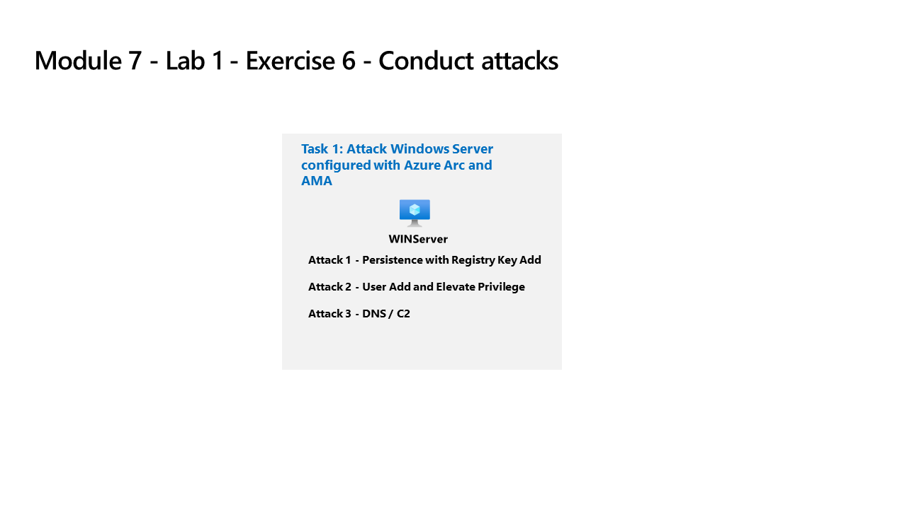

---
lab:
  title: 练习 6 - 进行攻击
  module: Learning Path 9 - Create detections and perform investigations using Microsoft Sentinel
---

# 学习路径 9 - 实验室 1 - 练习 6 - 进行攻击

## 实验室方案



你将模拟稍后将用于在 Microsoft Sentinel 中检测和调查的攻击。

>**重要说明：** 学习路径 #9 的实验室练习是在*独立*环境中进行的。 如果在完成实验室前退出，则需要重新运行配置。

### 完成本实验室的估计时间：30 分钟

### 任务 1：通过注册表项添加进行持久性攻击

>**重要提示：** 接下来的步骤将在另一台计算机上完成，而不是你之前使用的计算机。 在引用选项卡中查找虚拟机名称。

在此任务中，你将对与 Azure Arc 连接且已配置 Azure Monitor 代理的主机执行攻击。

1. 使用密码 Pa55w.rd 以管理员身份登录到 WINServer 虚拟机。  

    >重要说明：实验室保存功能可能会导致 Win2 与 Azure Arc 断开连接。重启可以解决此问题。  

1. 在 Windows 中选择“开始”。 然后依次选择“电源”和“重启” 。

1. 按照说明再次登录到 WINServer。

1. 在任务栏的搜索框中，输入“Command”。 命令提示符将显示在搜索结果中。 右键单击命令提示符，并选择“以管理员身份运行”。 在出现的“用户帐户控制”窗口中选择“是”以允许应用运行。

1. 在命令提示符的根目录中创建 Temp 文件夹。 请记住，在上一行后按 Enter 键：

    ```CommandPrompt
    cd \
    mkdir temp
    cd temp
    ```

1. 复制并运行以下命令以模拟程序持久性：

    ```CommandPrompt
    REG ADD "HKCU\SOFTWARE\Microsoft\Windows\CurrentVersion\Run" /V "SOC Test" /t REG_SZ /F /D "C:\temp\startup.bat"
    ```


### 任务 2：通过用户添加进行特权提升攻击

1. 复制并运行此命令以模拟管理员帐户的创建。 请记住，在上一行后按 Enter 键：

    ```CommandPrompt
    net user theusernametoadd /add
    net user theusernametoadd ThePassword1!
    net localgroup administrators theusernametoadd /add
    ```


### 任务 3：通过 DNS 进行命令和控制攻击

1. 复制并运行以下命令以创建一个脚本，用于模拟对 C2 服务器的 DNS 查询：

    ```CommandPrompt
    notepad c2.ps1
    ```

1. 选择“是”以创建新文件并将以下 PowerShell 脚本复制到 c2.ps1。

    >注意：粘贴到虚拟机文件中可能不会显示完整的脚本长度。**** 确保脚本与 c2.ps1 文件中的指令匹配**。

    ```PowerShell
    param(
        [string]$Domain = "microsoft.com",
        [string]$Subdomain = "subdomain",
        [string]$Sub2domain = "sub2domain",
        [string]$Sub3domain = "sub3domain",
        [string]$QueryType = "TXT",
        [int]$C2Interval = 8,
        [int]$C2Jitter = 20,
        [int]$RunTime = 240
    )
    $RunStart = Get-Date
    $RunEnd = $RunStart.addminutes($RunTime)
    $x2 = 1
    $x3 = 1 
    Do {
        $TimeNow = Get-Date
        Resolve-DnsName -type $QueryType $Subdomain".$(Get-Random -Minimum 1 -Maximum 999999)."$Domain -QuickTimeout
        if ($x2 -eq 3 )
        {
            Resolve-DnsName -type $QueryType $Sub2domain".$(Get-Random -Minimum 1 -Maximum 999999)."$Domain -QuickTimeout
            $x2 = 1
        }
        else
        {
            $x2 = $x2 + 1
        }    
        if ($x3 -eq 7 )
        {
            Resolve-DnsName -type $QueryType $Sub3domain".$(Get-Random -Minimum 1 -Maximum 999999)."$Domain -QuickTimeout
            $x3 = 1
        }
        else
        {
            $x3 = $x3 + 1
        }
        $Jitter = ((Get-Random -Minimum -$C2Jitter -Maximum $C2Jitter) / 100 + 1) +$C2Interval
        Start-Sleep -Seconds $Jitter
    }
    Until ($TimeNow -ge $RunEnd)
    ```

1. 在“记事本”菜单中，选择“文件”，然后选择“保存” 。 

1. 返回命令提示符窗口，输入以下命令并按 Enter 键。 

    >注意：你将看到 DNS 解析错误。 这是正常情况。

    ```CommandPrompt
    Start PowerShell.exe -file c2.ps1
    ```

>**重要提示：** 请勿关闭这些窗口。 让此 PowerShell 脚本在后台运行。 该命令需要在数小时内生成日志条目。 在此脚本运行期间，你可以继续进行下一项任务和下一个练习。 此任务创建的数据稍后将在威胁搜寻中使用。 此过程不会创造大量的数据或处理。

## 转到练习 7
