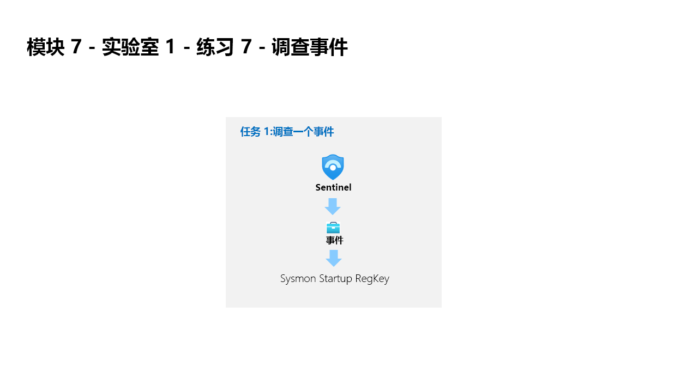
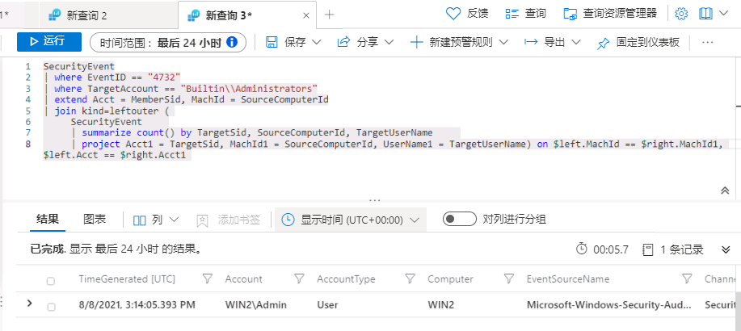

---
lab:
  title: 练习 7 - 创建检测
  module: Learning Path 9 - Create detections and perform investigations using Microsoft Sentinel
---

# 学习路径 9 - 实验室 1 - 练习 7 - 创建检测

## 实验室方案



你是一位安全运营分析师，你所在公司已实现 Microsoft Sentinel。 你将使用 Log Analytics KQL 查询，并从这里创建自定义分析规则，以帮助发现环境中的威胁和异常行为。

分析规则将在你的整个环境中搜索特定事件或事件集，在达到特定事件阈值或条件时发出警报，生成故障事件以供 SOC 进行会审和调查，并通过自动化跟踪和修正流程来响应威胁。

>**重要说明：** 学习路径 #9 的实验室练习是在*独立*环境中进行的。 如果在完成实验室前退出，则需要重新运行配置。

### 完成本实验室的估计时间：30 分钟

### 任务 1：持久性攻击检测

>**重要提示：** 接下来的步骤将在另一台计算机上完成，而不是你之前使用的计算机。 查找虚拟机名称引用。

在此任务中，你将为上一练习的第一个攻击创建检测。

>**备注：** Microsoft Sentinel 已在 Azure 订阅中预先部署了名称 **defenderWorkspace**，并且已安装所需的“*内容中心*”解决方案。

1. 使用以下密码以管理员身份登录到 WIN1 虚拟机：**Pa55w.rd**。  

1. 在 Microsoft Edge 浏览器中，导航到 Azure 门户 (<https://portal.azure.com> )。

1. 在“登录”对话框中，复制粘贴实验室托管提供者提供的租户电子邮件帐户，然后选择“下一步”  。

1. 在“输入密码”对话框中，复制粘贴实验室托管提供者提供的租户密码，然后选择“登录”  。

1. 在 Azure 门户的搜索栏中，键入“Sentinel”，然后选择“Microsoft Sentinel”。

1. 选择 Microsoft Sentinel **defenderWorkspace**。

1. 在“常规”部分选择“日志”。

1. 再次运行以下 KQL 语句，以召回包含此数据的表：

    ```KQL
    search "temp\\startup.bat"
    ```

    >注意：显示事件的结果可能需要长达 5 分钟的时间。 请等到它完成。 如果未显示，请确保已按照上一练习中的指示重启 WINServer，并且已完成学习路径 6 实验室练习 2 的任务 3。

1. SecurityEvent 表中的数据已经规范化，便于进行查询。 展开该行以查看与记录相关的所有列。

1. 从结果中，我们现在知道了 Threat Actor 正在使用 reg.exe 向注册表项添加项，程序位于 C:\temp。运行以下语句，将查询中的搜索运算符替换为 where 运算符 :

    ```KQL
    SecurityEvent 
    | where Activity startswith "4688" 
    | where Process == "reg.exe" 
    | where CommandLine startswith "REG" 
    ```

1. 请务必尽可能多地提供关于警报的上下文，为安全运营中心分析师提供帮助。 这包括投影在调查关系图中使用的实体。 运行以下查询：

    ```KQL
    SecurityEvent 
    | where Activity startswith "4688" 
    | where Process == "reg.exe" 
    | where CommandLine startswith "REG" 
    | extend timestamp = TimeGenerated, HostCustomEntity = Computer, AccountCustomEntity = SubjectUserName
    ```

1. 你现在有一个不错的检测规则，接下来请在“日志”窗口中，选择命令栏中的“+ 新建预警规则”，然后选择“创建 Microsoft Sentinel 警报” 。 随后会创建新的计划规则。 提示：可能需要从命令栏中选择省略号 (...) 按钮。

1. 这会启动“分析规则向导”。 在“常规”选项卡中，键入以下内容：

    |设置|值|
    |---|---|
    |名称|Startup RegKey|
    |说明|c:\temp 中的 Startup RegKey|
    |策略|持久性|
    |Severity|高|

1. 选择“下一页:**设置规则逻辑 >”按钮**。

1. 在“设置规则逻辑”** 选项卡上，*规则查询*应已填充你的 KQL 查询。

1. 使用下表中的参数配置*警报增强 - 实体映射*下的实体。

    |实体|标识符|数据字段|
    |:----|:----|:----|
    |帐户|FullName|AccountCustomEntity|
    |主机|主机名|HostCustomEntity|

1. 对于“查询计划”，设置以下项：

    |设置|值|
    |---|---|
    |运行查询的时间间隔|5 分钟|
    |查找上次的数据|1 天|

    >**注意：** 我们特意针对同一数据生成了多个事件。 这样，实验室就可使用这些警报。

1. 将其余选项保留为默认值。 选择“下一页:**事件设置 >”按钮**。

1. 对于“事件设置”选项卡，保留默认值并选择“下一页: “下一步: 自动响应 >”按钮。

1. 在“自动化规则”下的“自动响应”选项卡上，选择“新增” 。

1. 使用表中的设置配置自动化规则。

    |设置|“值”|
    |:----|:----|
    |自动化规则名称|Startup RegKey|
    |触发器|创建事件时|
    |操作 |运行攻略|
    |playbook |Defender_XDR_Ransomware_Playbook_SecOps-Tasks|

    >**注意：** 你已为 playbook 分配了权限，因此它将可用。

1. 选择“应用”

1. 选择底部的**** 查看 + 创建 >”按钮。
  
1. 在“查看并创建”选项卡上，选择“保存”按钮以新建计划分析规则******。

### 任务 2：特权提升攻击检测

在此任务中，你将为上一练习的第二个攻击创建检测。

>**备注：** 我们已将 WINServer 计算机上的本地安全策略配置为日志 4732 事件。 这将在“*高级审核策略配置 > 系统审核策略 - 本地组策略对象 > 帐户管理 > 审核安全组管理：成功和失败*”中配置。

1. 如果你已离开此页面，在 Microsoft Sentinel 门户中，选择“常规”部分中的“日志”。

1. 运行以下 KQL 语句以标识任何引用管理员的条目：

    ```KQL
    search "administrators" 
    | summarize count() by $table
    ```

1. 结果可能会显示不同表中的事件，但在我们的案例中，我们想要调查 SecurityEvent 表。 我们查找的 EventID 和 Event 为“4732 - 成员已添加到启用了安全性的本地组”。 通过此操作，我们将确定将成员添加到特权组。 运行以下 KQL 查询以确认：

    ```KQL
    SecurityEvent 
    | where EventID == 4732
    | where TargetAccount == "Builtin\\Administrators"
    ```

1. 展开该行以查看与记录相关的所有列。 不会显示添加为管理员的帐户的用户名。 问题在于未存储该用户名，我们具有的是安全标识符 (SID)。 运行以下 KQL，将 SID 与添加到 Administrators 组的用户名匹配：

    ```KQL
    SecurityEvent 
    | where EventID == 4732
    | where TargetAccount == "Builtin\\Administrators"
    | extend Acct = MemberSid, MachId = SourceComputerId  
    | join kind=leftouter (
        SecurityEvent 
        | summarize count() by TargetSid, SourceComputerId, TargetUserName 
        | project Acct1 = TargetSid, MachId1 = SourceComputerId, UserName1 = TargetUserName) on $left.MachId == $right.MachId1, $left.Acct == $right.Acct1
    ```

   

1. 扩展行以显示生成的列，在上一行中，我们在 KQL 查询投影的 UserName1 列下看到了添加的用户的名称 。 请务必尽可能多地提供关于警报的上下文，为安全操作分析师提供帮助。 这包括投影在调查关系图中使用的实体。 运行以下查询：

    ```KQL
    SecurityEvent 
    | where EventID == 4732
    | where TargetAccount == "Builtin\\Administrators"
    | extend Acct = MemberSid, MachId = SourceComputerId  
    | join kind=leftouter (
        SecurityEvent 
        | summarize count() by TargetSid, SourceComputerId, TargetUserName 
        | project Acct1 = TargetSid, MachId1 = SourceComputerId, UserName1 = TargetUserName) on $left.MachId == $right.MachId1, $left.Acct == $right.Acct1
    | extend timestamp = TimeGenerated, HostCustomEntity = Computer, AccountCustomEntity = UserName1
    ```

1. 你现在有一个不错的检测规则，接下来请在“日志”窗口中，选择命令栏中的“+ 新建预警规则”，然后选择“创建 Microsoft Sentinel 警报” 。 提示：可能需要从命令栏中选择省略号 (...) 按钮。

1. 这会启动“分析规则向导”。 在“常规”选项卡中，键入以下内容：

    |设置|值|
    |---|---|
    |名称|SecurityEvents 本地管理员用户添加操作|
    |说明|添加到本地管理员组的用户|
    |策略|**特权提升**|
    |Severity|**高**|

1. 选择“下一页:**设置规则逻辑 >”按钮**。

1. 在“设置规则逻辑”选项卡上，“规则查询”应已填充 KQL 查询，以及“警报增强 - 实体映射”下的实体******。

    |实体|标识符|数据字段|
    |:----|:----|:----|
    |帐户|FullName|AccountCustomEntity|
    |主机|主机名|HostCustomEntity|

1. 如果未为“主机”实体选择“主机名”，请从下拉列表中选择它，并使用上表中的参数填充字段******。

1. 对于“查询计划”，设置以下项：

    |设置|值|
    |---|---|
    |运行查询的时间间隔|5 分钟|
    |查找上次的数据|1 天|

    >**注意：** 我们特意针对同一数据生成了多个事件。 这样，实验室就可使用这些警报。

1. 将其余选项保留为默认值。 选择“下一页:**事件设置 >”按钮**。

1. 对于“事件设置”选项卡，保留默认值并选择“下一页: “下一步: 自动响应 >”按钮。

1. 在“自动化规则”下的“自动响应”选项卡上，选择“新增” 。

1. 使用表中的设置配置自动化规则。

   |设置|“值”|
   |:----|:----|
   |自动化规则名称|SecurityEvents 本地管理员用户添加操作|
   |触发器|创建事件时|
   |操作 |运行攻略|
   |playbook |Defender_XDR_Ransomware_Playbook_SecOps-Tasks|

   >**注意：** 你已为 playbook 分配了权限，因此它将可用。

1. 选择“应用”

1. 选择“下一步: 查看并创建 >”按钮。
  
1. 在“查看并创建”选项卡上，选择“创建”按钮以新建计划分析规则。

## 继续完成练习 8
